# KaiKo — Software Design Document (SDD)

**Dự án:** KaiKo — Nền tảng tranh biện video 1v1 được gamify với AI Judge  
**Môn học:** CSC10011 — Software Engineering for AI-enabled Systems  
**Trường:** Đại học Khoa học Tự nhiên, ĐHQG-HCM (HCMUS)  
**Nhóm:** 09 — KaiKo · **GVHD:** Nguyễn Văn Vũ  
**Thành viên:** Bàng Mỹ Linh (23122009) · Nguyễn Gia Bảo (23122015) · Lại Nguyễn Hồng Thanh (23122018) · Phan Huỳnh Châu Thịnh (23122019)  

---

## Mục lục

1. [Introduction](#1-introduction)
2. [System Overview](#2-system-overview)
3. [Architectural Design](#3-architectural-design)
4. [Data Design](#4-data-design)
5. [Interface Design](#5-interface-design)
   - 5.1 REST API — User Management & Game Core
   - 5.2 REST API — Social System
   - 5.3 REST API — Events & Community
   - 5.4 REST API — AI Subsystem
   - 5.5 WebSocket Protocol
6. [Deployment Design](#6-deployment-design)
7. [Behavioral Design (Sequence Diagrams)](#7-behavioral-design-sequence-diagrams)
8. [Algorithm Design](#8-algorithm-design)
   - 8.1–8.3 Matchmaking & Level-Up Tier System
   - 8.4 AI Algorithm Pipelines
9. [Security Design & Non-Functional Requirements](#9-security-design-non-functional-requirements)
10. [Architecture Decision Records (ADR)](#10-architecture-decision-records-adr)

---

## 1. Introduction

### 1.1 Purpose

Tài liệu này là **Software Design Document (SDD)** cho hệ thống KaiKo — nền tảng tranh biện online có tích hợp AI. SDD được lập theo chuẩn IEEE 1016 nhằm mô tả toàn bộ thiết kế kỹ thuật của hệ thống, bao gồm kiến trúc tổng thể, thiết kế dữ liệu, giao diện giữa các thành phần, các luồng xử lý chính (sequence), các thuật toán cốt lõi, các yêu cầu phi chức năng, và các quyết định kiến trúc (Architecture Decision Records).

Mục tiêu của tài liệu là phục vụ hai đối tượng chính:

- **Nhóm phát triển:** cung cấp đặc tả kỹ thuật đủ chi tiết để hiện thực và duy trì hệ thống.
- **Giảng viên và hội đồng đồ án:** làm tài liệu báo cáo chính thức cho môn CSC10011, thể hiện năng lực phân tích thiết kế hệ thống phần mềm có tích hợp AI.

SDD này **không** bao gồm tài liệu yêu cầu (SRS) hay tài liệu kiểm thử (Test Plan) — các tài liệu đó được quản lý riêng biệt.

---

### 1.2 Scope

KaiKo là một ứng dụng web cho phép người dùng tham gia các trận tranh biện trực tuyến có hỗ trợ AI realtime. Phạm vi thiết kế được mô tả trong SDD này bao phủ toàn bộ các tầng của hệ thống:

- **Frontend:** Ứng dụng Single-Page Application (SPA) xây dựng bằng React 18 + Vite, chạy trên trình duyệt, giao tiếp với backend qua REST API và WebSocket.
- **Backend:** Server FastAPI (Python), xử lý toàn bộ business logic, quản lý WebSocket connections, gọi AI services, và truy cập database.
- **Database:** PostgreSQL với 18 bảng, lưu trữ dữ liệu người dùng, lịch sử trận, hệ thống xã hội, và events.
- **AI tự xây dựng:** Hai model XLM-RoBERTa fine-tune chạy trên Kaggle GPU, được phục vụ qua endpoint `/analyze` và `/check-argument`.
- **AI bên ngoài:** Google Gemini API (gemini-2.5-flash) dùng cho chấm điểm, gợi ý, AI solo mode, và sinh chủ đề.
- **P2P Video:** WebRTC sử dụng STUN-only (Google STUN servers), tín hiệu (signaling) được relay qua FastAPI WebSocket.

Tài liệu này **không** bao gồm thiết kế của hạ tầng triển khai production (cloud server, load balancer, CI/CD pipeline) vì KaiKo là đồ án học thuật chạy trên môi trường phát triển cục bộ.

---

### 1.3 Definitions & Abbreviations

| Thuật ngữ / Viết tắt | Giải thích |
|-----------------------|------------|
| **SDD** | Software Design Document — tài liệu mô tả thiết kế phần mềm |
| **SRS** | Software Requirements Specification — tài liệu đặc tả yêu cầu |
| **ADR** | Architecture Decision Record — bản ghi quyết định kiến trúc |
| **API** | Application Programming Interface — giao diện lập trình ứng dụng |
| **REST** | Representational State Transfer — kiểu kiến trúc API phổ biến dùng HTTP |
| **WS / WebSocket** | Giao thức kết nối hai chiều (full-duplex) duy trì liên tục qua TCP |
| **WebRTC** | Web Real-Time Communication — chuẩn trình duyệt để truyền video/audio P2P |
| **P2P** | Peer-to-Peer — kết nối trực tiếp giữa hai trình duyệt, không qua server trung gian |
| **STUN** | Session Traversal Utilities for NAT — giao thức giúp peer khám phá địa chỉ IP công khai của mình |
| **TURN** | Traversal Using Relays around NAT — giao thức relay khi P2P trực tiếp thất bại (KaiKo không có) |
| **ICE** | Interactive Connectivity Establishment — framework tổng hợp để thiết lập kết nối WebRTC |
| **SDP** | Session Description Protocol — định dạng mô tả khả năng media (codec, địa chỉ) để thương lượng WebRTC |
| **NAT** | Network Address Translation — kỹ thuật router ánh xạ IP nội bộ sang IP công khai |
| **STT** | Speech-to-Text — chuyển đổi giọng nói thành văn bản |
| **TTS** | Text-to-Speech — chuyển đổi văn bản thành giọng nói |
| **LLM** | Large Language Model — mô hình ngôn ngữ lớn (ví dụ: Gemini, GPT) |
| **Fine-tune** | Quá trình huấn luyện thêm một pre-trained model trên bộ dữ liệu domain-specific |
| **XLM-RoBERTa** | Cross-lingual Language Model RoBERTa — model NLP đa ngôn ngữ của Facebook AI |
| **ArgKP** | Argument Key Point — kỹ thuật NLP kiểm tra xem một lập luận có khớp với key point hay không |
| **TF-IDF** | Term Frequency–Inverse Document Frequency — phương pháp vector hoá văn bản |
| **SPA** | Single-Page Application — ứng dụng web tải một lần, điều hướng phía client |
| **ORM** | Object-Relational Mapping — tầng trừu tượng hoá truy cập database (KaiKo dùng raw SQL qua psycopg2) |
| **CORS** | Cross-Origin Resource Sharing — cơ chế trình duyệt kiểm soát request cross-origin |
| **JWT** | JSON Web Token — chuẩn token xác thực stateless (KaiKo chưa triển khai) |
| **IDOR** | Insecure Direct Object Reference — lỗ hổng bảo mật cho phép truy cập tài nguyên của người khác |
| **NFR** | Non-Functional Requirement — yêu cầu phi chức năng (hiệu năng, bảo mật, khả dụng) |
| **psycopg2** | Python driver đồng bộ cho PostgreSQL |
| **Gemini** | Dòng LLM của Google DeepMind, truy cập qua Google AI Studio API |
| **Gamification** | Áp dụng cơ chế game (điểm, cấp độ, thành tích) vào ứng dụng phi game |
| **1v1 / 2v2** | Chế độ tranh biện: 1 đấu 1 hoặc 2 đấu 2 |
| **Fallacy** | Ngụy biện — lỗi logic trong lập luận |
| **Mentor / Disciple** | Sư phụ / Đệ tử — hệ thống cố vấn trong game hoá của KaiKo |
| **Level** | Cấp độ người dùng (1–101) trong hệ thống gamification |
| **HCMUS** | Đại học Khoa học Tự nhiên, ĐHQG TP.HCM |

---

### 1.4 References

| # | Tài liệu | Nguồn |
|---|----------|-------|
| 1 | IEEE Std 1016-2009: *IEEE Standard for Information Technology — Systems Design — Software Design Descriptions* | IEEE Standards Association |
| 2 | FastAPI Official Documentation | https://fastapi.tiangolo.com |
| 3 | Hugging Face Transformers Documentation | https://huggingface.co/docs/transformers |
| 4 | FacebookAI/xlm-roberta-base — Model Card | https://huggingface.co/FacebookAI/xlm-roberta-base |
| 5 | Google Gemini API Documentation | https://ai.google.dev/gemini-api/docs |
| 6 | WebRTC API — MDN Web Docs | https://developer.mozilla.org/en-US/docs/Web/API/WebRTC_API |
| 7 | Web Speech API — MDN Web Docs | https://developer.mozilla.org/en-US/docs/Web/API/Web_Speech_API |
| 8 | PostgreSQL 15 Documentation | https://www.postgresql.org/docs/15/ |
| 9 | psycopg2 Documentation | https://www.psycopg.org/docs/ |
| 10 | Vite + React Documentation | https://vitejs.dev, https://react.dev |
| 11 | RFC 3264: *An Offer/Answer Model with the Session Description Protocol* | IETF |
| 12 | RFC 8445: *Interactive Connectivity Establishment (ICE)* | IETF |

---


---

## 2. System Overview

### 2.1 Product Description

KaiKo (tên ghép từ "Khai" và "Ko" — ngụ ý "mở khoá tiềm năng tranh biện") là một nền tảng tranh biện trực tuyến có tích hợp trí tuệ nhân tạo, được thiết kế theo mô hình game hoá (gamification). Người dùng tham gia các trận tranh biện video/audio hoặc text thời gian thực với nhau, được AI phân tích ngụy biện ngay trong lúc nói, và được LLM chấm điểm chi tiết sau mỗi trận.

**Đối tượng người dùng mục tiêu:** Sinh viên và người trẻ Việt Nam muốn rèn kỹ năng lập luận, tư duy phản biện, và tranh biện có cấu trúc — trong một môi trường vui vẻ, cạnh tranh lành mạnh.

**Vấn đề giải quyết:**

- Thiếu nền tảng tranh biện tiếng Việt có feedback AI thời gian thực.
- Người học tranh biện truyền thống thiếu cơ chế đo lường tiến bộ cụ thể.
- Các ứng dụng học tập thiếu yếu tố game hoá khiến người dùng mất động lực lâu dài.

**Tính năng chính của KaiKo:**

- Ghép trận tự động (matchmaking) theo cấp độ người dùng qua WebSocket.
- Trận video/audio P2P thời gian thực qua WebRTC, hoặc trận text-only.
- Phát hiện ngụy biện realtime (13 loại) bằng model XLM-RoBERTa fine-tune trong lúc đang nói.
- Chấm điểm tổng hợp sau trận bằng Gemini LLM (4 tiêu chí: Logic, Phong thái, Giọng nói, Phản biện).
- Hệ thống cấp độ 1–101 với 5 dải tiến độ khác nhau, tăng dần độ khó.
- Hệ thống xã hội: bạn bè, sư đồ (mentor/disciple), chat, events cộng đồng.
- Cửa hàng vật phẩm, thành tích, bảng xếp hạng.
- Chế độ "AI Solo" — tranh biện với AI do Gemini điều khiển.

---

### 2.2 Design Goals

Dưới đây là các mục tiêu thiết kế định hướng toàn bộ các quyết định kiến trúc của KaiKo:

**DG-01 — Real-time Feedback:** Hệ thống phải cung cấp phản hồi AI trong vòng 500ms kể từ khi người dùng kết thúc một câu. Trải nghiệm phân tích ngụy biện phải xuất hiện trong lúc tranh biện đang diễn ra, không phải sau khi kết thúc.

**DG-02 — Fair Matchmaking:** Thuật toán ghép trận phải ưu tiên ghép người chơi có cấp độ chênh lệch không quá 10 bậc, nhưng phải có fallback FIFO để tránh waiting time quá dài.

**DG-03 — AI-Powered Scoring:** Chất lượng chấm điểm phải đủ chi tiết để người dùng hiểu điểm mạnh và điểm yếu cụ thể của mình (không phải chỉ một con số tổng). Gemini phải trả về structured JSON với điểm thành phần và gợi ý cải thiện.

**DG-04 — Gamification Depth:** Hệ thống cấp độ phải tạo ra cảm giác tiến bộ rõ ràng ở mọi giai đoạn. Điều kiện lên cấp phải tăng dần để tránh inflation và duy trì thách thức cho người dùng lâu dài.

**DG-05 — Minimal Infrastructure Cost:** Toàn bộ hệ thống phải chạy được trên một máy chủ đơn với chi phí vận hành gần bằng 0 (free tier Gemini API, Google STUN servers miễn phí, PostgreSQL self-hosted). Đây là ràng buộc thực tế của đồ án học thuật.

**DG-06 — Developer Simplicity:** Codebase phải đủ đơn giản để một nhóm 3–5 sinh viên có thể hiểu, duy trì, và mở rộng trong một học kỳ. Ưu tiên rõ ràng và dễ đọc hơn tối ưu kỹ thuật phức tạp.

**DG-07 — Extensibility for AI:** Kiến trúc backend phải tách biệt rõ ràng giữa AI subsystem và business logic, để dễ dàng thay thế hoặc nâng cấp model AI mà không cần refactor toàn bộ.

---

### 2.3 Design Constraints

Các ràng buộc thiết kế sau đây đã được xác định trước khi bắt đầu phát triển và ảnh hưởng trực tiếp đến các quyết định kiến trúc:

**DC-01 — STUN-only WebRTC:** Không có TURN server. Kết nối P2P chỉ thành công với người dùng sau non-symmetric NAT (~85% trường hợp). Khoảng 15% người dùng sau symmetric NAT (ví dụ: mạng doanh nghiệp, một số 4G carrier-grade NAT) sẽ không kết nối được video.

**DC-02 — In-Memory State cho WebSocket:** `ConnectionManager` (quản lý rooms, queues, connections) được lưu trong RAM của Python process, không persist vào database hay Redis. Toàn bộ state WebSocket mất khi server restart.

**DC-03 — Synchronous Database Calls:** Tất cả truy vấn PostgreSQL dùng `psycopg2` đồng bộ (blocking), không dùng `asyncpg`. Điều này có nghĩa là mỗi request REST API sẽ block một thread trong event loop của FastAPI trong thời gian query.

**DC-04 — Gemini API Rate Limit:** Google Gemini free tier giới hạn số request/phút. Hệ thống có semantic cache (cosine similarity ≥ 90%) để giảm số lần gọi API thực sự, nhưng không có cơ chế retry hay queue request khi quota bị vượt.

**DC-05 — Model Load on Startup:** Cả hai model XLM-RoBERTa phải được load vào RAM khi server khởi động. Nếu thiếu file model (`./fallacy_model/`), hệ thống sẽ fallback sang Gemini API cho việc phát hiện ngụy biện. Không có lazy loading hay model serving riêng biệt (ví dụ: Triton, TorchServe).

**DC-06 — No Authentication Middleware:** Không có JWT middleware hay session management. Các endpoint REST tin tưởng `username` được gửi trong request body. Authorization logic (nếu có) được thực hiện thủ công trong từng endpoint.

**DC-07 — Single Server Process:** Backend là một process uvicorn đơn. Không có horizontal scaling, worker processes, hay load balancer. Concurrency dựa vào asyncio event loop của Python.

---

### 2.4 Assumptions

Các giả định sau đây được đưa ra trong quá trình thiết kế và chưa được kiểm chứng đầy đủ:

**A-01 — Trình duyệt:** Người dùng sử dụng Google Chrome phiên bản ≥ 90 hoặc Microsoft Edge. Web Speech API (STT) và WebRTC hoạt động đầy đủ và ổn định trên các trình duyệt này. Firefox hỗ trợ WebRTC nhưng Web Speech API bị hạn chế.

**A-02 — Thiết bị đầu vào:** Người dùng có microphone và (cho chế độ video) webcam hoạt động. Chất lượng âm thanh đủ tốt để Web Speech API đạt độ chính xác ≥ 80% trong môi trường yên tĩnh.

**A-03 — Kết nối mạng:** Người dùng có kết nối internet ổn định, băng thông tối thiểu 1 Mbps để truyền video WebRTC. Latency đến server (FastAPI) ≤ 100ms trong cùng khu vực địa lý.

**A-04 — Scale học thuật:** Số người dùng đồng thời không vượt quá 100. Hệ thống không cần thiết kế cho production scale (hàng nghìn concurrent users).

**A-05 — Ngôn ngữ tranh biện:** Chủ yếu là tiếng Việt, hoặc hỗn hợp Việt-Anh (Viet-English code-switching). XLM-RoBERTa được chọn vì hỗ trợ đa ngôn ngữ.

**A-06 — Môi trường triển khai:** Backend chạy trên máy local hoặc server Linux với Python 3.10+, PostgreSQL 15+, và có kết nối internet để gọi Gemini API.

**A-07 — Tính trung thực:** Người dùng không cố ý gian lận hệ thống (ví dụ: gọi API trực tiếp để thay đổi level). Không có cơ chế anti-cheat phức tạp.

---


---

## 3. Architectural Design

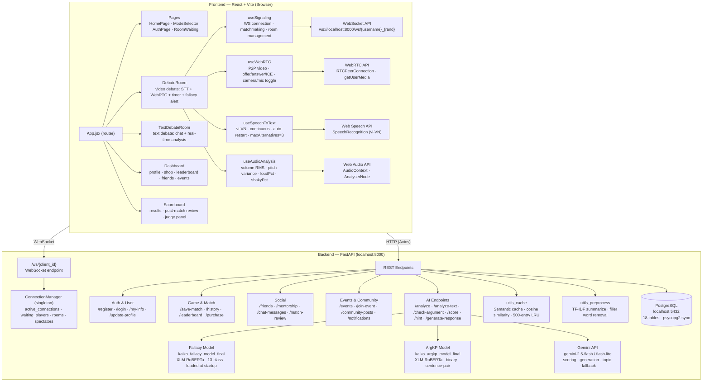

---

---

## 4. Data Design

```mermaid
erDiagram
    users {
        string username PK
        string password_hash
        string nickname
        int store_points
        int level_real
        int checkin_streak
        int consecutive_losses
    }
    match_history {
        int id PK
        string username FK
        string opponent FK
        string topic
        string mode
        string result
        int score_self
        int score_opp
        int fallacies_self
        int fallacies_opp
        string summary
        string played_at
    }
    friends {
        int id PK
        string user1 FK
        string user2 FK
        int debate_count
    }
    friend_requests {
        int id PK
        string sender FK
        string receiver FK
    }
    user_items {
        int id PK
        string username FK
        string item_id
        string purchased_at
    }
    events {
        int id PK
        string title
        string description
        string status
        string event_type
        string deadline
    }
    event_participants {
        int id PK
        int event_id FK
        string username FK
        string submission_text
        string joined_at
    }
    submission_votes {
        int id PK
        int participant_id FK
        string voter_username FK
        string voted_at
    }
    notifications {
        int id PK
        string username FK
        string type
        string message
        boolean is_read
        string created_at
    }
    user_achievements {
        int id PK
        string username FK
        string achievement_id
        string unlocked_at
    }
    mentorship {
        int id PK
        string master FK
        string disciple FK
        boolean is_graduated
        int debate_count
        string start_date
    }
    mentorship_requests {
        int id PK
        string master FK
        string disciple FK
        string created_at
    }
    community_posts {
        int id PK
        string username FK
        string content
        int likes
        string created_at
    }
    post_comments {
        int id PK
        int post_id FK
        string username FK
        string content
        string created_at
    }
    match_reviews {
        int id PK
        int match_id FK
        string reviewer FK
        string reviewee FK
        int rating
        int reviewer_level
        int level_bonus
        string created_at
    }
    judge_actions {
        int id PK
        string judge FK
        string target FK
        string action_type
        int score_delta
        int level_delta
        string reason
        string created_at
    }
    user_daily_comments {
        int id PK
        string username FK
        string comment_date
        int count
    }
    chat_messages {
        int id PK
        string sender FK
        string target
        string message
        string created_at
    }

    users ||--o{ match_history : "plays"
    users ||--o{ user_items : "owns"
    users ||--o{ notifications : "receives"
    users ||--o{ user_achievements : "earns"
    users ||--o{ community_posts : "writes"
    users ||--o{ post_comments : "posts"
    users ||--o{ user_daily_comments : "counted"
    users ||--o{ chat_messages : "sends"
    users ||--o{ match_reviews : "reviewer"
    users ||--o{ judge_actions : "judges"
    users ||--o{ friend_requests : "requests"
    users ||--o{ friends : "linked"
    users ||--o{ mentorship : "master-disciple"
    users ||--o{ mentorship_requests : "req-mentor"
    users ||--o{ event_participants : "joins"
    events ||--o{ event_participants : "has"
    event_participants ||--o{ submission_votes : "voted on"
    community_posts ||--o{ post_comments : "contains"
    match_history ||--o{ match_reviews : "reviewed in"
```

---

---

## 5. Interface Design

Section này đặc tả toàn bộ giao diện lập trình của KaiKo: **các REST API endpoint** (nhóm theo phân hệ) và **giao thức WebSocket** cho tính năng thời gian thực. Mọi response REST đều có field `success: boolean`; khi lỗi có thêm field `error`.

### 5.1 REST API — User Management & Game Core

#### Tổng quan

File này document **13 REST endpoints** phục vụ hai nhóm chức năng cốt lõi:

- **User Management** (đăng ký, đăng nhập, hồ sơ, mật khẩu, nickname)
- **Game Core** (checkin, phạt điểm, cửa hàng, lịch sử trận, bảng xếp hạng, thống kê ngụy biện)

Tất cả response đều có field `success: boolean`. Khi lỗi, field `error` chứa thông báo; khi thành công, field dữ liệu tùy endpoint.

---

#### Pydantic Models tham chiếu

```
AuthInput        { username: str, password: str }
NicknameUpdate   { username: str, nickname: str }
PasswordUpdate   { username: str, old_password: str, new_password: str }
UpdateProfile    { username: str, avatar: str, frame: str }
CheckinRequest   { username: str }
PenaltyRequest   { username: str }
PurchaseRequest  { username: str, item_id: str, price: int }
```

---

#### Danh sách Endpoints

| # | Method | Path | Pydantic Model |
|---|--------|------|----------------|
| 1 | POST | /register | AuthInput |
| 2 | POST | /login | AuthInput |
| 3 | POST | /set-nickname | NicknameUpdate |
| 4 | POST | /change-password | PasswordUpdate |
| 5 | GET | /nicknames | — |
| 6 | GET | /my-info/{username} | — |
| 7 | POST | /update-profile | UpdateProfile |
| 8 | POST | /checkin | CheckinRequest |
| 9 | POST | /deduct-penalty | PenaltyRequest |
| 10 | POST | /purchase | PurchaseRequest |
| 11 | GET | /history/{username}?limit=20 | — |
| 12 | GET | /leaderboard?limit=10 | — |
| 13 | GET | /fallacy-stats/{username} | — |

---

#### Chi tiết Endpoints

---

##### POST /register

**Mô tả:** Đăng ký tài khoản mới. Kiểm tra trùng `username`, hash password bằng SHA-256, lưu vào bảng `users`.

**Request body:**

| Field | Type | Required | Mô tả |
|-------|------|----------|-------|
| username | string | Có | Tên đăng nhập, phải là duy nhất trong hệ thống |
| password | string | Có | Mật khẩu plaintext, sẽ được hash trước khi lưu |

**Response (200 OK — thành công):**

| Field | Type | Mô tả |
|-------|------|-------|
| success | boolean | `true` khi đăng ký thành công |
| message | string | `"Đăng ký thành công"` |

**Response (error — vẫn trả HTTP 200):**

| HTTP Code | Điều kiện | Nội dung `error` |
|-----------|-----------|-----------------|
| 200 | `username` hoặc `password` rỗng | `"Vui lòng nhập đủ tên đăng nhập và mật khẩu"` |
| 200 | `username` đã tồn tại trong DB | `"Tài khoản đã tồn tại"` |

**Ví dụ:**

```json
// Request
{ "username": "alice", "password": "abc123" }

// Response — thành công
{ "success": true, "message": "Đăng ký thành công" }

// Response — tài khoản đã tồn tại
{ "success": false, "error": "Tài khoản đã tồn tại" }

// Response — thiếu field
{ "success": false, "error": "Vui lòng nhập đủ tên đăng nhập và mật khẩu" }
```

**Lưu ý thiết kế:**
- Password được hash bằng `hashlib.sha256(password.encode()).hexdigest()` trước khi lưu vào cột `password_hash`. Không dùng salt, không dùng bcrypt — đây là **known vulnerability** (xem ADR và Security section).
- INSERT dùng `ON CONFLICT DO NOTHING` nhưng đã check tồn tại trước → trả về lỗi rõ ràng hơn là silent ignore.
- Không có validation độ dài hoặc ký tự đặc biệt cho username/password ở tầng backend.

---

##### POST /login

**Mô tả:** Xác thực đăng nhập bằng cặp `username` + `password`. Trả về `username` nếu thành công (không sinh JWT hay session token).

**Request body:**

| Field | Type | Required | Mô tả |
|-------|------|----------|-------|
| username | string | Có | Tên đăng nhập |
| password | string | Có | Mật khẩu plaintext |

**Response (200 OK — thành công):**

| Field | Type | Mô tả |
|-------|------|-------|
| success | boolean | `true` |
| username | string | Username đã xác thực |

**Response (error):**

| HTTP Code | Điều kiện | Nội dung `error` |
|-----------|-----------|-----------------|
| 200 | Sai username hoặc password | `"Sai tài khoản hoặc mật khẩu"` |

**Ví dụ:**

```json
// Request
{ "username": "alice", "password": "abc123" }

// Response — thành công
{ "success": true, "username": "alice" }

// Response — sai thông tin
{ "success": false, "error": "Sai tài khoản hoặc mật khẩu" }
```

**Lưu ý thiết kế:**
- Cũng hash password bằng SHA-256 rồi so với `password_hash` trong DB.
- Hệ thống **không có JWT, không có session token**: sau khi login thành công, frontend lưu `username` vào `localStorage` và gửi kèm vào các request tiếp theo. Đây là thiết kế đơn giản phù hợp academic scope nhưng tiềm ẩn rủi ro IDOR (Insecure Direct Object Reference) — bất kỳ ai biết username đều có thể giả mạo request.

---

##### POST /set-nickname

**Mô tả:** Đặt hoặc đổi nickname hiển thị cho user. Lần đầu đặt là miễn phí. Đổi nickname lần tiếp theo yêu cầu phải có item `rename_card` trong kho đồ.

**Request body:**

| Field | Type | Required | Mô tả |
|-------|------|----------|-------|
| username | string | Có | Username của người dùng |
| nickname | string | Có | Nickname mới muốn đặt |

**Response (200 OK — thành công):**

| Field | Type | Mô tả |
|-------|------|-------|
| success | boolean | `true` |

**Response (error):**

| HTTP Code | Điều kiện | Nội dung `error` |
|-----------|-----------|-----------------|
| 200 | Đã có nickname và không có `rename_card` | `"Bạn cần mua Thẻ Đổi Nickname trong Cửa Hàng để đổi tên!"` |

**Ví dụ:**

```json
// Request — đặt nickname lần đầu
{ "username": "alice", "nickname": "AliceTheFighter" }

// Response — thành công
{ "success": true }

// Request — đổi nickname nhưng không có item
{ "username": "alice", "nickname": "AliceV2" }

// Response — thiếu item
{ "success": false, "error": "Bạn cần mua Thẻ Đổi Nickname trong Cửa Hàng để đổi tên!" }
```

**Lưu ý thiết kế:**
- Nếu `username` chưa tồn tại trong bảng `users` (trường hợp tích hợp Clerk Auth từ ngoài), endpoint sẽ tự INSERT row mới với `password_hash = 'clerk_auth'`.
- Khi đổi nickname thành công, item `rename_card` bị xoá khỏi `user_items` (tiêu thụ 1 lần dùng).
- Nickname được dùng thay thế username trong các màn hình public (leaderboard, chat) để ẩn username thật.

---

##### POST /change-password

**Mô tả:** Thay đổi mật khẩu sau khi xác thực mật khẩu cũ.

**Request body:**

| Field | Type | Required | Mô tả |
|-------|------|----------|-------|
| username | string | Có | Username của người dùng |
| old_password | string | Có | Mật khẩu hiện tại (plaintext) |
| new_password | string | Có | Mật khẩu mới (plaintext) |

**Response (200 OK — thành công):**

| Field | Type | Mô tả |
|-------|------|-------|
| success | boolean | `true` |

**Response (error):**

| HTTP Code | Điều kiện | Nội dung `error` |
|-----------|-----------|-----------------|
| 200 | Mật khẩu cũ không khớp | `"Mật khẩu cũ không chính xác!"` |

**Ví dụ:**

```json
// Request
{ "username": "alice", "old_password": "abc123", "new_password": "newSecure456" }

// Response — thành công
{ "success": true }

// Response — sai mật khẩu cũ
{ "success": false, "error": "Mật khẩu cũ không chính xác!" }
```

**Lưu ý thiết kế:**
- Cả `old_password` và `new_password` đều được hash SHA-256 trước khi xử lý.
- Không có validation độ phức tạp mật khẩu (minimum length, ký tự đặc biệt).

---

##### GET /nicknames

**Mô tả:** Lấy toàn bộ mapping `username → nickname` của tất cả user đã đặt nickname. Dùng để render tên hiển thị trên các màn hình public mà không cần gọi API riêng từng user.

**Query params:** Không có

**Response (200 OK):**

| Field | Type | Mô tả |
|-------|------|-------|
| success | boolean | `true` |
| nicknames | object | Dictionary dạng `{ "username": "nickname", ... }` — chỉ chứa user đã có nickname |

**Ví dụ:**

```json
// Request
GET /nicknames

// Response
{
  "success": true,
  "nicknames": {
    "alice": "AliceTheFighter",
    "bob123": "BobTheDebater",
    "charlie_dev": "CharlieGPT"
  }
}
```

**Lưu ý thiết kế:**
- Chỉ trả về user có `nickname IS NOT NULL AND nickname != ''`, loại bỏ các user chưa đặt nickname.
- Đây là endpoint không có auth — bất kỳ ai cũng có thể gọi. Phù hợp vì nickname là thông tin public.
- Khi số user lớn, response có thể phình to. Hiện tại không có pagination.

---

##### GET /my-info/{username}

**Mô tả:** Lấy toàn bộ thông tin profile của một user: điểm tích lũy, avatar, frame, level, chuỗi checkin, danh sách items, thành tích, và số thông báo chưa đọc.

**Path params:**

| Param | Type | Mô tả |
|-------|------|-------|
| username | string | Username của user |

**Response (200 OK):**

| Field | Type | Mô tả |
|-------|------|-------|
| success | boolean | `true` |
| store_points | integer | Điểm tích lũy (dùng trong cửa hàng), mặc định 0 |
| avatar | string | ID avatar đang dùng, rỗng nếu chưa chọn |
| frame | string | ID frame avatar, `"none"` nếu chưa có |
| level_real | integer | Level hiện tại trong hệ thống gamification [1–101] |
| checkin_streak | integer | Chuỗi checkin liên tiếp (ngày) |
| items | array[string] | Danh sách `item_id` đang sở hữu |
| achievements | array[string] | Danh sách `achievement_id` đã đạt được |
| unread_notifications | integer | Số thông báo chưa đọc |

**Ví dụ:**

```json
// Request
GET /my-info/alice

// Response
{
  "success": true,
  "store_points": 320,
  "avatar": "avatar_fire",
  "frame": "frame_gold",
  "level_real": 35,
  "checkin_streak": 7,
  "items": ["rename_card", "boost_xp"],
  "achievements": ["first_win", "debate_master"],
  "unread_notifications": 3
}
```

**Lưu ý thiết kế:**
- Endpoint này tổng hợp từ 4 bảng: `users`, `user_items`, `user_achievements`, `notifications` — 4 query riêng biệt (không JOIN).
- Nếu user chưa tồn tại trong DB, các field số trả về 0, field string trả về rỗng.

---

##### POST /update-profile

**Mô tả:** Cập nhật avatar và frame đang dùng cho user.

**Request body:**

| Field | Type | Required | Mô tả |
|-------|------|----------|-------|
| username | string | Có | Username của người dùng |
| avatar | string | Có | ID của avatar muốn dùng |
| frame | string | Có | ID của frame muốn dùng (`"none"` nếu không dùng frame) |

**Response (200 OK):**

| Field | Type | Mô tả |
|-------|------|-------|
| success | boolean | `true` |

**Ví dụ:**

```json
// Request
{ "username": "alice", "avatar": "avatar_fire", "frame": "frame_gold" }

// Response
{ "success": true }
```

**Lưu ý thiết kế:**
- Không có validation kiểm tra `avatar` và `frame` có hợp lệ hay không (tức là user có thực sự sở hữu item đó không). Frontend chịu trách nhiệm chỉ cho phép chọn item đang sở hữu.
- Không có response lỗi đặc biệt ngoài HTTP 500 nếu DB lỗi.

---

##### POST /checkin

**Mô tả:** Thực hiện điểm danh hằng ngày phía server, cộng **50 điểm tích lũy** vào `store_points` của user.

**Request body:**

| Field | Type | Required | Mô tả |
|-------|------|----------|-------|
| username | string | Có | Username của người dùng |

**Response (200 OK):**

| Field | Type | Mô tả |
|-------|------|-------|
| success | boolean | `true` |
| store_points | integer | Tổng điểm tích lũy sau khi checkin |

**Ví dụ:**

```json
// Request
{ "username": "alice" }

// Response
{ "success": true, "store_points": 370 }
```

**Lưu ý thiết kế:**
- Server **không kiểm tra đã checkin hôm nay chưa**. Logic chống checkin nhiều lần trong ngày được xử lý hoàn toàn ở phía frontend (localStorage).
- Nếu user chưa có trong bảng `users`, endpoint tự INSERT row mới (trường hợp guest/clerk user).
- Điểm cộng cố định là 50, không phụ thuộc streak. Cột `checkin_streak` được cập nhật bởi logic riêng ở frontend.

---

##### POST /deduct-penalty

**Mô tả:** Trừ **1 điểm tích lũy** khi user không bấm "Sẵn Sàng" đúng hạn trong trận. Điểm không được xuống dưới 0.

**Request body:**

| Field | Type | Required | Mô tả |
|-------|------|----------|-------|
| username | string | Có | Username của người dùng bị phạt |

**Response (200 OK):**

| Field | Type | Mô tả |
|-------|------|-------|
| success | boolean | `true` |

**Ví dụ:**

```json
// Request
{ "username": "alice" }

// Response
{ "success": true }
```

**Lưu ý thiết kế:**
- Username `"guest"` được miễn trừ — endpoint trả về `{ "success": true }` ngay lập tức không làm gì.
- Dùng `GREATEST(0, store_points - 1)` để đảm bảo điểm không âm.
- Không trả về số điểm còn lại sau khi trừ.

---

##### POST /purchase

**Mô tả:** Mua một vật phẩm trong cửa hàng bằng điểm tích lũy (`store_points`). Kiểm tra đủ điểm và chưa sở hữu item trước khi trừ điểm và lưu vào `user_items`.

**Request body:**

| Field | Type | Required | Mô tả |
|-------|------|----------|-------|
| username | string | Có | Username của người mua |
| item_id | string | Có | ID định danh vật phẩm (ví dụ: `"rename_card"`, `"boost_xp"`) |
| price | int | Có | Giá vật phẩm (điểm tích lũy), do frontend gửi lên |

**Response (200 OK — thành công):**

| Field | Type | Mô tả |
|-------|------|-------|
| success | boolean | `true` |
| remaining_points | integer | Số điểm tích lũy còn lại sau khi mua |

**Response (error):**

| HTTP Code | Điều kiện | Nội dung `error` |
|-----------|-----------|-----------------|
| 200 | Đã sở hữu item này | `"Bạn đã sở hữu vật phẩm này rồi!"` |
| 200 | Không đủ điểm | `"Không đủ điểm! Cần {price}, hiện có {current_points}."` |

**Ví dụ:**

```json
// Request
{ "username": "alice", "item_id": "rename_card", "price": 200 }

// Response — thành công
{ "success": true, "remaining_points": 120 }

// Response — đã có item
{ "success": false, "error": "Bạn đã sở hữu vật phẩm này rồi!" }

// Response — không đủ điểm
{ "success": false, "error": "Không đủ điểm! Cần 200, hiện có 50." }
```

**Lưu ý thiết kế:**
- `price` do **frontend gửi lên** và backend chỉ check `store_points >= price`. Không có bảng giá chuẩn ở phía backend → tiềm ẩn rủi ro nếu frontend bị giả mạo (gửi price=0).
- INSERT `user_items` dùng `ON CONFLICT DO NOTHING` nhưng đã kiểm tra tồn tại trước.
- Thời điểm mua (`purchased_at`) được lưu theo UTC.

---

##### GET /history/{username}

**Mô tả:** Lấy lịch sử các trận đấu đã chơi của một user, sắp xếp mới nhất lên đầu.

**Path params:**

| Param | Type | Mô tả |
|-------|------|-------|
| username | string | Username cần lấy lịch sử |

**Query params:**

| Param | Type | Default | Mô tả |
|-------|------|---------|-------|
| limit | integer | 20 | Số lượng trận tối đa trả về |

**Response (200 OK):**

| Field | Type | Mô tả |
|-------|------|-------|
| success | boolean | `true` |
| history | array[object] | Danh sách trận đấu (xem schema bên dưới) |

**Schema của mỗi phần tử trong `history`:**

| Field | Type | Mô tả |
|-------|------|-------|
| id | integer | ID trận đấu |
| opponent | string | Username đối thủ |
| topic | string | Chủ đề tranh biện |
| mode | string | Chế độ: `"1v1"`, `"text_1v1"`, `"2v2"`, `"solo_ai"` |
| result | string | Kết quả: `"win"`, `"lose"`, `"draw"` |
| score_self | integer | Điểm của user |
| score_opp | integer | Điểm của đối thủ |
| fallacies_self | integer | Số ngụy biện user mắc |
| fallacies_opp | integer | Số ngụy biện đối thủ mắc |
| summary | string | Tóm tắt trận đấu do AI tạo |
| played_at | string | Thời điểm chơi (UTC, format `YYYY-MM-DD HH:MM:SS`) |
| transcript_self | string | Transcript của user |
| transcript_opp | string | Transcript của đối thủ |
| visibility | string | `"public"` hoặc `"private"` |

**Ví dụ:**

```json
// Request
GET /history/alice?limit=2

// Response
{
  "success": true,
  "history": [
    {
      "id": 101,
      "opponent": "bob123",
      "topic": "AI có thay thế con người không?",
      "mode": "1v1",
      "result": "win",
      "score_self": 82,
      "score_opp": 61,
      "fallacies_self": 1,
      "fallacies_opp": 3,
      "summary": "Alice lập luận chặt chẽ, Bob mắc lỗi ad hominem 2 lần.",
      "played_at": "2025-05-20 14:30:00",
      "transcript_self": "Tôi cho rằng AI không thể...",
      "transcript_opp": "Bạn hoàn toàn sai khi...",
      "visibility": "public"
    }
  ]
}
```

**Lưu ý thiết kế:**
- Không có pagination (chỉ có `limit`). Các trận cũ hơn không truy xuất được nếu vượt quá limit.
- `transcript_self` và `transcript_opp` có thể rất dài nếu trận kéo dài — có thể ảnh hưởng performance khi limit lớn.

---

##### GET /leaderboard

**Mô tả:** Lấy bảng xếp hạng người chơi. Ưu tiên sắp xếp theo **số trận thắng** (wins), sau đó theo **điểm trung bình** (avg_score) — chỉ tính các trận có điểm > 0 để tránh làm loãng điểm trung bình.

**Query params:**

| Param | Type | Default | Mô tả |
|-------|------|---------|-------|
| limit | integer | 10 | Số lượng user tối đa trả về |

**Response (200 OK):**

| Field | Type | Mô tả |
|-------|------|-------|
| success | boolean | `true` |
| leaderboard | array[object] | Danh sách user xếp hạng (xem schema) |

**Schema mỗi phần tử trong `leaderboard`:**

| Field | Type | Mô tả |
|-------|------|-------|
| username | string | Username của player |
| total_matches | integer | Tổng số trận đã chơi |
| wins | integer | Số trận thắng |
| losses | integer | Số trận thua |
| avg_score | float | Điểm trung bình (chỉ tính trận score > 0), `0` nếu chưa có trận nào có điểm |

**Ví dụ:**

```json
// Request
GET /leaderboard?limit=3

// Response
{
  "success": true,
  "leaderboard": [
    { "username": "alice", "total_matches": 50, "wins": 35, "losses": 12, "avg_score": 78.5 },
    { "username": "charlie_dev", "total_matches": 40, "wins": 28, "losses": 10, "avg_score": 81.2 },
    { "username": "bob123", "total_matches": 30, "wins": 20, "losses": 8, "avg_score": 65.0 }
  ]
}
```

**Lưu ý thiết kế:**
- Điểm trung bình được tính bằng `AVG(CASE WHEN score_self > 0 THEN score_self ELSE NULL END)` — loại trừ trận 0 điểm (trận chưa chấm hoặc AI solo không scoring).
- Không lọc theo `visibility` — tất cả trận (kể cả private) đều tính vào leaderboard.
- Nickname không được trả về trong response này — frontend cần kết hợp với `/nicknames` để hiển thị tên.

---

##### GET /fallacy-stats/{username}

**Mô tả:** Thống kê các loại ngụy biện mà user hay mắc phải, tổng hợp từ toàn bộ lịch sử trận đấu. Dùng để hiển thị "điểm yếu" của user và gợi ý cải thiện.

**Path params:**

| Param | Type | Mô tả |
|-------|------|-------|
| username | string | Username cần thống kê |

**Response (200 OK):**

| Field | Type | Mô tả |
|-------|------|-------|
| success | boolean | `true` |
| stats | object | Dictionary dạng `{ "tên_ngụy_biện": số_lần, ... }` |

**Ví dụ:**

```json
// Request
GET /fallacy-stats/alice

// Response
{
  "success": true,
  "stats": {
    "ad hominem": 5,
    "false causality": 3,
    "appeal to emotion": 2,
    "faulty generalization": 1
  }
}
```

**Lưu ý thiết kế:**
- Dữ liệu lấy từ cột `fallacies_list_self` trong bảng `match_history`, được lưu dưới dạng chuỗi phân cách bởi dấu phẩy (ví dụ: `"ad hominem,false causality,ad hominem"`).
- Nếu user chưa có trận nào hoặc không mắc ngụy biện, trả về `{ "stats": {} }`.
- **13 nhãn ngụy biện** có thể xuất hiện trong stats: `ad hominem`, `ad populum`, `appeal to emotion`, `circular reasoning`, `equivocation`, `fallacy of credibility`, `fallacy of extension`, `fallacy of relevance`, `false causality`, `false dilemma`, `faulty generalization`, `intentional`. (`fallacy of logic` = không có ngụy biện — không được lưu vào stats.)

---

#### Ghi chú chung về thiết kế API

**Xử lý lỗi:**  
Tất cả endpoints đều trả về HTTP 200 kể cả khi có lỗi nghiệp vụ (business logic error). Phân biệt thành công/thất bại qua field `success`. Chỉ có lỗi server nội bộ (DB crash, exception) mới trả HTTP 500.

**Authentication:**  
Không có middleware authentication. Các endpoint tin tưởng `username` được gửi trong request body hoặc path parameter. Đây là **thiết kế phù hợp cho academic scope** nhưng cần thêm JWT middleware trước khi production.

**Database:**  
Mỗi request mở một connection riêng (`get_db()`) và đóng sau khi xong (`conn.close()`). Không dùng connection pool — đây là known limitation cần cải thiện (xem Security & NFR section).

**Encoding:**  
Tất cả string sử dụng UTF-8. Dữ liệu tiếng Việt được lưu và trả về trực tiếp.

### 5.2 REST API — Social System

#### Tổng quan

File này document **19 REST API endpoints** thuộc hệ thống xã hội (Social System) của KaiKo, bao gồm các nhóm chức năng:

| Nhóm | Số endpoint | Mô tả |
|------|-------------|-------|
| Friends (Bạn bè) | 5 | Quản lý kết bạn, lời mời, xóa bạn |
| Mentorship (Sư Đồ) | 4 | Hệ thống bái sư, duyệt yêu cầu, xem danh sách |
| Chat | 2 | Lịch sử tin nhắn, preview tin nhắn cuối |
| Kết quả + Đánh giá | 3 | Lưu kết quả trận, review đối thủ, nhờ trợ giúp |
| Judge — Level 101 | 2 | Điều chỉnh điểm, bảo kê đệ tử |
| Notifications | 2 | Lấy thông báo, đánh dấu đã đọc |
| Announcements | 1 | Thông báo server-wide |

**Base URL:** `http://localhost:8000`  
**Content-Type:** `application/json`  
**Authentication:** Không có JWT/Token — endpoints tin tưởng `username` trong request body (xem Security Note ở cuối file).

---

#### Pydantic Models tham chiếu

```python
class FriendAction(BaseModel):
    user: str       # Người thực hiện hành động
    target: str     # Người bị tác động

class MentorshipRequest(BaseModel):
    master: str     # Sư phụ
    disciple: str   # Đệ tử

class SaveMatch(BaseModel):
    username: str
    opponent: str
    topic: str
    mode: str
    result: str     # "win" | "lose" | "draw"
    score_self: int
    score_opp: int
    fallacies_self: int
    fallacies_opp: int
    fallacies_list_self: list[str]
    fallacies_list_opp: list[str]
    summary: str
    transcript_self: str
    transcript_opp: str

class MatchReviewInput(BaseModel):
    reviewer: str
    reviewee: str
    rating: int          # 1–5
    comment: str
    match_id: Optional[int]

class HelpRequestInput(BaseModel):
    from_user: str
    to_user: str
    topic: str
    mode: str

class JudgeScoreInput(BaseModel):
    judge: str
    target: str
    score_delta: int     # Phạm vi -10 đến +10
    reason: str

class JudgeProtectInput(BaseModel):
    judge: str
    disciple: str
    reason: str
```

---

#### PHẦN 1: FRIENDS (Bạn Bè)

---

##### GET /friends/{username}

**Mô tả:** Lấy danh sách bạn bè hiện tại và các lời mời kết bạn đang chờ xử lý của `username`.

**Path parameter:**
| Tham số | Type | Mô tả |
|---------|------|-------|
| username | string | Tên đăng nhập của người dùng |

**Không có Request body.**

**Response (200 OK):**
| Field | Type | Mô tả |
|-------|------|-------|
| success | boolean | Luôn `true` |
| friends | array | Danh sách bạn bè, mỗi phần tử gồm `username` và `debate_count` |
| friends[].username | string | Tên đăng nhập của bạn |
| friends[].debate_count | integer | Số trận đã debate cùng nhau |
| requests | array of string | Danh sách username đã gửi lời mời kết bạn cho `username` (đang chờ duyệt) |

**Ví dụ:**
```json
// Response
{
  "success": true,
  "friends": [
    { "username": "alice", "debate_count": 12 },
    { "username": "bob", "debate_count": 3 }
  ],
  "requests": ["charlie", "dave"]
}
```

**Lưu ý thiết kế:** `debate_count` được cộng dồn trong bảng `friends` mỗi khi hai người chơi này kết thúc một trận. Khi đạt đúng 50 trận, cả hai tự động nhận danh hiệu "Bạn Thân Tri Kỷ" và thông báo hệ thống. `requests` là lời mời **người khác gửi đến** `username` — tức là `username` là người cần duyệt.

---

##### POST /friend-request

**Mô tả:** Gửi lời mời kết bạn. Hỗ trợ tìm kiếm theo cả `username` lẫn `nickname`. Giới hạn tối đa 100 bạn bè/người.

**Request body:**
| Field | Type | Required | Mô tả |
|-------|------|----------|-------|
| user | string | Có | Username của người gửi lời mời |
| target | string | Có | Username hoặc nickname của người nhận |

**Response (200 OK — thành công):**
| Field | Type | Mô tả |
|-------|------|-------|
| success | boolean | `true` khi gửi thành công |

**Response (200 OK — thất bại):**
| HTTP Code | Điều kiện | error |
|-----------|-----------|-------|
| 200 | `user == target` | "Không thể tự kết bạn" |
| 200 | `target` không tồn tại | "Người chơi không tồn tại" |
| 200 | `user` đã có ≥ 100 bạn | "Bạn đã đạt giới hạn tối đa 100 bạn bè." |
| 200 | `target` đã có ≥ 100 bạn | "Người này đã đạt giới hạn tối đa 100 bạn bè." |
| 200 | Đã là bạn bè | "Đã là bạn bè" |

**Ví dụ:**
```json
// Request — gửi theo nickname
{ "user": "alice", "target": "KingDebater" }

// Response success
{ "success": true }

// Response error — hết chỗ
{ "success": false, "error": "Bạn đã đạt giới hạn tối đa 100 bạn bè." }
```

**Lưu ý thiết kế:** Endpoint gọi hàm `resolve_public_user_identifier()` để resolve `target` — trước tiên tìm theo `nickname` trong bảng `users`, nếu không có thì tìm theo `username` (chỉ những user chưa có nickname). Điều này bảo vệ privacy: user có nickname sẽ không thể bị tìm kiếm bằng username gốc của họ. Lời mời được lưu vào bảng `friend_requests` với ràng buộc `UNIQUE(sender, receiver)`.

---

##### POST /accept-friend

**Mô tả:** Chấp nhận lời mời kết bạn. Chuyển trạng thái từ `friend_requests` sang `friends`.

**Request body:**
| Field | Type | Required | Mô tả |
|-------|------|----------|-------|
| user | string | Có | Username người nhận lời mời (người đang duyệt) |
| target | string | Có | Username người đã gửi lời mời |

**Response (200 OK):**
| Field | Type | Mô tả |
|-------|------|-------|
| success | boolean | `true` nếu thành công |

**Response (error):**
| HTTP Code | Điều kiện | error |
|-----------|-----------|-------|
| 200 | `user` đã có ≥ 100 bạn | "Bạn đã đạt giới hạn tối đa 100 bạn bè." |

**Ví dụ:**
```json
// Request — alice chấp nhận lời mời từ charlie
{ "user": "alice", "target": "charlie" }

// Response
{ "success": true }
```

**Lưu ý thiết kế:** Khi chấp nhận, bản ghi `friend_requests` bị xóa (`DELETE`) và một bản ghi mới được thêm vào bảng `friends`. Giới hạn 100 bạn chỉ kiểm tra phía `user` (người duyệt), không kiểm tra lại phía `target`.

---

##### POST /decline-friend

**Mô tả:** Từ chối lời mời kết bạn. Xóa bản ghi khỏi bảng `friend_requests`.

**Request body:**
| Field | Type | Required | Mô tả |
|-------|------|----------|-------|
| user | string | Có | Username người nhận lời mời (người từ chối) |
| target | string | Có | Username người đã gửi lời mời |

**Response (200 OK):**
| Field | Type | Mô tả |
|-------|------|-------|
| success | boolean | Luôn `true` (ngay cả khi lời mời không tồn tại) |

**Ví dụ:**
```json
// Request
{ "user": "alice", "target": "charlie" }

// Response
{ "success": true }
```

**Lưu ý thiết kế:** Endpoint thực hiện `DELETE` trực tiếp, không kiểm tra sự tồn tại của lời mời trước. Nếu lời mời đã bị xóa từ trước (race condition), vẫn trả `success: true`.

---

##### POST /remove-friend

**Mô tả:** Xóa bạn bè. Gỡ mối quan hệ bạn bè giữa hai người.

**Request body:**
| Field | Type | Required | Mô tả |
|-------|------|----------|-------|
| user | string | Có | Username người thực hiện xóa |
| target | string | Có | Username người bạn cần xóa |

**Response (200 OK):**
| Field | Type | Mô tả |
|-------|------|-------|
| success | boolean | Luôn `true` |

**Ví dụ:**
```json
// Request
{ "user": "alice", "target": "bob" }

// Response
{ "success": true }
```

**Lưu ý thiết kế:** Query `DELETE` xử lý cả hai chiều: `(user1=user AND user2=target) OR (user1=target AND user2=user)`. Khi xóa bạn, `debate_count` giữa hai người cũng bị mất. Không có cơ chế khóa thời gian hay xác nhận 2 bước.

---

#### PHẦN 2: MENTORSHIP (Sư Đồ)

---

##### POST /mentorship/request

**Mô tả:** Đệ tử gửi yêu cầu bái sư. Tạo bản ghi trong `mentorship_requests` và gửi notification cho sư phụ.

**Request body:**
| Field | Type | Required | Mô tả |
|-------|------|----------|-------|
| master | string | Có | Username người được bái làm sư phụ |
| disciple | string | Có | Username người muốn bái sư (đệ tử) |

**Response (200 OK — thành công):**
| Field | Type | Mô tả |
|-------|------|-------|
| success | boolean | `true` |

**Response (200 OK — thất bại):**
| HTTP Code | Điều kiện | error |
|-----------|-----------|-------|
| 200 | Đã có quan hệ sư đồ tồn tại (cả hai chiều) | "Đã có quan hệ sư đồ!" |
| 200 | Đã gửi yêu cầu trước đó (UNIQUE constraint) | "Đã gửi yêu cầu bái sư trước đó hoặc có lỗi." |

**Ví dụ:**
```json
// Request — charlie muốn bái alice làm sư phụ
{ "master": "alice", "disciple": "charlie" }

// Response success
{ "success": true }

// Response error — đã có quan hệ
{ "success": false, "error": "Đã có quan hệ sư đồ!" }
```

**Lưu ý thiết kế:** Hệ thống kiểm tra cả hai chiều trong bảng `mentorship` (cả `master=alice, disciple=charlie` lẫn `master=charlie, disciple=alice`) để tránh quan hệ vòng tròn sư đồ. Bảng `mentorship_requests` có ràng buộc `UNIQUE(master, disciple)`.

---

##### POST /mentorship/accept

**Mô tả:** Sư phụ duyệt chấp nhận yêu cầu bái sư. Chuyển từ `mentorship_requests` sang `mentorship`.

**Request body:**
| Field | Type | Required | Mô tả |
|-------|------|----------|-------|
| master | string | Có | Username sư phụ đang duyệt |
| disciple | string | Có | Username đệ tử được chấp nhận |

**Response (200 OK):**
| Field | Type | Mô tả |
|-------|------|-------|
| success | boolean | `true` nếu thành công |
| error | string | Mô tả lỗi nếu `success: false` |

**Ví dụ:**
```json
// Request
{ "master": "alice", "disciple": "charlie" }

// Response
{ "success": true }
```

**Lưu ý thiết kế:** Sau khi chấp nhận, bản ghi trong `mentorship` có `is_graduated = FALSE` và `debate_count = 0`. Quan hệ tự động "xuất sư" (`is_graduated = TRUE`) khi hai thầy trò hoàn thành đủ 20 trận debate cùng nhau (logic trong `POST /save-match`).

---

##### POST /mentorship/decline

**Mô tả:** Sư phụ từ chối yêu cầu bái sư. Xóa bản ghi khỏi `mentorship_requests`.

**Request body:**
| Field | Type | Required | Mô tả |
|-------|------|----------|-------|
| master | string | Có | Username sư phụ từ chối |
| disciple | string | Có | Username đệ tử bị từ chối |

**Response (200 OK):**
| Field | Type | Mô tả |
|-------|------|-------|
| success | boolean | `true` nếu thành công |

**Ví dụ:**
```json
// Request
{ "master": "alice", "disciple": "dave" }

// Response
{ "success": true }
```

---

##### GET /mentorship/{username}

**Mô tả:** Lấy toàn bộ thông tin mentorship của một user: danh sách đệ tử, danh sách sư phụ, và các yêu cầu bái sư đang chờ duyệt.

**Path parameter:**
| Tham số | Type | Mô tả |
|---------|------|-------|
| username | string | Tên đăng nhập cần tra cứu |

**Response (200 OK):**
| Field | Type | Mô tả |
|-------|------|-------|
| success | boolean | `true` |
| disciples | array | Danh sách bản ghi mentorship mà `username` là `master` |
| disciples[].id | integer | ID bản ghi |
| disciples[].master | string | Username sư phụ |
| disciples[].disciple | string | Username đệ tử |
| disciples[].start_date | string | Ngày bắt đầu (UTC ISO string) |
| disciples[].is_graduated | boolean | Đã xuất sư chưa |
| disciples[].debate_count | integer | Số trận đã debate cùng |
| masters | array | Danh sách bản ghi mentorship mà `username` là `disciple` |
| requests | array of string | Danh sách username muốn bái `username` làm sư phụ (đang chờ duyệt) |

**Ví dụ:**
```json
// Response cho alice (đang có 1 đệ tử, 1 sư phụ, 1 yêu cầu mới)
{
  "success": true,
  "disciples": [
    {
      "id": 5,
      "master": "alice",
      "disciple": "charlie",
      "start_date": "2025-01-10 08:00:00",
      "is_graduated": false,
      "debate_count": 14
    }
  ],
  "masters": [
    {
      "id": 2,
      "master": "sensei_pro",
      "disciple": "alice",
      "start_date": "2024-12-01 12:00:00",
      "is_graduated": false,
      "debate_count": 7
    }
  ],
  "requests": ["dave"]
}
```

**Lưu ý thiết kế:** `requests` chỉ trả về danh sách `disciple` đang muốn bái `username` làm sư phụ (không trả về yêu cầu ngược lại). Frontend phân biệt vai trò sư phụ/đệ tử dựa vào `username` trùng với trường `master` hay `disciple` trong response.

---

#### PHẦN 3: CHAT

---

##### GET /chat-messages/{target}

**Mô tả:** Lấy lịch sử tin nhắn. `target='global'` trả về 100 tin nhắn global chat gần nhất (ngược thứ tự). `target=<username>` trả về 100 tin nhắn DM giữa hai người theo thứ tự tăng dần.

**Path parameter:**
| Tham số | Type | Mô tả |
|---------|------|-------|
| target | string | `'global'` hoặc username của người nhận |

**Query parameter:**
| Tham số | Type | Required | Mô tả |
|---------|------|----------|-------|
| username | string | Chỉ khi `target != 'global'` | Username của người gửi request (để lọc DM) |

**Response (200 OK):**
| Field | Type | Mô tả |
|-------|------|-------|
| success | boolean | `true` |
| messages | array | Danh sách tin nhắn |
| messages[].sender | string | Username người gửi |
| messages[].text | string | Nội dung tin nhắn |
| messages[].timestamp | string | Thời gian gửi (UTC ISO string) |

**Response (error):**
| HTTP Code | Điều kiện | error |
|-----------|-----------|-------|
| 200 | `target != 'global'` nhưng thiếu `username` | "Missing username" |

**Ví dụ:**
```json
// GET /chat-messages/global
{
  "success": true,
  "messages": [
    { "sender": "alice", "text": "Mọi người ơi!", "timestamp": "2025-06-01 09:00:00" },
    { "sender": "bob", "text": "Ai muốn debate không?", "timestamp": "2025-06-01 09:01:00" }
  ]
}

// GET /chat-messages/bob?username=alice
{
  "success": true,
  "messages": [
    { "sender": "alice", "text": "Bob ơi, debate nhé?", "timestamp": "2025-06-01 10:00:00" },
    { "sender": "bob", "text": "Ok, 8 giờ tối!", "timestamp": "2025-06-01 10:02:00" }
  ]
}
```

**Lưu ý thiết kế:** Global chat lấy 100 tin nhắn mới nhất theo `ORDER BY id DESC` rồi đảo ngược ở tầng Python để hiển thị đúng thứ tự thời gian. DM lấy trực tiếp `ORDER BY id ASC`. Tin nhắn DM được lưu khi client gửi message type `"chat"` qua WebSocket với `target` là username cụ thể (không phải `'global'`).

---

##### GET /chat-friends-preview/{username}

**Mô tả:** Lấy danh sách bạn bè kèm tin nhắn cuối cùng giữa `username` và mỗi người bạn. Dùng để render danh sách inbox.

**Path parameter:**
| Tham số | Type | Mô tả |
|---------|------|-------|
| username | string | Tên đăng nhập cần lấy preview |

**Response (200 OK):**
| Field | Type | Mô tả |
|-------|------|-------|
| success | boolean | `true` |
| data | array | Danh sách preview, một phần tử mỗi người bạn |
| data[].friend | string | Username của người bạn |
| data[].lastMessage | object \| null | Tin nhắn cuối cùng, hoặc `null` nếu chưa nhắn |
| data[].lastMessage.sender | string | Người gửi tin nhắn cuối |
| data[].lastMessage.text | string | Nội dung tin nhắn cuối |
| data[].lastMessage.timestamp | string | Thời gian (UTC ISO string) |

**Ví dụ:**
```json
{
  "success": true,
  "data": [
    {
      "friend": "bob",
      "lastMessage": {
        "sender": "alice",
        "text": "Chúc mừng bạn thắng trận!",
        "timestamp": "2025-06-01 10:30:00"
      }
    },
    {
      "friend": "charlie",
      "lastMessage": null
    }
  ]
}
```

**Lưu ý thiết kế:** Endpoint thực hiện N+1 query (một query tổng quát lấy danh sách bạn, rồi vòng lặp từng bạn để lấy tin nhắn cuối). Với giới hạn 100 bạn bè, đây chấp nhận được ở quy mô academic. Production cần refactor thành một CTE/subquery duy nhất.

---

#### PHẦN 4: KẾT QUẢ + ĐÁNH GIÁ

---

##### POST /save-match

**Mô tả:** Lưu kết quả một trận debate vào lịch sử, cộng điểm tích lũy (`store_points`), tính toán level mới theo hệ thống phân cấp, kiểm tra thành tích (achievements), và cập nhật các quan hệ xã hội (friends, mentorship).

**Request body:**
| Field | Type | Required | Mô tả |
|-------|------|----------|-------|
| username | string | Có | Username người chơi |
| opponent | string | Có | Username đối thủ (hoặc `"ai_bot"`) |
| topic | string | Có | Chủ đề tranh biện |
| mode | string | Có | Chế độ: `"1v1"`, `"text_1v1"`, `"solo_ai"`, `"2v2"` |
| result | string | Có | `"win"`, `"lose"`, hoặc `"draw"` |
| score_self | integer | Có | Điểm của người chơi (0–100) |
| score_opp | integer | Có | Điểm của đối thủ |
| fallacies_self | integer | Có | Số ngụy biện của người chơi |
| fallacies_opp | integer | Có | Số ngụy biện của đối thủ |
| fallacies_list_self | array of string | Không | Danh sách tên ngụy biện (EN) của người chơi |
| fallacies_list_opp | array of string | Không | Danh sách tên ngụy biện (EN) của đối thủ |
| summary | string | Có | Tóm tắt trận đấu từ AI scoring |
| transcript_self | string | Không | Toàn bộ transcript của người chơi |
| transcript_opp | string | Không | Toàn bộ transcript của đối thủ |

**Response (200 OK):**
| Field | Type | Mô tả |
|-------|------|-------|
| success | boolean | `true` |
| match_id | integer | ID của bản ghi vừa lưu trong `match_history` |
| level | integer | Level mới của người chơi sau khi tính toán |

**Ví dụ:**
```json
// Request
{
  "username": "alice",
  "opponent": "bob",
  "topic": "TikTok có nên bị cấm cho trẻ em dưới 16 tuổi?",
  "mode": "1v1",
  "result": "win",
  "score_self": 78,
  "score_opp": 65,
  "fallacies_self": 1,
  "fallacies_opp": 2,
  "fallacies_list_self": ["ad hominem"],
  "fallacies_list_opp": ["false dilemma", "ad populum"],
  "summary": "Alice đã có lập luận logic hơn...",
  "transcript_self": "TikTok với trẻ em...",
  "transcript_opp": "Không nên cấm vì..."
}

// Response
{
  "success": true,
  "match_id": 1024,
  "level": 15
}
```

**Lưu ý thiết kế — Logic tính điểm (`store_points`):**
- **Video/1v1 thắng:** +5 điểm
- **Text debate thắng (mode bắt đầu bằng `text_`):** +3 điểm
- **Video/1v1 hòa:** +1 điểm
- **Text debate hòa:** +0 điểm
- **Thua:** không cộng điểm

**Lưu ý thiết kế — Hệ thống Level-Up (5 dải):**

| Dải level | Điều kiện tăng (+1) | Điều kiện giảm | Ghi chú |
|-----------|---------------------|----------------|---------|
| 1–9 | `score_self > max_score_lịch_sử` HOẶC `result == 'win'` | Không giảm | Dải khởi động — dễ tăng |
| 10–29 | `score_self ≥ prev_score + 2` VÀ `result == 'win'` | Không giảm | Phải cải thiện đáng kể |
| 30–59 | `score_self > prev_score` VÀ `event_count ≥ 1` | Không giảm | Bắt buộc tham gia ít nhất 1 event |
| 60–89 | `score_self > prev_score` VÀ `event_count ≥ 2` | 3 thua liên tiếp → −1 (không xuống dưới 60) | Vùng cạnh tranh cao |
| 90–99 | `result == 'win'` VÀ `event_count ≥ 3` | `result == 'lose'` → −1 (không xuống dưới 90) | Vùng elite — mỗi thua đều có hậu quả |

Level được clamp trong phạm vi `[1, 101]`. Level 101 là đặc biệt (Judge) — không tăng thêm.

**Lưu ý thiết kế — Side effects quan trọng:**
1. **Friends milestone:** Khi `debate_count` giữa hai người bạn đạt đúng 50, cả hai nhận danh hiệu item `'title_banthan'` và notification.
2. **Mentorship xuất sư:** Khi `debate_count` trong `mentorship` đạt ≥ 20, quan hệ tự động chuyển `is_graduated = TRUE`, cả hai nhận notification.
3. **Achievements:** Kiểm tra và unlock: `first_win` (chiến thắng đầu tiên), `win_10` (10 chiến thắng), `perfect_logic` (0 ngụy biện), `perfect_score` (điểm ≥ 100).

---

##### POST /match-review

**Mô tả:** Đánh giá đối thủ sau trận bằng thang điểm 1–5 sao. Nếu reviewer có level đủ cao và cho rating ≥ 4 sao, người được đánh giá nhận bonus level.

**Request body:**
| Field | Type | Required | Mô tả |
|-------|------|----------|-------|
| reviewer | string | Có | Username người đánh giá |
| reviewee | string | Có | Username người được đánh giá |
| rating | integer | Có | Điểm đánh giá: 1–5 (tự động clamp) |
| comment | string | Không | Nhận xét (tối đa 500 ký tự sau strip) |
| match_id | integer | Không | ID trận cụ thể; nếu không có sẽ tự tìm trận gần nhất |

**Response (200 OK):**
| Field | Type | Mô tả |
|-------|------|-------|
| success | boolean | `true` |
| level_bonus | integer | Số level thưởng cho `reviewee` (0, 1, 2, hoặc 3) |
| new_level | integer | Level mới của `reviewee` |

**Response (error):**
| HTTP Code | Điều kiện | error |
|-----------|-----------|-------|
| 200 | `reviewer == reviewee` | "Không thể tự đánh giá chính mình" |
| 200 | `reviewee` là `"ai_bot"` hoặc bắt đầu bằng `"Guest_"` | "Không thể đánh giá tài khoản này" |
| 200 | Đã đánh giá cặp `(match_id, reviewer, reviewee)` này rồi | "Bạn đã đánh giá người này cho trận đấu này rồi" |
| 200 | Không tìm thấy trận đấu phù hợp | "Không tìm thấy trận đấu để đánh giá" |

**Ví dụ:**
```json
// Request — alice đánh giá bob 5 sao sau trận
{
  "reviewer": "alice",
  "reviewee": "bob",
  "rating": 5,
  "comment": "Lập luận rất sắc bén!"
}

// Response (alice là Lv.75, rating=5 → bonus=1)
{
  "success": true,
  "level_bonus": 1,
  "new_level": 23
}
```

**Lưu ý thiết kế — Bảng bonus level theo reviewer:**

| Level của reviewer | Rating yêu cầu | Level bonus cho reviewee |
|-------------------|----------------|--------------------------|
| < 61 | Bất kỳ | 0 (không bonus) |
| 61–90 | ≥ 4 sao | +1 level |
| 91–100 | ≥ 4 sao | +2 level |
| 101 | ≥ 4 sao | +3 level |

Cơ chế này tạo ra giá trị xã hội: được đánh giá bởi player cấp cao là một phần thưởng có ý nghĩa. Ràng buộc `UNIQUE(match_id, reviewer, reviewee)` ngăn spam đánh giá.

---

##### POST /request-help

**Mô tả:** Nhờ bạn thân hỗ trợ trong khi đang tranh biện. Gửi tin nhắn DM kèm notification real-time qua WebSocket đến bạn bè được chọn.

**Request body:**
| Field | Type | Required | Mô tả |
|-------|------|----------|-------|
| from_user | string | Có | Username người nhờ giúp |
| to_user | string | Có | Username bạn thân được nhờ |
| topic | string | Có | Chủ đề tranh biện hiện tại |
| mode | string | Không | Chế độ đang chơi (default: `"1v1"`) |

**Response (200 OK):**
| Field | Type | Mô tả |
|-------|------|-------|
| success | boolean | `true` nếu gửi thành công |

**Response (error):**
| HTTP Code | Điều kiện | error |
|-----------|-----------|-------|
| 200 | Hai người chưa đủ 50 trận debate cùng nhau | "Chỉ có thể nhờ Bạn thân đã debate cùng ít nhất 50 trận." |

**Ví dụ:**
```json
// Request
{
  "from_user": "alice",
  "to_user": "bob",
  "topic": "TikTok có nên bị cấm cho trẻ em dưới 16 tuổi?",
  "mode": "1v1"
}

// Response success
{ "success": true }

// Response error
{ "success": false, "error": "Chỉ có thể nhờ Bạn thân đã debate cùng ít nhất 50 trận." }
```

**Lưu ý thiết kế:** Điều kiện "Bạn thân" (`debate_count ≥ 50`) được kiểm tra trong DB. Nếu hợp lệ, hệ thống: (1) lưu tin nhắn vào `chat_messages` với nội dung `"🆘 {from_user} cần bạn thân trợ giúp topic: {topic}"`, (2) tạo notification trong DB, (3) gửi real-time qua WebSocket nếu `to_user` đang online. Endpoint này là `async` để có thể await WebSocket push.

---

#### PHẦN 5: JUDGE — LEVEL 101

---

##### POST /judge/adjust-score

**Mô tả:** Giám khảo (Level 101) điều chỉnh điểm trận đấu gần nhất của một người chơi trong phạm vi ±10 điểm. Có thể gây thay đổi level nếu delta ≥ 5 hoặc ≤ -5.

**Request body:**
| Field | Type | Required | Mô tả |
|-------|------|----------|-------|
| judge | string | Có | Username giám khảo (phải là Level 101) |
| target | string | Có | Username người chơi bị điều chỉnh |
| score_delta | integer | Có | Lượng điểm điều chỉnh: clamp vào `[-10, +10]` |
| reason | string | Không | Lý do điều chỉnh (tối đa 500 ký tự) |

**Response (200 OK):**
| Field | Type | Mô tả |
|-------|------|-------|
| success | boolean | `true` |
| match_id | integer | ID trận vừa bị điều chỉnh |
| score | integer | Điểm mới của trận (sau điều chỉnh, clamp [0, 100]) |
| level_delta | integer | Thay đổi level: +1, -1 hoặc 0 |
| new_level | integer | Level mới của `target` |

**Response (error):**
| HTTP Code | Điều kiện | error |
|-----------|-----------|-------|
| 200 | `judge.level_real < 101` | "Chỉ Level 101 mới có quyền Giám khảo" |
| 200 | Không tìm thấy trận của `target` | "Không tìm thấy trận gần nhất của người chơi" |

**Ví dụ:**
```json
// Request — judge alice điều chỉnh +8 điểm cho bob
{
  "judge": "alice",
  "target": "bob",
  "score_delta": 8,
  "reason": "Điểm Gemini bị thiếu vì lỗi transcript"
}

// Response
{
  "success": true,
  "match_id": 1024,
  "score": 76,
  "level_delta": 1,
  "new_level": 24
}
```

**Lưu ý thiết kế:**
- `score_delta` được clamp về `[-10, +10]` bởi backend, bất kể client gửi giá trị nào.
- Điều chỉnh level theo quy tắc: `delta ≥ +5` → `level_delta = +1`; `delta ≤ -5` → `level_delta = -1`; `-4 đến +4` → `level_delta = 0`.
- Mọi hành động Judge được ghi vào bảng `judge_actions` để audit.
- Người chơi bị tác động nhận notification real-time trong DB.
- Điểm trận được clamp vào `[0, 100]` sau khi cộng delta.

---

##### POST /judge/protect-disciple

**Mô tả:** Sư phụ Level 101 "bảo kê" đệ tử đang học, tặng +2 level. Đệ tử phải còn trong quan hệ sư đồ chưa tốt nghiệp.

**Request body:**
| Field | Type | Required | Mô tả |
|-------|------|----------|-------|
| judge | string | Có | Username sư phụ (phải là Level 101) |
| disciple | string | Có | Username đệ tử cần bảo kê |
| reason | string | Không | Lý do bảo kê (tối đa 500 ký tự) |

**Response (200 OK):**
| Field | Type | Mô tả |
|-------|------|-------|
| success | boolean | `true` |
| new_level | integer | Level mới của đệ tử sau khi nhận +2 |

**Response (error):**
| HTTP Code | Điều kiện | error |
|-----------|-----------|-------|
| 200 | `judge.level_real < 101` | "Chỉ Level 101 mới có quyền bảo kê" |
| 200 | `disciple` không phải đệ tử đang học của `judge` | "Người này không phải đệ tử đang theo học của bạn" |

**Ví dụ:**
```json
// Request
{
  "judge": "sensei_pro",
  "disciple": "charlie",
  "reason": "Charlie thi đấu xuất sắc tuần này"
}

// Response
{
  "success": true,
  "new_level": 35
}
```

**Lưu ý thiết kế:** Điều kiện `is_graduated = FALSE` trong query đảm bảo chỉ áp dụng cho đệ tử còn đang học, không phải những người đã xuất sư. Bonus +2 level sử dụng hàm `apply_level_delta()` với ràng buộc `LEAST(101, GREATEST(1, ...))`. Hành động được ghi vào `judge_actions` và đệ tử nhận notification.

---

#### PHẦN 6: NOTIFICATIONS

---

##### GET /notifications/{username}

**Mô tả:** Lấy 20 thông báo mới nhất của người dùng, sắp xếp theo thứ tự mới nhất trước.

**Path parameter:**
| Tham số | Type | Mô tả |
|---------|------|-------|
| username | string | Tên đăng nhập cần lấy thông báo |

**Response (200 OK):**
| Field | Type | Mô tả |
|-------|------|-------|
| success | boolean | `true` |
| notifications | array | Danh sách tối đa 20 thông báo |
| notifications[].id | integer | ID thông báo |
| notifications[].username | string | Username chủ sở hữu |
| notifications[].type | string | Loại thông báo: `"system"`, `"review"`, `"judge"`, `"mentorship"`, `"help_request"` |
| notifications[].message | string | Nội dung thông báo |
| notifications[].is_read | boolean | Đã đọc hay chưa |
| notifications[].created_at | string | Thời gian tạo (UTC ISO string) |

**Ví dụ:**
```json
{
  "success": true,
  "notifications": [
    {
      "id": 501,
      "username": "alice",
      "type": "review",
      "message": "Đánh giá tốt từ người Lv.75 giúp bạn tăng 1 level!",
      "is_read": false,
      "created_at": "2025-06-01 14:30:00"
    },
    {
      "id": 498,
      "username": "alice",
      "type": "mentorship",
      "message": "charlie muốn bái bạn làm sư phụ!",
      "is_read": true,
      "created_at": "2025-05-30 10:00:00"
    }
  ]
}
```

**Lưu ý thiết kế:** Thông báo được tạo bởi nhiều endpoint khác nhau (save-match, match-review, request-help, judge actions, mentorship). Số thông báo chưa đọc được trả về tổng hợp trong endpoint `GET /my-info/{username}` (field `unread_notifications`) để hiển thị badge.

---

##### POST /notifications/read/{notif_id}

**Mô tả:** Đánh dấu một thông báo là đã đọc.

**Path parameter:**
| Tham số | Type | Mô tả |
|---------|------|-------|
| notif_id | integer | ID thông báo cần đánh dấu |

**Không có Request body.**

**Response (200 OK):**
| Field | Type | Mô tả |
|-------|------|-------|
| success | boolean | Luôn `true` (ngay cả khi `notif_id` không tồn tại) |

**Ví dụ:**
```json
// POST /notifications/read/501
{ "success": true }
```

**Lưu ý thiết kế:** Endpoint thực hiện `UPDATE notifications SET is_read=TRUE WHERE id=%s` không có điều kiện kiểm tra username — bất kỳ client nào biết `notif_id` đều có thể đánh dấu đã đọc. Đây là một IDOR vulnerability nhỏ được chấp nhận ở phạm vi academic (xem Security Note).

---

#### PHẦN 7: ANNOUNCEMENTS

---

##### GET /server-announcements

**Mô tả:** Lấy danh sách thông báo động cho toàn server, tổng hợp từ số liệu thực tế: top player, tổng số trận, tổng số người dùng.

**Không có tham số.**

**Response (200 OK):**
| Field | Type | Mô tả |
|-------|------|-------|
| success | boolean | `true` |
| announcements | array of string | Danh sách chuỗi thông báo hiển thị trên UI |

**Ví dụ:**
```json
{
  "success": true,
  "announcements": [
    "🌟 KaiKo Arena - Nơi tranh biện huyền thoại! Hiện có 1250 võ sĩ đang hành đạo",
    "⚔️ Tổng số trận đấu toàn server: 8432 trận - Chiến trường chưa bao giờ sôi động đến vậy!",
    "👑 Đại Cao Thủ đang dẫn đầu bảng xếp hạng: [grandmaster_vn] - Cấp 98",
    "🥊 Trận vừa kết thúc: alice đánh bại bob - Huyết chiến vừa tàn!",
    "🎓 Hệ thống Sư Đồ đã mở! Bái sư để nâng cao tu vi của bạn ngay hôm nay",
    "🦀 Huy hiệu 'Cua Hoàng Đế' đang chờ những tranh biện viên xuất sắc nhất",
    "🔥 Tính năng Chat Cộng Đồng mới ra mắt - Kết nối với các đạo hữu ngay bây giờ!"
  ]
}
```

**Lưu ý thiết kế:** Endpoint query bảng `users` và `match_history` để tính số liệu động. Tuy nhiên có một bug tiềm ẩn: query "Top player" dùng `ORDER BY level DESC, exp DESC` nhưng cột `exp` không tồn tại trong schema (schema chỉ có `level_real`) — nếu lỗi xảy ra, fallback trả về một thông báo chào mừng mặc định. Nếu `match_history` không có cột `winner`/`loser` (schema thực tế dùng `username`/`opponent`/`result`), phần "Trận vừa kết thúc" cũng có thể trả về `null`.

---

#### Security Note

> **Cảnh báo thiết kế (Academic scope):** Tất cả các endpoint trong file này sử dụng `username` trực tiếp từ request body mà không xác thực bằng token. Điều này có nghĩa là client A có thể gửi request với `username = "B"` để thực hiện hành động thay mặt B. Trong môi trường production, cần bổ sung JWT middleware hoặc session-based auth. Xem chi tiết tại Section 9 — Security Design của SDD.

---

*Tài liệu được tạo tự động từ mã nguồn `backend/main.py` của dự án KaiKo.*  
*Phiên bản tương ứng: KaiKo-main (commit tại thời điểm xuất file)*

### 5.3 REST API — Events & Community

#### Pydantic Models tham chiếu

| Model | Fields |
|-------|--------|
| `JoinEventRequest` | `username: str`, `event_id: int` |
| `EventSubmission` | `username: str`, `event_id: int`, `content: str` |
| `VoteSubmission` | `participant_id: int`, `voter_username: str` |
| `EventToggle` | `event_id: int`, `status: str` |
| `CommunityPostInput` | `username: str`, `content: str` |
| `CommunityCommentInput` | `username: str`, `content: str` |

---

#### 1. Events

---

##### GET /events

**Mô tả:** Lấy danh sách tất cả sự kiện (events) trong hệ thống, bao gồm trạng thái hiển thị thực tế. Event loại `large` sẽ bị khóa (`locked`) nếu vẫn còn ít nhất một event loại `small` đang ở trạng thái `open` hoặc `upcoming`.

**Request body:** Không có (GET request)

**Query params:** Không có

**Response (200 OK):**

| Field | Type | Mô tả |
|-------|------|-------|
| `success` | boolean | Luôn `true` |
| `events` | array | Danh sách event objects |
| `events[].id` | integer | ID của event |
| `events[].title` | string | Tên sự kiện |
| `events[].description` | string | Mô tả sự kiện |
| `events[].event_type` | string | `"small"` hoặc `"large"` |
| `events[].status` | string | `"open"` / `"upcoming"` / `"locked"` — xem Lưu ý thiết kế |
| `events[].created_at` | string | Timestamp tạo sự kiện |

**Ví dụ:**

```json
// Response (khi có small event đang open)
{
  "success": true,
  "events": [
    {
      "id": 1,
      "title": "Sự kiện Tranh Biện Tuần 1",
      "description": "Viết luận điểm về AI trong giáo dục",
      "event_type": "small",
      "status": "open",
      "created_at": "2024-01-10 08:00:00"
    },
    {
      "id": 2,
      "title": "Grand Tournament Tháng 1",
      "description": "Giải đấu lớn dành cho người chơi cấp cao",
      "event_type": "large",
      "status": "locked",
      "created_at": "2024-01-05 08:00:00"
    }
  ]
}
```

**Lưu ý thiết kế:**
- **Lock logic:** Server đếm số event `small` có `status IN ('open', 'upcoming')`. Nếu `count > 0`, tất cả event `large` sẽ bị gán `status = 'locked'` trong kết quả trả về (chỉ ghi đè in-memory, không thay đổi DB).
- **Thứ tự sắp xếp:** `ORDER BY event_type DESC, status ASC` — event `small` hiển thị trước, trong cùng loại thì `locked` cuối.
- Trường `status` trong response có thể khác với giá trị thực trong DB (do override `locked` logic).

---

##### POST /join-event

**Mô tả:** Cho phép người dùng đăng ký tham gia một sự kiện. Chỉ thành công khi event đang có `status = 'open'`.

**Request body:**

| Field | Type | Required | Mô tả |
|-------|------|----------|-------|
| `username` | string | Có | Username người dùng tham gia |
| `event_id` | integer | Có | ID của event muốn tham gia |

**Response (200 OK — thành công):**

| Field | Type | Mô tả |
|-------|------|-------|
| `success` | boolean | `true` |

**Response (200 OK — thất bại):**

| HTTP Code | Điều kiện | `error` |
|-----------|-----------|---------|
| 200 | Event không tồn tại hoặc `status != 'open'` | `"Sự kiện không tồn tại hoặc chưa mở."` |
| 200 | User đã tham gia event này rồi | `"Bạn đã tham gia sự kiện này rồi."` |

**Ví dụ:**

```json
// Request
{ "username": "alice", "event_id": 1 }

// Response thành công
{ "success": true }

// Response lỗi — event chưa mở
{ "success": false, "error": "Sự kiện không tồn tại hoặc chưa mở." }

// Response lỗi — đã tham gia
{ "success": false, "error": "Bạn đã tham gia sự kiện này rồi." }
```

**Lưu ý thiết kế:**
- Endpoint kiểm tra `status` của event trước khi insert. Event bị override `locked` ở GET /events thì thực tế `status` trong DB có thể là `open` — tuy nhiên logic join dựa trên giá trị DB thực tế, không phải giá trị đã override.
- Duplicate detection thông qua UNIQUE constraint trên bảng `event_participants(event_id, username)` — exception từ DB được bắt và trả về lỗi thân thiện.
- `joined_at` được ghi nhận theo UTC.

---

##### GET /my-events/{username}

**Mô tả:** Lấy danh sách `event_id` mà user đã đăng ký tham gia.

**Path params:**

| Param | Type | Mô tả |
|-------|------|-------|
| `username` | string | Username cần tra cứu |

**Response (200 OK):**

| Field | Type | Mô tả |
|-------|------|-------|
| `success` | boolean | `true` |
| `events` | array of integer | Danh sách `event_id` user đã join |

**Ví dụ:**

```json
// GET /my-events/alice

// Response
{
  "success": true,
  "events": [1, 3, 5]
}
```

**Lưu ý thiết kế:**
- Trả về mảng ID thuần (không phải object event đầy đủ) — client cần kết hợp với GET /events để lấy thông tin chi tiết.
- Dùng để frontend kiểm tra nhanh user đã join event nào, tô sáng nút "Đã tham gia".

---

##### POST /submit-event

**Mô tả:** Nộp (hoặc cập nhật) bài viết luận điểm cho một event mà user đã tham gia.

**Request body:**

| Field | Type | Required | Mô tả |
|-------|------|----------|-------|
| `username` | string | Có | Username người nộp bài |
| `event_id` | integer | Có | ID event tương ứng |
| `content` | string | Có | Nội dung bài viết luận điểm |

**Response (200 OK):**

| Field | Type | Mô tả |
|-------|------|-------|
| `success` | boolean | `true` |

**Ví dụ:**

```json
// Request
{
  "username": "alice",
  "event_id": 1,
  "content": "AI trong giáo dục mang lại lợi ích lớn vì..."
}

// Response
{ "success": true }
```

**Lưu ý thiết kế:**
- Endpoint dùng `UPDATE` thay vì `INSERT` — user phải đã có record trong `event_participants` (đã join event) thì bài mới được lưu. Nếu chưa join, `submission_text` sẽ không được cập nhật (UPDATE ảnh hưởng 0 row, vẫn trả `success: true`).
- Không có giới hạn độ dài content ở server — client nên tự kiểm soát (khuyến nghị tối đa 2000 ký tự).
- Gọi nhiều lần sẽ ghi đè bài cũ (upsert bằng UPDATE).

---

##### GET /event-submission/{event_id}/{username}

**Mô tả:** Xem nội dung bài nộp của một user cụ thể cho một event.

**Path params:**

| Param | Type | Mô tả |
|-------|------|-------|
| `event_id` | integer | ID của event |
| `username` | string | Username cần xem bài |

**Response (200 OK — có bài):**

| Field | Type | Mô tả |
|-------|------|-------|
| `success` | boolean | `true` |
| `content` | string | Nội dung bài nộp (có thể là `""` nếu chưa viết) |

**Response (200 OK — không tìm thấy):**

| HTTP Code | Điều kiện | `error` |
|-----------|-----------|---------|
| 200 | User chưa tham gia event | `"Not found"` |

**Ví dụ:**

```json
// GET /event-submission/1/alice

// Response có bài
{
  "success": true,
  "content": "AI trong giáo dục mang lại lợi ích lớn vì..."
}

// Response chưa join event
{ "success": false, "error": "Not found" }
```

**Lưu ý thiết kế:**
- Nếu user đã join nhưng chưa submit (`submission_text IS NULL`), `content` trả về `""` (empty string, do `... or ""`).
- Dùng cho tính năng "xem trước bài của người khác" hoặc load lại bài đang soạn.

---

##### GET /event-submissions-list/{event_id}

**Mô tả:** Lấy danh sách tất cả bài nộp của một event, bao gồm số lượt vote, sắp xếp theo số vote giảm dần.

**Path params:**

| Param | Type | Mô tả |
|-------|------|-------|
| `event_id` | integer | ID của event cần xem |

**Response (200 OK):**

| Field | Type | Mô tả |
|-------|------|-------|
| `success` | boolean | `true` |
| `submissions` | array | Danh sách bài nộp đã có nội dung |
| `submissions[].participant_id` | integer | ID của record trong `event_participants` |
| `submissions[].username` | string | Username người nộp |
| `submissions[].submission_text` | string | Nội dung bài viết |
| `submissions[].votes` | integer | Tổng số vote nhận được |

**Ví dụ:**

```json
// GET /event-submissions-list/1

{
  "success": true,
  "submissions": [
    {
      "participant_id": 42,
      "username": "bob",
      "submission_text": "Lập luận của tôi là...",
      "votes": 7
    },
    {
      "participant_id": 38,
      "username": "alice",
      "submission_text": "AI mang lại nhiều lợi ích...",
      "votes": 3
    }
  ]
}
```

**Lưu ý thiết kế:**
- Chỉ hiển thị bài có `submission_text IS NOT NULL AND submission_text != ''` — người join event nhưng chưa nộp bài sẽ không xuất hiện.
- Sắp xếp: ưu tiên `votes DESC`, rồi `joined_at DESC` (join muộn hơn hiển thị trước nếu hòa vote).
- `votes` được đếm trực tiếp từ bảng `submission_votes` (subquery `COUNT(*)`), luôn phản ánh số vote thực tế.

---

##### POST /vote-submission

**Mô tả:** Vote cho một bài nộp của event. Mỗi user được tối đa 10 lượt vote mỗi ngày và không thể tự vote cho bài của mình.

**Request body:**

| Field | Type | Required | Mô tả |
|-------|------|----------|-------|
| `participant_id` | integer | Có | ID của bài nộp (lấy từ GET /event-submissions-list) |
| `voter_username` | string | Có | Username người thực hiện vote |

**Response (200 OK — thành công):**

| Field | Type | Mô tả |
|-------|------|-------|
| `success` | boolean | `true` |
| `remaining_votes` | integer | Số lượt vote còn lại trong ngày (= 9 - số đã vote trước đó) |

**Response (200 OK — thất bại):**

| HTTP Code | Điều kiện | `error` |
|-----------|-----------|---------|
| 200 | Đã hết 10 lượt vote trong ngày | `"Bạn đã hết 10 lượt vote trong ngày hôm nay."` |
| 200 | Tự vote cho bài của mình | `"Bạn không thể tự vote cho chính mình."` |
| 200 | Đã vote cho bài này rồi | `"Bạn đã vote cho bài viết này rồi."` |

**Ví dụ:**

```json
// Request
{ "participant_id": 42, "voter_username": "alice" }

// Response thành công
{ "success": true, "remaining_votes": 8 }

// Response lỗi — hết lượt
{ "success": false, "error": "Bạn đã hết 10 lượt vote trong ngày hôm nay." }

// Response lỗi — tự vote
{ "success": false, "error": "Bạn không thể tự vote cho chính mình." }
```

**Lưu ý thiết kế:**
- **Daily limit:** Đếm theo `DATE(voted_at) = CURRENT_DATE` trong DB (timezone server). Giới hạn 10 vote/ngày tính trên tất cả bài của tất cả events, không phải per-event.
- **Self-vote check:** Server tra cứu `username` của `participant_id` trong bảng `event_participants`, so sánh với `voter_username`.
- **Duplicate vote:** Kiểm tra UNIQUE trên `(username, participant_id)` trong `submission_votes`.
- Thứ tự kiểm tra: daily limit → self-vote → duplicate vote → insert.
- `remaining_votes` = `9 - today_votes` (tính trước khi insert vote mới, nên nếu đây là vote thứ 1 thì trả về 9).

---

##### POST /admin/event-toggle

**Mô tả:** Admin thay đổi trạng thái của một event (toggle giữa `open`, `upcoming`, `locked`).

**Request body:**

| Field | Type | Required | Mô tả |
|-------|------|----------|-------|
| `event_id` | integer | Có | ID của event cần thay đổi |
| `status` | string | Có | Trạng thái mới: `"open"` / `"upcoming"` / `"locked"` |

**Response (200 OK — thành công):**

| Field | Type | Mô tả |
|-------|------|-------|
| `success` | boolean | `true` |

**Response (200 OK — thất bại):**

| HTTP Code | Điều kiện | `error` |
|-----------|-----------|---------|
| 200 | `status` không hợp lệ | `"Invalid status"` |

**Ví dụ:**

```json
// Request — mở event
{ "event_id": 2, "status": "open" }

// Response
{ "success": true }

// Request — status không hợp lệ
{ "event_id": 2, "status": "archived" }

// Response lỗi
{ "success": false, "error": "Invalid status" }
```

**Lưu ý thiết kế:**
- **Không có xác thực admin** ở cấp độ API — bất kỳ client nào cũng có thể gọi endpoint này. Đây là vulnerability đã biết, cần bổ sung middleware kiểm tra quyền admin trong tương lai.
- Enum hợp lệ: `['open', 'upcoming', 'locked']` — kiểm tra trước khi UPDATE.
- Khi admin set `large` event sang `open`, logic lock trong GET /events vẫn override nếu còn `small` event đang `open`/`upcoming`.

---

#### 2. Community Forum

---

##### GET /community-posts

**Mô tả:** Lấy danh sách bài viết cộng đồng kèm comments. Response bao gồm dữ liệu nested (comments bên trong mỗi post).

**Query params:**

| Param | Type | Default | Mô tả |
|-------|------|---------|-------|
| `limit` | integer | 30 | Số bài viết tối đa trả về |

**Response (200 OK — thành công):**

| Field | Type | Mô tả |
|-------|------|-------|
| `success` | boolean | `true` |
| `posts` | array | Danh sách bài viết (mới nhất trước) |
| `posts[].id` | integer | ID bài viết |
| `posts[].username` | string | Username tác giả |
| `posts[].nickname` | string | Nickname hiển thị (từ bảng `users`) |
| `posts[].content` | string | Nội dung bài viết |
| `posts[].created_at` | string | Timestamp đăng bài |
| `posts[].likes` | integer | Số lượt like |
| `posts[].comment_count` | integer | Tổng số comment |
| `posts[].comments` | array | Danh sách comment (tối đa 50 comment/bài) |
| `posts[].comments[].id` | integer | ID comment |
| `posts[].comments[].post_id` | integer | ID bài viết cha |
| `posts[].comments[].username` | string | Username người comment |
| `posts[].comments[].nickname` | string | Nickname người comment |
| `posts[].comments[].content` | string | Nội dung comment |
| `posts[].comments[].created_at` | string | Timestamp comment |

**Response (200 OK — thất bại):**

| HTTP Code | Điều kiện | `error` |
|-----------|-----------|---------|
| 200 | Lỗi DB | message exception |

**Ví dụ:**

```json
// GET /community-posts?limit=2

{
  "success": true,
  "posts": [
    {
      "id": 101,
      "username": "alice",
      "nickname": "Alice Pro",
      "content": "Mọi người nghĩ sao về chủ đề AI trong y tế?",
      "created_at": "2024-01-15 10:30:00",
      "likes": 12,
      "comment_count": 3,
      "comments": [
        {
          "id": 201,
          "post_id": 101,
          "username": "bob",
          "nickname": "Bob Debate",
          "content": "Rất thú vị! Tôi nghĩ...",
          "created_at": "2024-01-15 10:45:00"
        }
      ]
    }
  ]
}
```

**Lưu ý thiết kế:**
- **N+1 query pattern:** Server thực hiện 1 query lấy posts, sau đó với mỗi post lại query comments riêng (N+1). Với `limit=30`, có thể phát sinh đến 31 queries. Đây là trade-off chọn đơn giản thay vì tối ưu cho academic project.
- Comments được giới hạn `LIMIT 50` mỗi bài, sắp xếp theo `id ASC` (cũ nhất trước).
- `nickname` có thể là empty string `""` nếu user chưa đặt nickname.
- Sắp xếp posts theo `id DESC` (bài mới nhất trước).

---

##### POST /community-posts

**Mô tả:** Đăng bài viết mới lên Community Forum.

**Request body:**

| Field | Type | Required | Mô tả |
|-------|------|----------|-------|
| `username` | string | Có | Username người đăng bài |
| `content` | string | Có | Nội dung bài viết (tối đa 1000 ký tự) |

**Response (200 OK — thành công):**

| Field | Type | Mô tả |
|-------|------|-------|
| `success` | boolean | `true` |
| `post` | object | Object bài viết vừa tạo |
| `post.id` | integer | ID bài viết mới |
| `post.username` | string | Username tác giả |
| `post.content` | string | Nội dung (đã được trim) |
| `post.created_at` | string | Timestamp đăng bài |
| `post.likes` | integer | `0` (mới tạo) |
| `post.comments` | array | `[]` (mới tạo) |
| `post.comment_count` | integer | `0` (mới tạo) |

**Response (200 OK — thất bại):**

| HTTP Code | Điều kiện | `error` |
|-----------|-----------|---------|
| 200 | `content` rỗng sau khi strip | `"Nội dung bài viết không được để trống"` |

**Ví dụ:**

```json
// Request
{
  "username": "alice",
  "content": "Mọi người nghĩ sao về việc AI chấm điểm tranh biện?"
}

// Response thành công
{
  "success": true,
  "post": {
    "id": 102,
    "username": "alice",
    "content": "Mọi người nghĩ sao về việc AI chấm điểm tranh biện?",
    "created_at": "2024-01-15 11:00:00",
    "likes": 0,
    "comments": [],
    "comment_count": 0
  }
}

// Response lỗi
{ "success": false, "error": "Nội dung bài viết không được để trống" }
```

**Lưu ý thiết kế:**
- Nội dung được **truncate** tại 1000 ký tự (`content[:1000]`) trước khi lưu — không báo lỗi nếu vượt giới hạn, chỉ cắt ngầm.
- `content` được `.strip()` trước khi kiểm tra empty và trước khi truncate.
- `likes` được khởi tạo là `0` trong DB (không phải NULL), đảm bảo an toàn cho `COALESCE`.

---

##### POST /community-posts/{post_id}/like

**Mô tả:** Tăng số lượt like của một bài viết lên 1. Không yêu cầu xác thực — bất kỳ ai cũng có thể like.

**Path params:**

| Param | Type | Mô tả |
|-------|------|-------|
| `post_id` | integer | ID bài viết cần like |

**Request body:** Không có

**Response (200 OK — thành công):**

| Field | Type | Mô tả |
|-------|------|-------|
| `success` | boolean | `true` |
| `likes` | integer | Tổng số like sau khi tăng |

**Response (200 OK — thất bại):**

| HTTP Code | Điều kiện | `error` |
|-----------|-----------|---------|
| 200 | `post_id` không tồn tại | `"Bài viết không tồn tại"` |

**Ví dụ:**

```json
// POST /community-posts/101/like

// Response thành công
{ "success": true, "likes": 13 }

// Response lỗi
{ "success": false, "error": "Bài viết không tồn tại" }
```

**Lưu ý thiết kế:**
- **Không có anti-spam / per-user limit** — cùng một client có thể like nhiều lần. Đây là quyết định thiết kế đơn giản hóa cho MVP.
- `COALESCE(likes, 0) + 1` đảm bảo an toàn với giá trị NULL trong DB.
- Endpoint dùng `RETURNING likes` để trả về giá trị mới nhất mà không cần query thêm.

---

##### POST /community-posts/{post_id}/comments

**Mô tả:** Đăng bình luận mới dưới một bài viết.

**Path params:**

| Param | Type | Mô tả |
|-------|------|-------|
| `post_id` | integer | ID bài viết cần bình luận |

**Request body:**

| Field | Type | Required | Mô tả |
|-------|------|----------|-------|
| `username` | string | Có | Username người bình luận |
| `content` | string | Có | Nội dung bình luận (tối đa 500 ký tự) |

**Response (200 OK — thành công):**

| Field | Type | Mô tả |
|-------|------|-------|
| `success` | boolean | `true` |
| `comment` | object | Object comment vừa tạo |
| `comment.id` | integer | ID comment mới |
| `comment.post_id` | integer | ID bài viết cha |
| `comment.username` | string | Username người comment |
| `comment.content` | string | Nội dung comment (đã truncate) |
| `comment.created_at` | string | Timestamp tạo comment |

**Response (200 OK — thất bại):**

| HTTP Code | Điều kiện | `error` |
|-----------|-----------|---------|
| 200 | `content` rỗng | `"Nội dung bình luận không được để trống"` |
| 200 | `post_id` không tồn tại | `"Bài viết không tồn tại"` |

**Ví dụ:**

```json
// POST /community-posts/101/comments
// Request
{
  "username": "bob",
  "content": "Tôi đồng ý, AI chấm điểm rất công bằng!"
}

// Response thành công
{
  "success": true,
  "comment": {
    "id": 202,
    "post_id": 101,
    "username": "bob",
    "content": "Tôi đồng ý, AI chấm điểm rất công bằng!",
    "created_at": "2024-01-15 11:05:00"
  }
}

// Response lỗi — bài không tồn tại
{ "success": false, "error": "Bài viết không tồn tại" }
```

**Lưu ý thiết kế:**
- Nội dung comment được **truncate** tại 500 ký tự (`content[:500]`) — không báo lỗi.
- Server kiểm tra tồn tại của `post_id` trước khi insert comment, tránh orphan records.
- Response comment object không bao gồm `nickname` (khác với GET /community-posts) — client tự resolve nếu cần.

---

#### 3. User Achievements

---

##### GET /fallacy-stats/{username}

**Mô tả:** Trả về thống kê các loại ngụy biện mà user đã mắc phải trong toàn bộ lịch sử tranh biện. Dữ liệu được aggregate từ trường `fallacies_list_self` trong bảng `match_history`.

**Path params:**

| Param | Type | Mô tả |
|-------|------|-------|
| `username` | string | Username cần tra cứu |

**Response (200 OK):**

| Field | Type | Mô tả |
|-------|------|-------|
| `success` | boolean | `true` |
| `stats` | object | Map từ tên ngụy biện → số lần xuất hiện |

**Ví dụ:**

```json
// GET /fallacy-stats/alice

{
  "success": true,
  "stats": {
    "ad hominem": 5,
    "false causality": 3,
    "appeal to emotion": 2,
    "faulty generalization": 1
  }
}

// Nếu user chưa có lịch sử
{
  "success": true,
  "stats": {}
}
```

**Lưu ý thiết kế:**
- `fallacies_list_self` là chuỗi phân cách bằng dấu phẩy (comma-separated string), ví dụ: `"ad hominem,false causality,ad hominem"`.
- Server parse chuỗi bằng `.split(',')` rồi `strip()` từng phần tử, đếm tần suất xuất hiện bằng Python dict.
- Chỉ lấy các trận có `fallacies_list_self != ''` (loại bỏ hàng rỗng).
- 13 loại ngụy biện có thể xuất hiện: `ad hominem`, `ad populum`, `appeal to emotion`, `circular reasoning`, `equivocation`, `fallacy of credibility`, `fallacy of extension`, `fallacy of relevance`, `false causality`, `false dilemma`, `faulty generalization`, `intentional`. (`fallacy of logic` = không có ngụy biện — không được đưa vào stats).
- Dùng hiển thị "Điểm yếu" của user trong Dashboard, giúp user nhận ra pattern và cải thiện.

---

#### 4. Live Rooms

---

##### GET /live-rooms

**Mô tả:** Lấy danh sách các phòng tranh biện public đang diễn ra (có đủ 2 người chơi và cả hai đang kết nối). Ưu tiên hiển thị phòng high-level trước.

**Request body:** Không có (GET request)

**Query params:** Không có

**Response (200 OK):**

| Field | Type | Mô tả |
|-------|------|-------|
| `success` | boolean | `true` |
| `rooms` | array | Danh sách phòng public đang hoạt động |
| `rooms[].roomId` | string | ID phòng (dùng để spectate) |
| `rooms[].topic` | string | Chủ đề đang tranh biện |
| `rooms[].mode` | string | `"1v1"` / `"text_1v1"` / `"2v2"` |
| `rooms[].players` | array | Danh sách người chơi (2 người) |
| `rooms[].players[].id` | string | `client_id` format `{username}_{rand4}` |
| `rooms[].players[].name` | string | Tên hiển thị |
| `rooms[].players[].level` | integer | Level của người chơi |
| `rooms[].spectators` | integer | Số người đang xem phòng này |
| `rooms[].visibility` | string | `"public"` |
| `rooms[].isHighLevel` | boolean | `true` nếu max level trong phòng ≥ 31 |

**Ví dụ:**

```json
// GET /live-rooms

{
  "success": true,
  "rooms": [
    {
      "roomId": "abc12_xyz34",
      "topic": "AI có thể thay thế giáo viên không?",
      "mode": "1v1",
      "players": [
        { "id": "alice_1234", "name": "alice", "level": 45 },
        { "id": "bob_5678", "name": "bob", "level": 38 }
      ],
      "spectators": 3,
      "visibility": "public",
      "isHighLevel": true
    },
    {
      "roomId": "def56_ghi78",
      "topic": "Mạng xã hội có hại hơn lợi không?",
      "mode": "1v1",
      "players": [
        { "id": "carol_2222", "name": "carol", "level": 12 },
        { "id": "dave_3333", "name": "dave", "level": 8 }
      ],
      "spectators": 0,
      "visibility": "public",
      "isHighLevel": false
    }
  ]
}
```

**Lưu ý thiết kế:**
- **Nguồn dữ liệu:** In-memory `manager.rooms` dict (không query DB) — dữ liệu realtime nhưng sẽ mất khi server restart.
- **Điều kiện lọc phòng hợp lệ:**
  1. `visibility == "public"`
  2. Có đúng 2 player (`len(players) >= 2`)
  3. Cả 2 player_id đang có trong `manager.active_connections` (đang kết nối WS)
- **Sắp xếp:** `(not isHighLevel, -max_level)` — phòng high-level (`isHighLevel=true`) lên đầu, trong cùng nhóm thì phòng có max level cao hơn ưu tiên hơn.
- **`isHighLevel`:** `true` khi max level bất kỳ người chơi nào trong phòng ≥ 31.
- `players[].name` được lấy từ `room['player_names']` dict; nếu không có, fallback parse từ `client_id` (bỏ `_{rand4}` suffix).
- Endpoint này được dùng cho trang "Xem Trực Tiếp" — user có thể vào xem (spectate) bằng cách gửi WS message `spectate_room` với `roomId`.

---

#### Tổng quan các Pydantic Models và bảng DB liên quan

##### Database Tables được sử dụng

| Table | Mô tả | Endpoints liên quan |
|-------|-------|-------------------|
| `events` | Thông tin events | GET /events, POST /admin/event-toggle |
| `event_participants` | Lịch sử join + bài nộp | POST /join-event, GET /my-events, POST /submit-event, GET /event-submission, GET /event-submissions-list |
| `submission_votes` | Vote cho bài event | POST /vote-submission |
| `community_posts` | Bài viết forum | GET /community-posts, POST /community-posts, POST /{post_id}/like |
| `post_comments` | Comments bài viết | GET /community-posts (nested), POST /{post_id}/comments |
| `match_history` | Lịch sử trận | GET /fallacy-stats |
| `users` | Thông tin user | GET /community-posts (JOIN để lấy nickname) |

##### In-Memory State được sử dụng

| State | Mô tả | Endpoints liên quan |
|-------|-------|-------------------|
| `manager.rooms` | Phòng đang active | GET /live-rooms |
| `manager.active_connections` | WS connections active | GET /live-rooms (filter) |
| `manager.spectators` | Người đang xem phòng | GET /live-rooms (spectator count) |

---

*Tài liệu được tạo cho SDD — KaiKo Gamified Debate Platform, CSC10011 HCMUS.*

### 5.4 REST API — AI Subsystem

#### Tổng quan AI Subsystem

KaiKo tích hợp hai luồng AI song song:

- **AI tự xây (Local Models):** Hai model XLM-RoBERTa fine-tune chạy trên Kaggle GPU T4 x2, được load vào RAM khi server khởi động.
  - `kaiko_fallacy_model_final` — 13-class multiclass, phát hiện ngụy biện.
  - `kaiko_argkp_model_final` — binary sentence-pair, kiểm tra lập luận có khớp chủ đề không.
- **AI ngoài (Google Gemini API):** Dùng `gemini-3.1-flash-lite-preview` (hoặc `gemini-2.5-flash` cho `/random-topic`) để scoring, gợi ý, AI Solo, kiểm tra văn bản, và sinh chủ đề.

**Base URL:** `http://localhost:8000`

---

#### Danh sách 7 AI Endpoints

| # | Method | Path | Model / Service |
|---|--------|------|-----------------|
| 1 | POST | `/analyze` | XLM-RoBERTa (fallback: Gemini) |
| 2 | POST | `/analyze-text` | Gemini `gemini-3.1-flash-lite-preview` |
| 3 | POST | `/check-argument` | XLM-RoBERTa ArgKP (fallback: mặc định `match=true`) |
| 4 | POST | `/score` | Gemini `gemini-3.1-flash-lite-preview` |
| 5 | POST | `/hint` | Gemini `gemini-3.1-flash-lite-preview` |
| 6 | POST | `/generate-response` | Gemini `gemini-3.1-flash-lite-preview` |
| 7 | GET | `/random-topic` | Gemini `gemini-2.5-flash` (fallback: danh sách hardcode) |

---

#### 13 Nhãn Ngụy biện (LABEL_NAMES)

| Nhãn tiếng Anh | Tên tiếng Việt | Ý nghĩa |
|----------------|----------------|---------|
| `ad hominem` | Công kích cá nhân | Tấn công người nói thay vì lập luận |
| `ad populum` | Dựa vào số đông | Cho rằng đúng vì nhiều người tin |
| `appeal to emotion` | Khai thác cảm xúc | Lợi dụng cảm xúc thay lý lẽ |
| `circular reasoning` | Lập luận vòng tròn | Kết luận lặp lại tiền đề |
| `equivocation` | Ngụy biện từ ngữ | Dùng từ mơ hồ để gây nhầm lẫn |
| `fallacy of credibility` | Ngụy biện uy tín | Dựa vào quyền lực/uy tín không liên quan |
| `fallacy of extension` | Bóp méo lập luận | Phóng đại hoặc bóp méo quan điểm đối thủ |
| **`fallacy of logic`** | **Lập luận hợp lệ** | **KHÔNG phải ngụy biện — nhãn âm** |
| `fallacy of relevance` | Lập luận lạc đề | Lý lẽ không liên quan đến vấn đề |
| `false causality` | Nhân quả giả | Kết luận quan hệ nhân quả sai |
| `false dilemma` | Lưỡng nan giả | Giả vờ chỉ có 2 lựa chọn |
| `faulty generalization` | Khái quát hóa sai | Khái quát từ mẫu không đại diện |
| `intentional` | Ngụy biện cố ý | Cố tình dùng lý lẽ sai để gian lận |

> **Lưu ý:** `fallacy of logic` là nhãn đặc biệt chỉ ra câu nói **không có ngụy biện**. Đây là nhãn âm (negative class), không được trả về cho người dùng.

---

#### POST /analyze

**Mô tả:** Phân tích real-time một câu/đoạn văn bản để phát hiện ngụy biện logic trong khi debate đang diễn ra. Được gọi sau mỗi final chunk từ Speech-to-Text.

**AI Model / Service:** `kaiko_fallacy_model_final` (XLM-RoBERTa fine-tune, 13-class multiclass)
**Fallback:** Gemini `gemini-3.1-flash-lite-preview` nếu local model chưa được load
**Prompt strategy (Gemini fallback):** Yêu cầu trả về JSON 4 keys (`is_fallacy`, `fallacy_name_en`, `fallacy_name_vi`, `confidence`); temperature=0.1 để output ổn định
**Token budget:** `max_output_tokens = 200`

**Request body:**
| Field | Type | Required | Mô tả |
|-------|------|----------|-------|
| `text` | string | Có | Câu/đoạn văn cần phân tích (tối thiểu 10 ký tự) |
| `speaker` | string | Không | Username của người nói (default: `"unknown"`) |

**Response (200 OK — Local Model):**
| Field | Type | Mô tả |
|-------|------|-------|
| `fallacy` | string \| null | Tên ngụy biện tiếng Việt, `null` nếu không có |
| `fallacy_en` | string | Tên ngụy biện tiếng Anh (1 trong 13 nhãn) |
| `confidence` | float | Độ tin cậy (0–100), làm tròn 1 chữ số thập phân |
| `is_fallacy` | boolean | `true` nếu phát hiện ngụy biện |
| `speaker` | string | Echo lại `speaker` từ request |

**Response (200 OK — Văn bản quá ngắn):**
| Field | Type | Mô tả |
|-------|------|-------|
| `fallacy` | null | Không phân tích |
| `confidence` | integer | `0` |

**Response (200 OK — Lỗi / Fallback thất bại):**
| Field | Type | Mô tả |
|-------|------|-------|
| `fallacy` | null | — |
| `confidence` | integer | `0` |
| `is_fallacy` | boolean | `false` |

**Ví dụ:**
```json
// Request
{
  "text": "Mọi người đều biết chính sách này là đúng, nên bạn sai khi phản đối.",
  "speaker": "alice"
}

// Response — phát hiện ngụy biện (local model)
{
  "fallacy": "Dựa vào số đông",
  "fallacy_en": "ad populum",
  "confidence": 87.3,
  "is_fallacy": true,
  "speaker": "alice"
}

// Response — không có ngụy biện
{
  "fallacy": null,
  "fallacy_en": "fallacy of logic",
  "confidence": 91.0,
  "is_fallacy": false,
  "speaker": "alice"
}
```

**Lưu ý thiết kế:**

- **Ngưỡng phát hiện:** `is_fallacy = (label != "fallacy of logic") AND (confidence >= 70)`. Ngưỡng 70% được chọn để cân bằng giữa false positive (gán oan ngụy biện) và false negative (bỏ sót ngụy biện) trong ngữ cảnh tranh biện thời gian thực.
- **Inference pipeline XLM-RoBERTa:**
  1. `tokenizer(text, max_length=256, truncation=True, return_tensors='pt')`
  2. `model(**tokens).logits`
  3. `softmax(logits, dim=-1)` → `probs`
  4. `top_idx = argmax(probs)` → `confidence = probs[top_idx] * 100`
  5. `label = LABEL_NAMES[top_idx]`
- **Fallback chain:** Local model → Gemini → `{fallacy: null, confidence: 0, is_fallacy: false}`
- Endpoint là `async` — Gemini được gọi qua `asyncio.to_thread()` để không block event loop.

---

#### POST /analyze-text

**Mô tả:** Phân tích toàn diện một câu nói trong chế độ **text debate** (không có video/audio). Ngoài phát hiện ngụy biện, còn kiểm tra ngôn từ xúc phạm, lạc đề, nội dung xuất sắc, và dấu hiệu dùng AI để gian lận.

**AI Model / Service:** Gemini `gemini-3.1-flash-lite-preview` (bắt buộc — không có local model fallback)
**Fallback:** Không có fallback; trả về `{is_fallacy: false, is_ai: false}` nếu lỗi
**Prompt strategy:** Prompt yêu cầu JSON 8 keys cố định; context gồm chủ đề + câu nói; temperature=0.1 để giảm hallucination
**Token budget:** `max_output_tokens = 200`

**Request body:**
| Field | Type | Required | Mô tả |
|-------|------|----------|-------|
| `text` | string | Có | Câu nói của người chơi (tối thiểu 10 ký tự) |
| `speaker` | string | Có | Username của người gõ |
| `topic` | string | Có | Chủ đề tranh biện hiện tại |

**Response (200 OK):**
| Field | Type | Mô tả |
|-------|------|-------|
| `fallacy` | string \| null | Tên ngụy biện tiếng Việt, `null` nếu không có |
| `fallacy_en` | string \| null | Tên ngụy biện tiếng Anh |
| `is_fallacy` | boolean | Có ngụy biện không |
| `is_ai` | boolean | Có dấu hiệu copy từ AI (ChatGPT, Gemini…) không |
| `ai_reason` | string | Lý do Gemini cho rằng là AI-generated (nếu có) |
| `is_profanity` | boolean | Có chứa từ ngữ xúc phạm, chửi thề không |
| `is_off_topic` | boolean | Có hoàn toàn lạc đề không |
| `is_excellent` | boolean | Câu nói có xuất sắc, lập luận sắc bén không |
| `speaker` | string | Echo lại `speaker` từ request |

**Response (error — thiếu API key):**
| HTTP Code | Điều kiện | Mô tả |
|-----------|-----------|-------|
| 200 | `GEMINI_API_KEY` chưa config | `{"error": "Chưa config GEMINI_API_KEY", "is_fallacy": false, "is_ai": false}` |

**Ví dụ:**
```json
// Request
{
  "text": "Chính sách A rõ ràng là tốt vì tất cả các chuyên gia đều đồng ý.",
  "speaker": "bob",
  "topic": "Có nên áp dụng chính sách A không?"
}

// Response — phát hiện ngụy biện uy tín
{
  "fallacy": "Ngụy biện uy tín",
  "fallacy_en": "fallacy of credibility",
  "is_fallacy": true,
  "is_ai": false,
  "ai_reason": "",
  "is_profanity": false,
  "is_off_topic": false,
  "is_excellent": false,
  "speaker": "bob"
}

// Response — phát hiện AI-generated
{
  "fallacy": null,
  "fallacy_en": null,
  "is_fallacy": false,
  "is_ai": true,
  "ai_reason": "Văn phong cấu trúc rõ ràng theo template, dùng từ ngữ chính xác không tự nhiên",
  "is_profanity": false,
  "is_off_topic": false,
  "is_excellent": false,
  "speaker": "bob"
}
```

**Lưu ý thiết kế:**

- Endpoint này **chỉ dành cho text debate mode** — không dùng cho voice/video debate (đã có `/analyze` xử lý sau STT).
- 8 keys bắt buộc trong JSON Gemini trả về: `is_profanity`, `is_off_topic`, `is_excellent`, `is_fallacy`, `fallacy_name_vi`, `fallacy_name_en`, `is_ai_generated`, `ai_reason`.
- Nếu văn bản dưới 10 ký tự, endpoint trả ngay `{fallacy: null, is_fallacy: false, is_ai: false, score_deduct: 0, message: ""}` mà không gọi Gemini.
- Gemini được gọi qua `asyncio.to_thread()` để không block event loop.

---

#### POST /check-argument

**Mô tả:** Kiểm tra xem lập luận của người chơi có bám sát chủ đề tranh biện không (Argument-KeyPoint matching). Được gọi để cảnh báo khi người chơi nói lạc đề.

**AI Model / Service:** `kaiko_argkp_model_final` (XLM-RoBERTa fine-tune, binary sentence-pair classification)
**Fallback:** Nếu model chưa load hoặc lỗi inference → trả về `{match: true, score: 100}` (mặc định coi là khớp để tránh false positive)
**Prompt strategy:** Không dùng prompt — là model inference thuần túy
**Token budget:** Không áp dụng (không gọi LLM)

**Request body:**
| Field | Type | Required | Mô tả |
|-------|------|----------|-------|
| `argument` | string | Có | Câu lập luận của người chơi (tối thiểu 10 ký tự) |
| `topic` | string | Có | Chủ đề tranh biện đang diễn ra |

**Response (200 OK):**
| Field | Type | Mô tả |
|-------|------|-------|
| `match` | boolean | `true` nếu lập luận khớp chủ đề (nhãn 1 là argmax) |
| `score` | float | Điểm khớp (0–100), là xác suất nhãn 1 × 100 |
| `argument` | string | Echo lại argument từ request |
| `topic` | string | Echo lại topic từ request |

**Response (200 OK — văn bản quá ngắn hoặc fallback):**
| Field | Type | Mô tả |
|-------|------|-------|
| `match` | boolean | `true` (mặc định) |
| `score` | integer | `100` (mặc định) |

**Ví dụ:**
```json
// Request
{
  "argument": "Người dân có quyền sở hữu vũ khí để tự vệ.",
  "topic": "Có nên cấm súng dân dụng?"
}

// Response — khớp chủ đề
{
  "match": true,
  "score": 84.2,
  "argument": "Người dân có quyền sở hữu vũ khí để tự vệ.",
  "topic": "Có nên cấm súng dân dụng?"
}

// Response — không khớp
{
  "match": false,
  "score": 18.7,
  "argument": "Tôi rất thích ăn phở vào buổi sáng.",
  "topic": "Có nên cấm súng dân dụng?"
}
```

**Lưu ý thiết kế:**

- **Inference pipeline ArgKP:**
  1. `tokenizer(argument, topic, padding="max_length", truncation=True, max_length=256, return_tensors='pt')` — cặp câu được encode cùng nhau (sentence-pair input)
  2. `model(**tokens).logits` → `softmax(dim=-1)` → `probs`
  3. `score = probs[1] * 100` — điểm của **nhãn 1** (khớp chủ đề)
  4. `is_match = argmax(probs) == 1`
- **Fallback mặc định `true`** được chọn có chủ ý: trong debate, false positive (cảnh báo nhầm) gây phiền hơn false negative (bỏ sót lạc đề). Khi model lỗi, tốt hơn là không cảnh báo.
- Đây là model binary — nhãn 0: không khớp, nhãn 1: khớp.

---

#### POST /score

**Mô tả:** Chấm điểm toàn bộ trận tranh biện khi kết thúc. Gemini đóng vai chuyên gia huấn luyện kỹ năng tranh biện, phân tích transcript của cả 2 người chơi và trả về điểm chi tiết kèm nhận xét.

**AI Model / Service:** Gemini `gemini-3.1-flash-lite-preview` với `response_mime_type="application/json"`
**Fallback:** Không có fallback — nếu Gemini lỗi, trả về `{success: false, error: "..."}`
**Prompt strategy:** Structured prompt cung cấp: chủ đề, transcript hai bên, danh sách ngụy biện đã phát hiện, thang điểm chi tiết, và JSON schema bắt buộc trong prompt. temperature=0.1 để output ổn định và có thể parse được
**Token budget:** `max_output_tokens = 1000`

**Request body:**
| Field | Type | Required | Mô tả |
|-------|------|----------|-------|
| `topic` | string | Có | Chủ đề tranh biện |
| `player_a` | string | Có | Username player A (phe ủng hộ) |
| `player_b` | string | Có | Username player B (phe phản đối) |
| `transcript_a` | string | Có | Toàn bộ lời phát biểu của player A |
| `transcript_b` | string | Có | Toàn bộ lời phát biểu của player B |
| `fallacies_a` | array[string] | Không | Danh sách ngụy biện tiếng Việt của player A (default: `[]`) |
| `fallacies_b` | array[string] | Không | Danh sách ngụy biện tiếng Việt của player B (default: `[]`) |
| `video_scores_a` | object | Không | Điểm video/cử chỉ của player A (default: `{}`) |
| `audio_scores_a` | object | Không | Điểm giọng nói của player A (default: `{}`) |
| `video_scores_b` | object | Không | Điểm video/cử chỉ của player B (default: `{}`) |
| `audio_scores_b` | object | Không | Điểm giọng nói của player B (default: `{}`) |

**Response (200 OK — thành công):**
```json
{
  "success": true,
  "scores": {
    "player_a": {
      "logic": 32,
      "delivery": 16,
      "voice": 18,
      "rebuttal": 15,
      "deduct": 5,
      "total": 76,
      "strengths": ["Lập luận logic chặt chẽ", "Dẫn chứng cụ thể"],
      "weaknesses": ["Giọng điệu đôi khi thiếu tự tin"],
      "tips": ["Tập trình bày tự nhiên hơn"]
    },
    "player_b": {
      "logic": 28,
      "delivery": 17,
      "voice": 15,
      "rebuttal": 18,
      "deduct": 0,
      "total": 78,
      "strengths": ["Phản biện sắc sảo", "Phong thái bình tĩnh"],
      "weaknesses": ["Một số luận điểm chưa có dẫn chứng"],
      "tips": ["Bổ sung số liệu để tăng thuyết phục"]
    },
    "winner": "player_b",
    "why": "Player B có tổng điểm cao hơn và không mắc ngụy biện",
    "comment": "Trận tranh biện có chất lượng tốt, cả hai đều thể hiện tốt",
    "quality": "Tốt"
  }
}
```

**Cấu trúc scores cho mỗi player:**
| Field | Type | Mô tả |
|-------|------|-------|
| `logic` | integer | Điểm Logic (tối đa 40) |
| `delivery` | integer | Điểm Phong thái (tối đa 20) |
| `voice` | integer | Điểm Giọng nói (tối đa 20) |
| `rebuttal` | integer | Điểm Phản biện (tối đa 20) |
| `deduct` | integer | Điểm bị trừ (5 điểm × số ngụy biện) |
| `total` | integer | Tổng điểm = logic + delivery + voice + rebuttal − deduct |
| `strengths` | array[string] | Danh sách điểm mạnh |
| `weaknesses` | array[string] | Danh sách điểm yếu |
| `tips` | array[string] | Lời khuyên cải thiện |

**Cấu trúc fields cấp cao:**
| Field | Type | Mô tả |
|-------|------|-------|
| `winner` | string | Username của người thắng |
| `why` | string | Giải thích ngắn tại sao thắng |
| `comment` | string | Nhận xét tổng quan trận đấu |
| `quality` | string | Đánh giá chất lượng trận (ví dụ: "Tốt", "Xuất sắc") |

**Response (error):**
| HTTP Code | Điều kiện | Mô tả |
|-----------|-----------|-------|
| 200 | Thiếu API key | `{"success": false, "error": "Chưa config GEMINI_API_KEY"}` |
| 200 | Gemini không trả JSON hợp lệ | `{"success": false, "error": "Không parse được JSON từ Gemini", "raw": "...500 chars..."}` |
| 200 | Exception khác | `{"success": false, "error": "...message..."}` |

**Lưu ý thiết kế:**

- **Thang điểm:** Logic 40đ + Phong thái 20đ + Giọng nói 20đ + Phản biện 20đ = 100đ. Trừ **5đ cho mỗi ngụy biện** bị phát hiện trong quá trình debate.
- **JSON parsing:** Ưu tiên `json.loads(response.text)` trực tiếp. Nếu fail, fallback regex `re.search(r'\{.*\}', text, re.DOTALL)` để trích xuất JSON từ text có thể có preamble.
- **Semantic Cache:** Endpoint này được bao bọc bởi `utils_cache.py` — trước khi gọi Gemini, kiểm tra cache với ngưỡng cosine similarity ≥ 90% (xem ADR-06). Cache lưu in-memory, reset khi restart server.
- `response_mime_type="application/json"` buộc Gemini trả JSON thuần, giảm parse error.

---

#### POST /hint

**Mô tả:** Tạo một gợi ý ngắn (Hint Bot) giúp người chơi phản biện lại đối thủ trong thời gian thực. Được gọi khi người chơi nhấn nút "Hint" trong giao diện debate.

**AI Model / Service:** Gemini `gemini-3.1-flash-lite-preview`
**Fallback:** Không có fallback AI — trả về `{success: false, hint: "Không thể tạo gợi ý lúc này."}` nếu lỗi
**Prompt strategy:** Prompt cung cấp chủ đề + lời đối thủ, yêu cầu 1 câu gợi ý tiếng Việt dưới 20 chữ, tập trung vào điểm yếu của đối thủ. temperature=0.7 để đa dạng gợi ý
**Token budget:** `max_output_tokens = 100`

**Request body:**
| Field | Type | Required | Mô tả |
|-------|------|----------|-------|
| `topic` | string | Có | Chủ đề tranh biện |
| `transcript_a` | string | Có | Lời của player A (đối thủ cần phản biện) |
| `transcript_b` | string | Có | Lời của player B trước đó (người nhận gợi ý) |

**Response (200 OK — thành công):**
| Field | Type | Mô tả |
|-------|------|-------|
| `success` | boolean | `true` |
| `hint` | string | Câu gợi ý ngắn bằng tiếng Việt (dưới 20 chữ) |

**Response (200 OK — lỗi):**
| Field | Type | Mô tả |
|-------|------|-------|
| `success` | boolean | `false` |
| `hint` | string | `"Vui lòng cấu hình API Key để nhận gợi ý."` hoặc `"Không thể tạo gợi ý lúc này."` |

**Ví dụ:**
```json
// Request
{
  "topic": "Có nên cấm TikTok cho trẻ em dưới 16 tuổi?",
  "transcript_a": "Trẻ em cần tự do học hỏi và TikTok giúp phát triển sáng tạo.",
  "transcript_b": "Tôi cho rằng TikTok gây nghiện và mất tập trung."
}

// Response
{
  "success": true,
  "hint": "Hỏi: sáng tạo có cần mạng xã hội mới làm được?"
}
```

**Lưu ý thiết kế:**

- Gemini được call qua `asyncio.to_thread()`, không block event loop.
- `max_output_tokens=100` đủ cho gợi ý ngắn, tránh lãng phí quota.
- Gợi ý nhắm vào **điểm yếu** trong câu nói của đối thủ (`transcript_a`), không phải viết lại lập luận.

---

#### POST /generate-response

**Mô tả:** Tạo câu trả lời cho AI trong chế độ **AI Solo** — người chơi debate 1v1 với AI. AI đóng vai chuyên gia tranh biện sắc bén, tạo phản biện sau khi nghe lập luận của người chơi.

**AI Model / Service:** Gemini `gemini-3.1-flash-lite-preview`
**Fallback:** Không có fallback AI — trả về câu thông báo lỗi cố định nếu exception
**Prompt strategy:** Prompt đặt AI vào vai "chuyên gia tranh biện", cung cấp chủ đề + lập luận đối thủ + lập luận trước của AI, yêu cầu phản biện 4-5 câu tự nhiên bằng tiếng Việt nói được. temperature=0.7 để phản hồi sinh động
**Token budget:** `max_output_tokens = 300`

**Request body:**
| Field | Type | Required | Mô tả |
|-------|------|----------|-------|
| `topic` | string | Có | Chủ đề tranh biện |
| `transcript_a` | string | Có | Lập luận mới nhất của Player A (người chơi) |
| `transcript_b` | string | Có | Lập luận trước đó của AI (có thể rỗng ở lượt đầu) |

**Response (200 OK — thành công):**
| Field | Type | Mô tả |
|-------|------|-------|
| `success` | boolean | `true` |
| `response` | string | Câu trả lời phản biện của AI (4-5 câu, tiếng Việt tự nhiên) |

**Response (200 OK — lỗi):**
| Field | Type | Mô tả |
|-------|------|-------|
| `success` | boolean | `false` |
| `error` | string | Thông tin lỗi (thiếu API key hoặc exception message) |
| `response` | string | `"Xin lỗi, tôi đang gặp trục trặc kỹ thuật..."` (thân thiện với người dùng) |

**Ví dụ:**
```json
// Request
{
  "topic": "Bằng đại học có còn quan trọng trong thời đại AI?",
  "transcript_a": "Kỹ năng thực tế quan trọng hơn tấm bằng. Nhiều tỉ phú đã bỏ học đại học.",
  "transcript_b": ""
}

// Response
{
  "success": true,
  "response": "Bạn trích dẫn vài trường hợp ngoại lệ rồi khái quát hóa thành quy tắc — đó là faulty generalization. Thực tế, 80% vị trí tuyển dụng vẫn yêu cầu bằng đại học. Bằng cấp không chỉ là kiến thức mà còn là mạng lưới quan hệ và khả năng tư duy hệ thống được rèn giũa 4 năm. AI thay thế công việc nhưng không thay thế được quá trình học cách học."
}
```

**Lưu ý thiết kế:**

- Prompt yêu cầu **không dùng markdown hay ký tự định dạng** — output được đọc to qua Text-to-Speech, các ký tự `**`, `#` sẽ gây lỗi TTS.
- AI được thiết kế để phản biện (oppose), không đồng ý với người chơi, giúp thực hành tranh biện hiệu quả hơn.
- Kết hợp với STT (Web Speech API) và TTS (Web Speech API) ở frontend để tạo trải nghiệm debate bằng giọng nói.

---

#### GET /random-topic

**Mô tả:** Lấy một chủ đề tranh biện ngẫu nhiên. Được gọi khi người chơi nhấn nút "Random Topic" trên giao diện chọn phòng. Ưu tiên dùng Gemini để tạo chủ đề mới lạ, viral; fallback về danh sách 19 chủ đề hardcode nếu không có API key hoặc lỗi.

**AI Model / Service:** Gemini `gemini-2.5-flash` *(lưu ý: dùng model khác so với các endpoint còn lại)*
**Fallback:** Danh sách `TRENDING_TOPICS` hardcode (19 chủ đề) — `random.choice(TRENDING_TOPICS)`
**Prompt strategy:** Prompt 1 câu ngắn, yêu cầu chủ đề viral/hài hước/đang trending, dưới 15 chữ, kèm ví dụ minh hoạ. temperature=0.9 để tạo chủ đề đa dạng và bất ngờ
**Token budget:** `max_output_tokens = 50`

**Request:** Không có request body (GET endpoint)

**Response (200 OK):**
| Field | Type | Mô tả |
|-------|------|-------|
| `success` | boolean | Luôn `true` (cả trường hợp fallback) |
| `topic` | string | Chủ đề tranh biện (1 câu ngắn, thường kết thúc bằng `?`) |

**Ví dụ:**
```json
// Response — Gemini sinh chủ đề mới
{
  "success": true,
  "topic": "AI có nên được cấp quyền công dân không?"
}

// Response — fallback hardcode
{
  "success": true,
  "topic": "TikTok có nên bị cấm cho trẻ em dưới 16 tuổi?"
}
```

**Danh sách TRENDING_TOPICS hardcode (19 chủ đề):**

| Nhóm | Ví dụ chủ đề |
|------|-------------|
| Mạng xã hội & Trend | "TikTok có nên bị cấm cho trẻ em dưới 16 tuổi?" |
| Mạng xã hội & Trend | "Flexing trên mạng xã hội: Sống ảo hay động lực phấn đấu?" |
| Mạng xã hội & Trend | "Gen Z dùng quá nhiều tiếng lóng: Tiến hóa hay làm hỏng tiếng Việt?" |
| Mạng xã hội & Trend | "Hủy diệt (Cancel) một người trên MXH: Công lý hay bạo lực mạng?" |
| Reddit & Cuộc sống | "Chia tiền 50/50 buổi hẹn đầu tiên: Hiện đại hay quá đáng?" |
| Reddit & Cuộc sống | "Sự nghiệp hay tình yêu quan trọng hơn ở tuổi 25?" |
| Reddit & Cuộc sống | "Bằng đại học có còn quan trọng trong thời đại AI?" |
| Văn mẫu hài hước | "Tại sao 'Trà Sữa' lại có sức mạnh hòa giải lớn hơn lời xin lỗi?" |
| Văn mẫu hài hước | "Cảm nghĩ của cái điện thoại khi bị rớt xuống bồn cầu" |
| … | *(và 10 chủ đề khác)* |

**Lưu ý thiết kế:**

- Dùng `gemini-2.5-flash` thay vì `gemini-3.1-flash-lite-preview` — model mạnh hơn để tạo chủ đề sáng tạo hơn.
- Sau khi nhận response từ Gemini, server kiểm tra `len(topic) > 10` để loại bỏ response quá ngắn/rỗng trước khi trả về. Nếu fail điều kiện này → fallback hardcode.
- Ký tự `"` trong topic Gemini trả về được `.replace('"', '')` để làm sạch.

---

#### Bảng tóm tắt kỹ thuật các AI Endpoints

| Endpoint | Model | temperature | max_tokens | response_mime_type | Async |
|----------|-------|-------------|------------|-------------------|-------|
| `/analyze` | XLM-RoBERTa / Gemini | 0.1 (Gemini) | 200 | `application/json` | Có |
| `/analyze-text` | Gemini | 0.1 | 200 | `application/json` | Có |
| `/check-argument` | XLM-RoBERTa | — | — | — | Có |
| `/score` | Gemini | 0.1 | 1000 | `application/json` | Có |
| `/hint` | Gemini | 0.7 | 100 | *(text)* | Có |
| `/generate-response` | Gemini | 0.7 | 300 | *(text)* | Có |
| `/random-topic` | Gemini 2.5-flash | 0.9 | 50 | *(text)* | Có |

> **Lưu ý chung:**
> - Tất cả 7 endpoints đều là `async def` và gọi Gemini qua `asyncio.to_thread()` để không block FastAPI event loop.
> - Gemini API Key được đọc từ biến môi trường `GEMINI_API_KEY`. Nếu thiếu, các endpoint sử dụng Gemini trả lỗi ngay hoặc fallback về local model / hardcode.
> - Local models (`fallacy_model`, `argkp_model`) được load vào RAM tại startup event `@app.on_event("startup")`. Nếu file model không tồn tại tại `FALLACY_MODEL_PATH` / `ARGKP_MODEL_PATH`, biến được giữ là `None` và hệ thống dùng fallback.

### 5.5 WebSocket Protocol

#### 2. Connection Lifecycle

##### 2.1 Endpoint

```
ws://localhost:8000/ws/{client_id}
```

##### 2.2 Format client_id

```
{username}_{random4digit}
```

**Ví dụ:** `alice_7342`, `bob_1029`

- Phần `username` được trích xuất bằng `client_id.rsplit("_", 1)[0]`
- Random 4 chữ số: `Math.floor(Math.random() * 10000)` — tạo ở frontend khi load hook
- Mục đích: cho phép 1 username mở nhiều tab mà không xung đột key trong `active_connections`

##### 2.3 Vòng đời kết nối

```
Client load app (useSignaling hook khởi tạo)
        │
        ▼
WebSocket constructor: new WebSocket(`ws://localhost:8000/ws/${playerName}_${rand}`)
        │
        ▼  (ws.onopen)
Server: manager.connect(websocket, client_id)
  → active_connections[client_id] = websocket
        │
        ▼  (trong suốt phiên)
Gửi/nhận các message types (Section 3)
        │
        ▼  (component unmount hoặc đóng tab)
ws.close() → ws.onclose
Server: WebSocketDisconnect
  → manager.notify_opponent_disconnected(client_id)
  → manager.disconnect(client_id)
    ├── Xóa khỏi active_connections
    ├── Xóa khỏi player_names
    ├── Xóa khỏi tất cả waiting_players queues
    └── Xóa khỏi spectators sets
```

##### 2.4 Thông số kết nối (frontend — useSignaling.js)

| Thuộc tính | Giá trị |
|------------|---------|
| Hook | `useSignaling(playerName)` |
| URL pattern | `ws://localhost:8000/ws/${playerName}_${Math.floor(Math.random()*10000)}` |
| Auto-connect | Có — khi component mount (`useEffect` với dependency `[playerName]`) |
| Auto-disconnect | Có — cleanup function trong `useEffect` gọi `ws.close()` |
| Reconnect tự động | Không — phải reload page hoặc remount component |
| Message parsing | `JSON.parse(event.data)` |

---

#### 3. Message Types — Toàn bộ 22 loại

##### 3.1 Client → Server: Tìm phòng & kết nối

---

###### `find_match`
**Chiều:** Client → Server  
**Mô tả:** Yêu cầu server tìm đối thủ phù hợp. Server sẽ đưa client vào queue của mode tương ứng và ghép cặp khi có người chờ.

**Payload JSON schema:**
```json
{
  "type": "find_match",
  "playerName": "string",
  "mode": "1v1 | text_1v1 | 2v2",
  "level": "integer",
  "visibility": "public | private"
}
```

| Field | Type | Required | Mô tả |
|-------|------|----------|-------|
| type | string | Có | Luôn là `"find_match"` |
| playerName | string | Có | Tên hiển thị của người chơi |
| mode | string | Có | Chế độ chơi: `1v1` (video), `text_1v1` (text), `2v2` (nhóm) |
| level | integer | Không | Level của người chơi (mặc định 1 — server sẽ lấy lại từ DB) |
| visibility | string | Không | `"public"` để phòng hiện lên live-rooms, mặc định `"private"` |

**Điều kiện trigger:** Người dùng nhấn nút "Tìm trận" trong `ModeSelector`. Hàm `findMatch()` trong hook `useSignaling` gọi ngay sau khi reset state (`matchInfo`, `roomError`, `createdRoomCode`).

**Side effect trên server:**
1. Server gọi `manager.matchmake(client_id, playerName, mode, level, visibility)`
2. Query DB lấy `level_real` thực của username (ghi đè `level` từ client nếu có)
3. Tìm trong queue `waiting_players[mode]` người chơi có `|level_A - level_B| ≤ 10`
4. Nếu tìm thấy → tạo phòng, gửi `matched` cho cả 2 người
5. Nếu không tìm thấy → đưa client vào cuối queue (FIFO)

---

###### `create_room`
**Chiều:** Client → Server  
**Mô tả:** Tạo phòng riêng với mã phòng 5 chữ số ngẫu nhiên. Dùng khi người chơi muốn mời bạn bè cụ thể thay vì ghép ngẫu nhiên.

**Payload JSON schema:**
```json
{
  "type": "create_room",
  "visibility": "public | private"
}
```

| Field | Type | Required | Mô tả |
|-------|------|----------|-------|
| type | string | Có | Luôn là `"create_room"` |
| visibility | string | Không | `"public"` nếu muốn phòng hiện trên live-rooms, mặc định `"private"` |

**Điều kiện trigger:** Người dùng nhấn "Tạo phòng" trong `ModeSelector`. Hàm `createRoom(visibility)` trong hook `useSignaling`.

**Side effect trên server:**
1. Tạo `room_code = random.randint(10000, 99999)` (5 chữ số)
2. Khởi tạo `manager.rooms[room_code]` với 1 player (người tạo), mode `"custom"`, topic ngẫu nhiên
3. Gửi `room_created` với `roomCode` về cho client

---

###### `join_room`
**Chiều:** Client → Server  
**Mô tả:** Vào phòng bằng mã 5 chữ số do người tạo phòng cung cấp.

**Payload JSON schema:**
```json
{
  "type": "join_room",
  "roomCode": "string"
}
```

| Field | Type | Required | Mô tả |
|-------|------|----------|-------|
| type | string | Có | Luôn là `"join_room"` |
| roomCode | string | Có | Mã phòng 5 chữ số |

**Điều kiện trigger:** Người dùng nhập mã phòng và nhấn "Vào phòng". Hàm `joinRoom(roomCode)` trong hook.

**Side effect trên server:**
1. Kiểm tra `room_code in manager.rooms` và `len(players) == 1` (phòng tồn tại và chưa đầy)
2. Nếu hợp lệ: thêm client vào `players`, gửi `matched` cho cả 2 (host và guest)
3. Nếu không hợp lệ: gửi `error` với message `"Phòng không tồn tại hoặc đã đầy!"`

---

###### `spectate_room`
**Chiều:** Client → Server  
**Mô tả:** Vào xem một phòng public đang diễn ra mà không tham gia tranh biện.

**Payload JSON schema:**
```json
{
  "type": "spectate_room",
  "roomId": "string"
}
```

| Field | Type | Required | Mô tả |
|-------|------|----------|-------|
| type | string | Có | Luôn là `"spectate_room"` |
| roomId | string | Có | ID phòng lấy từ danh sách `/live-rooms` |

**Điều kiện trigger:** Người dùng nhấn "Xem trực tiếp" trên một phòng trong trang Live Rooms của Dashboard.

**Side effect trên server:**
1. Kiểm tra phòng tồn tại và `visibility == "public"`
2. Nếu hợp lệ: thêm `client_id` vào `manager.spectators[room_id]`, gửi `spectator_joined`
3. Nếu không hợp lệ: gửi `error` với message `"Phòng live không còn tồn tại."`

---

##### 3.2 Server → Client: Phản hồi hệ thống

---

###### `matched`
**Chiều:** Server → Client  
**Mô tả:** Thông báo ghép trận thành công. Server gửi cho **cả 2 người chơi** với `isHost` khác nhau. Người chờ trong queue trước là `isHost: true`; người ghép vào sau là `isHost: false`.

**Payload JSON schema:**
```json
{
  "type": "matched",
  "roomId": "string",
  "isHost": "boolean",
  "opponentId": "string",
  "opponentName": "string",
  "topic": "string"
}
```

| Field | Type | Mô tả |
|-------|------|-------|
| type | string | Luôn là `"matched"` |
| roomId | string | ID phòng dạng `room_{8hex}` (matchmaking) hoặc mã 5 chữ số (create/join room) |
| isHost | boolean | `true` = người chờ trước (khởi tạo WebRTC offer), `false` = người ghép vào |
| opponentId | string | `client_id` của đối thủ (dạng `username_XXXX`) |
| opponentName | string | Tên hiển thị của đối thủ |
| topic | string | Chủ đề tranh biện được random từ `TRENDING_TOPICS` (19 chủ đề) |

**Lưu ý:** Khi `join_room`, payload không có `opponentName` (chỉ có `opponentId`). Frontend xử lý bằng `data.opponentName || data.opponentId`.

**Side effect trên frontend (useSignaling.js):**
```javascript
setMatchInfo({
  roomId: data.roomId,
  isHost: data.isHost,
  opponentId: data.opponentId,
  opponentName: data.opponentName || data.opponentId,
  topic: data.topic,
  visibility: data.visibility || 'private'
})
```
Sau khi `matchInfo` được set, `App.jsx` chuyển sang màn hình `ReadyCheck`.

---

###### `room_created`
**Chiều:** Server → Client  
**Mô tả:** Trả về mã phòng sau khi tạo thành công. Client hiển thị mã này để chia sẻ với bạn.

**Payload JSON schema:**
```json
{
  "type": "room_created",
  "roomCode": "string"
}
```

| Field | Type | Mô tả |
|-------|------|-------|
| type | string | Luôn là `"room_created"` |
| roomCode | string | Mã phòng 5 chữ số (ví dụ: `"47391"`) |

**Side effect trên frontend:** `setCreatedRoomCode(data.roomCode)` — hiển thị mã phòng trong UI `RoomWaiting`.

---

###### `spectator_joined`
**Chiều:** Server → Client  
**Mô tả:** Xác nhận đã vào xem phòng thành công. Kèm theo snapshot hiện tại của phòng.

**Payload JSON schema:**
```json
{
  "type": "spectator_joined",
  "roomId": "string",
  "room": {
    "roomId": "string",
    "topic": "string",
    "mode": "string",
    "players": [
      { "id": "string", "name": "string", "level": "integer" }
    ],
    "spectators": "integer",
    "visibility": "public",
    "isHighLevel": "boolean"
  }
}
```

| Field | Type | Mô tả |
|-------|------|-------|
| roomId | string | ID phòng đang xem |
| room | object | Snapshot đầy đủ của phòng (từ hàm `public_room_snapshot()`) |
| room.isHighLevel | boolean | `true` nếu max level của 2 player ≥ 31 |

---

###### `player_declined`
**Chiều:** Server → Client  
**Mô tả:** Thông báo đối thủ từ chối trận hoặc mất kết nối. Được gửi trong 2 trường hợp: (1) đối thủ nhấn "Từ chối" trong ReadyCheck, (2) đối thủ bị ngắt kết nối WebSocket.

**Payload JSON schema:**
```json
{
  "type": "player_declined",
  "reason": "disconnect | decline"
}
```

| Field | Type | Mô tả |
|-------|------|-------|
| type | string | Luôn là `"player_declined"` |
| reason | string | `"disconnect"` = mất kết nối, `"decline"` = chủ động từ chối |

**Nguồn gửi:**
- Từ server tự động: `manager.notify_opponent_disconnected()` khi xử lý `WebSocketDisconnect`
- Từ relay (client → client): khi người chơi nhấn từ chối trong `ReadyCheck`, gửi `{type: "player_declined", target: opponentId}` và server relay sang

---

###### `error`
**Chiều:** Server → Client  
**Mô tả:** Thông báo lỗi chung cho client.

**Payload JSON schema:**
```json
{
  "type": "error",
  "message": "string"
}
```

| Field | Type | Mô tả |
|-------|------|-------|
| type | string | Luôn là `"error"` |
| message | string | Nội dung lỗi (tiếng Việt) |

**Các trường hợp lỗi:**
- `"Phòng không tồn tại hoặc đã đầy!"` — khi `join_room` thất bại
- `"Phòng live không còn tồn tại."` — khi `spectate_room` thất bại

**Side effect trên frontend:** `setRoomError(data.message)` — hiển thị thông báo lỗi trong UI.

---

##### 3.3 Client → Client (Relay qua Server): Signaling & In-game

Tất cả message loại này có cấu trúc relay:
- Client A gửi lên server kèm `"target": "client_id_của_B"`
- Server thực hiện `manager.send_personal_message(json.dumps(message), target_id)`
- Server KHÔNG thay đổi nội dung message

---

###### `offer`
**Chiều:** Client → Client (relay)  
**Mô tả:** SDP Offer từ host tới guest để khởi tạo kết nối WebRTC P2P.

**Payload JSON schema:**
```json
{
  "type": "offer",
  "target": "string",
  "sdp": {
    "type": "offer",
    "sdp": "string"
  }
}
```

| Field | Type | Mô tả |
|-------|------|-------|
| target | string | `client_id` của đối thủ |
| sdp | RTCSessionDescription | SDP offer object từ `peerConnection.createOffer()` |

**Điều kiện trigger:** Bên `isHost: true` sau khi nhận `player_ready` từ đối thủ → gọi `peerConnection.createOffer()` → gửi qua signaling.

---

###### `answer`
**Chiều:** Client → Client (relay)  
**Mô tả:** SDP Answer từ guest phản hồi lại SDP Offer của host.

**Payload JSON schema:**
```json
{
  "type": "answer",
  "target": "string",
  "sdp": {
    "type": "answer",
    "sdp": "string"
  }
}
```

**Điều kiện trigger:** Bên `isHost: false` sau khi nhận `offer`, gọi `peerConnection.setRemoteDescription()` → `createAnswer()` → gửi.

---

###### `ice-candidate`
**Chiều:** Client → Client (relay)  
**Mô tả:** ICE Candidate để hỗ trợ kết nối qua NAT (STUN-only, không có TURN).

**Payload JSON schema:**
```json
{
  "type": "ice-candidate",
  "target": "string",
  "candidate": {
    "candidate": "string",
    "sdpMid": "string",
    "sdpMLineIndex": "integer"
  }
}
```

**Điều kiện trigger:** Event `peerConnection.onicecandidate` khi ICE agent tìm được candidate mới. Cả 2 phía đều gửi.

**Lưu ý thiết kế:** Với STUN-only, chỉ các loại candidate `host` và `srflx` (server reflexive) được trao đổi. Người dùng sau symmetric NAT (~15%) sẽ không kết nối được vì không có relay `relay` candidate từ TURN server.

---

###### `transcript_update`
**Chiều:** Client → Client (relay) + broadcast to spectators  
**Mô tả:** Đồng bộ transcript real-time. Gửi sau mỗi chunk STT cuối (khi `isFinal: true` từ Web Speech API).

**Payload JSON schema:**
```json
{
  "type": "transcript_update",
  "target": "string",
  "text": "string",
  "player": "string",
  "timestamp": "number"
}
```

| Field | Type | Mô tả |
|-------|------|-------|
| target | string | `client_id` của đối thủ |
| text | string | Nội dung transcript STT |
| player | string | Tên người nói (dùng để hiển thị trong `TranscriptPanel`) |
| timestamp | number | Unix timestamp (ms) |

**Side effect đặc biệt:** Server tự động broadcast message này đến tất cả spectators của phòng (qua `broadcast_to_spectators`).

---

###### `fallacy_detected`
**Chiều:** Client → Client (relay) + broadcast to spectators  
**Mô tả:** Thông báo phát hiện ngụy biện. Client tự gọi `POST /analyze` và nếu phát hiện ngụy biện thì gửi message này để đối thủ (và spectators) thấy.

**Payload JSON schema:**
```json
{
  "type": "fallacy_detected",
  "target": "string",
  "speaker": "string",
  "fallacy": "string",
  "confidence": "number",
  "original_text": "string"
}
```

| Field | Type | Mô tả |
|-------|------|-------|
| target | string | `client_id` của đối thủ |
| speaker | string | Người nói bị phát hiện ngụy biện |
| fallacy | string | Tên loại ngụy biện (1 trong 12 nhãn có thực, không kể `fallacy of logic`) |
| confidence | number | Độ tin cậy (%) từ model XLM-RoBERTa |
| original_text | string | Đoạn văn gốc kích hoạt cảnh báo |

**Điều kiện trigger:** Sau khi `POST /analyze` trả về `is_fallacy: true` (confidence ≥ 70% và label ≠ `"fallacy of logic"`).

**Side effect:** `FallacyAlert` component hiển thị pop-up cảnh báo cho cả 2 người + spectators.

---

###### `debate_ended`
**Chiều:** Client → Client (relay) + broadcast to spectators  
**Mô tả:** Thông báo trận đấu kết thúc. Được gửi khi hết giờ hoặc khi flow kết thúc được trigger.

**Payload JSON schema:**
```json
{
  "type": "debate_ended",
  "target": "string",
  "reason": "string"
}
```

| Field | Type | Mô tả |
|-------|------|-------|
| target | string | `client_id` của đối thủ |
| reason | string | Lý do kết thúc (ví dụ: `"time_up"`, `"manual"`) |

**Điều kiện trigger:** Hết thời gian đếm ngược hoặc điều kiện kết thúc tự động trong `DebateRoom`.

---

###### `emoji_react`
**Chiều:** Client → Client (relay) + broadcast to spectators  
**Mô tả:** Gửi reaction emoji trong trận. Hiển thị animation float-up trên màn hình.

**Payload JSON schema:**
```json
{
  "type": "emoji_react",
  "target": "string",
  "emoji": "string",
  "sender": "string"
}
```

| Field | Type | Mô tả |
|-------|------|-------|
| target | string | `client_id` của đối thủ |
| emoji | string | Ký tự emoji (ví dụ: `"🔥"`, `"👏"`, `"😂"`) |
| sender | string | Username người gửi |

**Điều kiện trigger:** Người dùng nhấn nút emoji trong `ControlsBar` của `DebateRoom`. Hàm `sendEmoji(emoji)` gọi `sendMessage`.

---

###### `player_ready`
**Chiều:** Client → Client (relay)  
**Mô tả:** Thông báo người chơi đã sẵn sàng bắt đầu trận sau khi được ghép cặp. Bắt đầu flow WebRTC handshake.

**Payload JSON schema:**
```json
{
  "type": "player_ready",
  "target": "string"
}
```

| Field | Type | Mô tả |
|-------|------|-------|
| target | string | `client_id` của đối thủ |

**Điều kiện trigger:** Người dùng nhấn "Sẵn sàng" trong `ReadyCheck`. `App.jsx` gọi `sendMessage({ type: 'player_ready', target: matchInfo.opponentId })`.

**Side effect trên người nhận:** `registerHandler('player_ready', ...)` trong `App.jsx` nhận được → khởi tạo WebRTC peer connection → bên `isHost` bắt đầu tạo `offer`.

---

###### `control_action`
**Chiều:** Client → Client (relay)  
**Mô tả:** Điều khiển luồng trận đấu: bắt đầu, tạm dừng, chuyển lượt. Chỉ host mới có quyền gửi một số action.

**Payload JSON schema:**
```json
{
  "type": "control_action",
  "target": "string",
  "action": "start | pause | next_turn",
  "nextPlayer": "string"
}
```

| Field | Type | Mô tả |
|-------|------|-------|
| target | string | `client_id` của đối thủ |
| action | string | `"start"` = bắt đầu trận, `"pause"` = tạm dừng, `"next_turn"` = chuyển lượt |
| nextPlayer | string | Username của người được nói tiếp theo (chỉ dùng với `next_turn`) |

**Điều kiện trigger:** Người dùng nhấn các nút điều khiển trong `ControlsBar`:
- `"start"` — bắt đầu đếm giờ và cho phép nói
- `"pause"` — tạm dừng
- `"next_turn"` — chuyển quyền nói

---

###### `chat_msg`
**Chiều:** Client → Client (relay) + broadcast to spectators  
**Mô tả:** Tin nhắn chat **trong trận** giữa 2 người chơi. Khác với `chat` (DM/global chat ngoài trận), `chat_msg` dùng trong `TextDebateRoom`.

**Payload JSON schema:**
```json
{
  "type": "chat_msg",
  "target": "string",
  "msg": {
    "text": "string",
    "speaker": "string",
    "timestamp": "number"
  }
}
```

| Field | Type | Mô tả |
|-------|------|-------|
| target | string | `client_id` của đối thủ |
| msg.text | string | Nội dung tin nhắn |
| msg.speaker | string | Username người gửi |
| msg.timestamp | number | Thời điểm gửi (Unix ms) |

**Điều kiện trigger:** Người dùng gõ và gửi trong text box của `TextDebateRoom` khi đến lượt của họ.

---

###### `chat`
**Chiều:** Client → Client (relay, lưu DB)  
**Mô tả:** Tin nhắn **ngoài trận** — global chat hoặc DM giữa bạn bè. Khác `chat_msg` ở chỗ: **được lưu vào database** và xử lý đặc biệt trên server (không chỉ relay đơn giản).

**Payload JSON schema:**
```json
{
  "type": "chat",
  "target": "string",
  "sender": "string",
  "text": "string"
}
```

| Field | Type | Mô tả |
|-------|------|-------|
| target | string | Username đích (không phải `client_id`) HOẶC `"global"` |
| sender | string | Username người gửi |
| text | string | Nội dung tin nhắn |

**Điều kiện trigger:**
- Global chat: người dùng gửi trong tab Global Chat của Dashboard → `target: "global"`
- DM: người dùng gửi trong tab Direct Message → `target: username_bạn_bè`

**Side effect trên server (đặc biệt — KHÔNG chỉ relay):**
1. Lưu vào DB: `INSERT INTO chat_messages (sender, target, message, created_at) VALUES (...)`
2. Nếu `target == "global"`: broadcast đến **tất cả** active connections (trừ sender)
3. Nếu `target != "global"`: dùng `send_message_to_username()` tìm connection của user đó bằng prefix `username_` và gửi

---

###### `end_request`
**Chiều:** Client → Client (relay)  
**Mô tả:** Bước 1 của handshake kết thúc 2 chiều trong `TextDebateRoom`. Người chơi A đề nghị kết thúc trận.

**Payload JSON schema:**
```json
{
  "type": "end_request",
  "target": "string"
}
```

| Field | Type | Mô tả |
|-------|------|-------|
| target | string | `client_id` của đối thủ |

**Điều kiện trigger:** Người dùng nhấn nút "Kết thúc trận" trong `TextDebateRoom`.

**Flow hoàn chỉnh:**
```
A gửi end_request → B nhận → B gửi end_confirm → A nhận → cả 2 gọi scoring
```

---

###### `end_confirm`
**Chiều:** Client → Client (relay)  
**Mô tả:** Bước 2 của handshake kết thúc. Đối thủ xác nhận đồng ý kết thúc.

**Payload JSON schema:**
```json
{
  "type": "end_confirm",
  "target": "string"
}
```

| Field | Type | Mô tả |
|-------|------|-------|
| target | string | `client_id` của người gửi `end_request` ban đầu |

**Điều kiện trigger:** Handler nhận `end_request` → tự động gửi `end_confirm` ngay lập tức (không cần xác nhận UI thêm).

---

###### `debate_result`
**Chiều:** Client → Client (relay)  
**Mô tả:** Truyền kết quả scoring từ người gọi API về cho đối thủ. Chỉ 1 người gọi `POST /score` và sau đó share kết quả.

**Payload JSON schema:**
```json
{
  "type": "debate_result",
  "target": "string",
  "result": {
    "player_a": {
      "logic": "integer",
      "delivery": "integer",
      "voice": "integer",
      "rebuttal": "integer",
      "deduct": "integer",
      "total": "integer",
      "strengths": ["string"],
      "weaknesses": ["string"],
      "tips": ["string"]
    },
    "player_b": { "...": "same structure" },
    "winner": "string",
    "why": "string",
    "comment": "string",
    "quality": "string"
  }
}
```

**Điều kiện trigger:** Sau khi `POST /score` trả về thành công trong `TextDebateRoom`, người nhận kết quả gửi cho đối thủ.

---

###### `topic_submitted`
**Chiều:** Client → Client (relay)  
**Mô tả:** Dùng trong `TextDebateRoom` — đồng bộ chủ đề khi một người thay đổi topic trước khi bắt đầu.

**Payload JSON schema:**
```json
{
  "type": "topic_submitted",
  "target": "string",
  "topic": "string",
  "speakerName": "string"
}
```

| Field | Type | Mô tả |
|-------|------|-------|
| target | string | `client_id` của đối thủ |
| topic | string | Chủ đề mới được đề xuất |
| speakerName | string | Tên người đề xuất (playerA hoặc playerB) |

**Điều kiện trigger:** Người dùng thay đổi topic trong form của `TextDebateRoom` và gửi.

---

#### 4. Error States

##### 4.1 Lỗi khi vào phòng

| Tình huống | Message nhận được | Payload |
|------------|-------------------|---------|
| `join_room` với mã không tồn tại | `error` | `{"type": "error", "message": "Phòng không tồn tại hoặc đã đầy!"}` |
| `join_room` với phòng đã có 2 người | `error` | `{"type": "error", "message": "Phòng không tồn tại hoặc đã đầy!"}` |
| `spectate_room` với phòng không public | `error` | `{"type": "error", "message": "Phòng live không còn tồn tại."}` |
| `spectate_room` với phòng không tồn tại | `error` | `{"type": "error", "message": "Phòng live không còn tồn tại."}` |

##### 4.2 Lỗi kết nối WebSocket

| Tình huống | Hành vi server | Thông báo đối thủ |
|------------|----------------|-------------------|
| Client đóng tab / mất mạng | `WebSocketDisconnect` exception | `player_declined` với `reason: "disconnect"` |
| Client disconnect khi đang trong queue | Xóa khỏi queue, không cần thông báo | — |
| Client disconnect khi là spectator | Xóa khỏi spectators set của phòng | — |
| Gửi tin nhắn tới `target_id` không online | `RuntimeError` bị catch, bỏ qua | — |

##### 4.3 Trạng thái phòng không hợp lệ

| Tình huống | Hành vi |
|------------|---------|
| Relay message với `target_id` không có trong `active_connections` | Server gọi `send_personal_message` → try/except RuntimeError, bỏ qua |
| `find_match` với `mode` không hợp lệ | Server log `"❌ Invalid mode: {mode}"`, không làm gì thêm |
| Client cố thêm vào queue 2 lần | Bị bỏ qua (`if not any(p["id"] == client_id for p in queue)`) |

---

#### 5. Spectator Architecture

##### 5.1 Cơ chế đăng ký spectator

```python
# server-side
manager.spectators: Dict[str, set[str]]
# key = room_id, value = set of client_ids đang xem
```

Spectator được thêm vào set khi gửi `spectate_room` và phòng hợp lệ. Khi spectator disconnect, `manager.disconnect()` tự dọn dẹp khỏi tất cả spectator sets.

##### 5.2 Broadcast sự kiện đến spectators

Server broadcast đến spectators khi nhận relay của các message types sau:

| Message type relay | Có broadcast spectator |
|--------------------|------------------------|
| `transcript_update` | ✅ Có |
| `fallacy_detected` | ✅ Có |
| `debate_ended` | ✅ Có |
| `emoji_react` | ✅ Có |
| `chat_msg` | ✅ Có |
| `offer`, `answer`, `ice-candidate` | ❌ Không (WebRTC internal) |
| `player_ready`, `player_declined` | ❌ Không |
| `control_action` | ❌ Không |
| `end_request`, `end_confirm` | ❌ Không |
| `debate_result` | ❌ Không |

##### 5.3 Format message spectator nhận được

Spectator không nhận message gốc mà nhận một wrapper:

```json
{
  "type": "spectator_event",
  "roomId": "room_abc123",
  "event": {
    // Original message payload (ví dụ: transcript_update, fallacy_detected...)
  }
}
```

##### 5.4 Luồng spectator đầy đủ

```
Spectator mở Live Rooms
        │
        ▼
GET /live-rooms → danh sách phòng public có 2 player online
        │
        ▼
Chọn phòng → gửi spectate_room {roomId}
        │
        ▼
Server: thêm vào spectators[roomId]
Server → Client: spectator_joined {room snapshot}
        │
        ▼  (trong khi xem)
Khi player A relay transcript_update/fallacy_detected/...
Server → tất cả spectators: spectator_event {type, roomId, event}
        │
        ▼
Spectator đóng tab → disconnect → manager.disconnect() dọn dẹp
```

##### 5.5 Hiển thị phòng high-level

Khi render danh sách live rooms, server sort theo tiêu chí:
```python
rooms.sort(key=lambda r: (not r["isHighLevel"], -max([p["level"] for p in r["players"]] or [1])))
```
- `isHighLevel = True` khi max level của 2 player ≥ 31
- High-level rooms luôn lên đầu danh sách
- Trong cùng nhóm, sort giảm dần theo max level

---

#### 6. ConnectionManager — Thiết kế nội bộ

##### 6.1 Cấu trúc dữ liệu

```python
class ConnectionManager:
    active_connections: Dict[str, WebSocket]
    # key: client_id (e.g. "alice_7342")
    # value: WebSocket object

    player_names: Dict[str, str]
    # key: client_id → value: displayName

    waiting_players: {
        "1v1": List[{"id": str, "level": int}],
        "text_1v1": List[{"id": str, "level": int}],
        "2v2": List[{"id": str, "level": int}]
    }
    # Queue FIFO cho từng mode

    rooms: Dict[str, {
        "players": List[str],      # [client_id_A, client_id_B]
        "topic": str,
        "mode": str,
        "visibility": "public|private",
        "player_names": Dict[str, str],
        "levels": Dict[str, int]
    }]
    # key: room_id hoặc room_code

    spectators: Dict[str, set[str]]
    # key: room_id → value: set of spectator client_ids
```

##### 6.2 Các method quan trọng

| Method | Mô tả |
|--------|-------|
| `connect(ws, client_id)` | Async — accept WebSocket, lưu vào `active_connections` |
| `disconnect(client_id)` | Sync — dọn dẹp tất cả state liên quan đến client |
| `notify_opponent_disconnected(client_id)` | Async — tìm phòng và gửi `player_declined` cho đối thủ |
| `send_personal_message(msg, client_id)` | Async — gửi tới 1 client theo `client_id` |
| `send_message_to_username(msg, username)` | Async — tìm connection bằng prefix `username_` và gửi |
| `broadcast_to_spectators(room_id, payload)` | Async — gửi `spectator_event` tới tất cả spectators của phòng |
| `matchmake(client_id, name, mode, level, visibility)` | Async — logic ghép cặp |
| `find_room_for_players(*client_ids)` | Sync — tìm phòng chứa ít nhất 1 trong các client_id |

---

#### 7. Sơ đồ luồng tổng thể

##### 7.1 Luồng Matchmaking → WebRTC Handshake

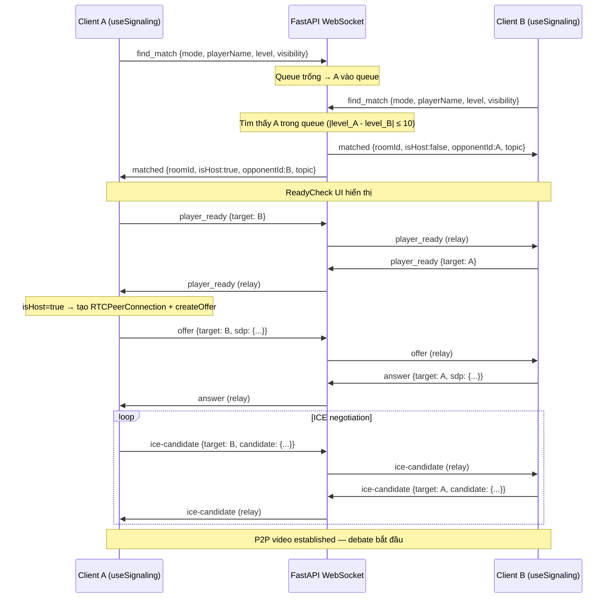

##### 7.2 Luồng In-game Events + Spectator Broadcast

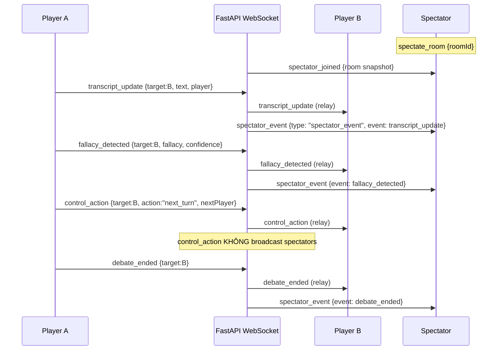

##### 7.3 Luồng Chat (Global & DM)

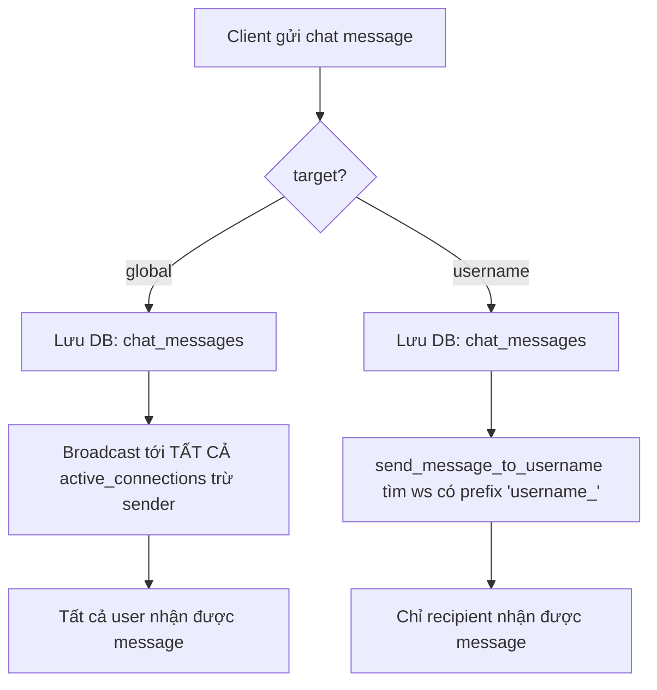

---

*Tài liệu này là một phần của SDD KaiKo — Section 5: Interface Design.*  
*Các phần liên quan: SDD_05a (User & Game API), SDD_05b (Social API), SDD_05c (Events API), SDD_05d (AI API).*

---

## 6. Deployment Design

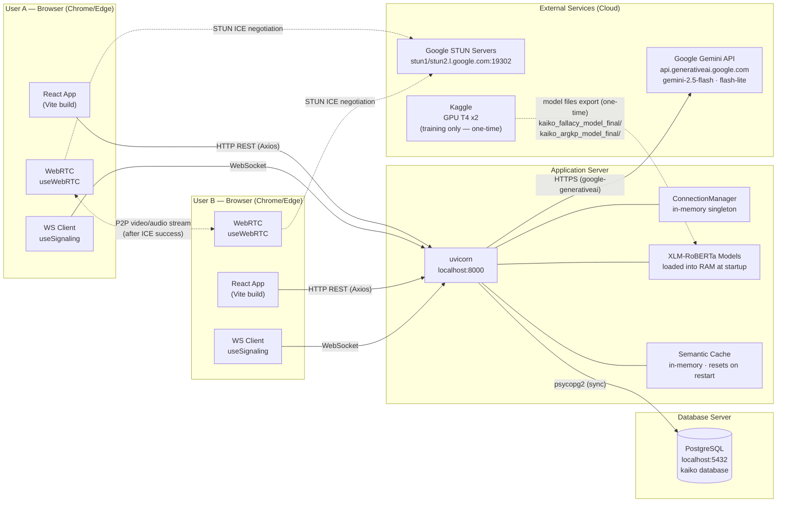

> **Ghi chú:** TURN server không được triển khai. Khoảng 15% người dùng sau symmetric NAT sẽ không thể thiết lập P2P stream.

---

---

## 7. Behavioral Design (Sequence Diagrams)

#### SD-01: Matchmaking Flow

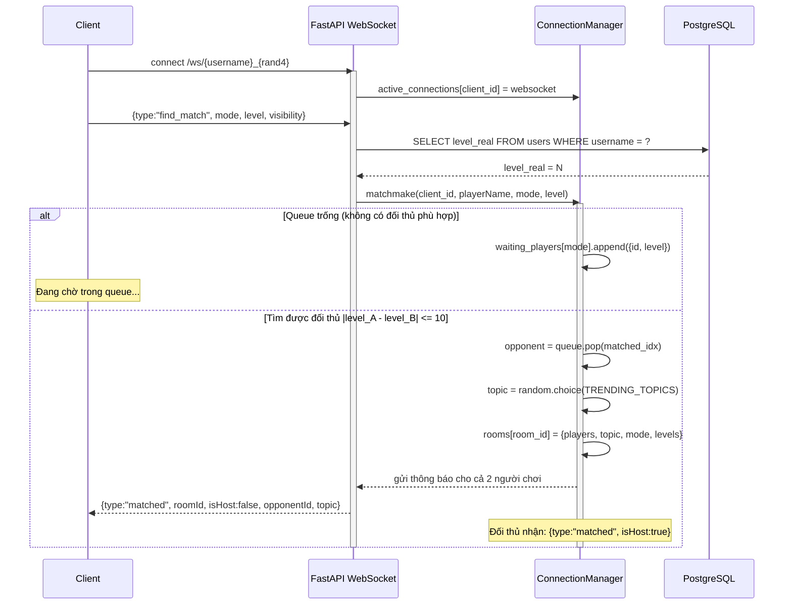

---

#### SD-02: WebRTC Handshake

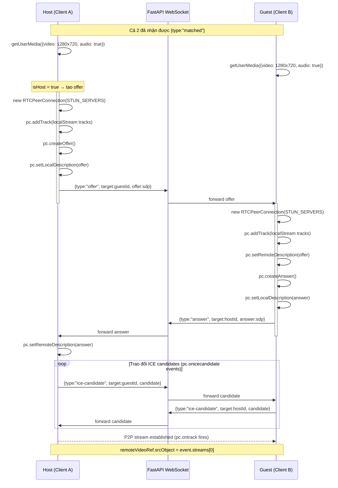

---

#### SD-03: Real-time Fallacy Detection

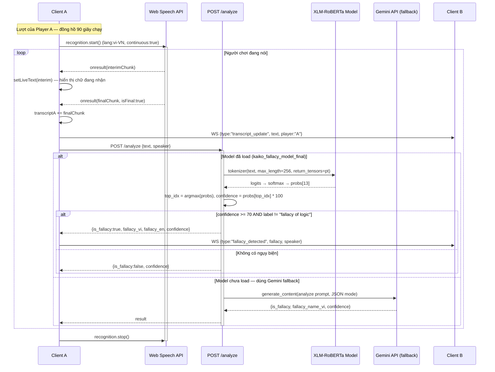

---

#### SD-04: Scoring & Level Update

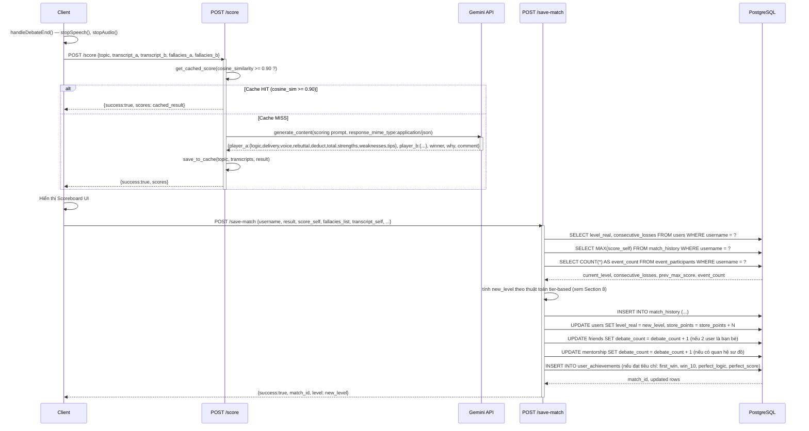

---

## 8. Algorithm Design

Section này trình bày các thuật toán cốt lõi của KaiKo: **matchmaking & level-up** (8.1–8.3) và **các pipeline AI** (8.4).

### 8.1 Thuật toán Matchmaking

#### 8.1.1 Mô tả thuật toán

Thuật toán Matchmaking của KaiKo được thiết kế theo mô hình **queue-based + level-banded matching** — kết hợp giữa hàng chờ FIFO và ưu tiên ghép cặp theo khoảng level. Khi một người chơi gửi yêu cầu `find_match` qua WebSocket, hệ thống trước tiên truy vấn `level_real` thực tế từ cơ sở dữ liệu PostgreSQL (không tin tưởng giá trị `level` do client tự khai báo), sau đó kiểm tra hàng chờ của chế độ tương ứng (`1v1`, `text_1v1`, hoặc `2v2`).

Nếu hàng chờ có ít nhất một người chờ, thuật toán duyệt tuần tự để tìm đối thủ có `|level_A − level_B| ≤ 10`. Nếu tìm thấy, cặp đấu được tạo ngay lập tức. Nếu không tìm thấy ai trong ngưỡng 10 level, hệ thống **fallback** sang người chờ lâu nhất (index 0 trong queue — FIFO), nhằm tránh tình trạng người chơi bị mắc kẹt vô thời hạn trong queue. Sau khi ghép cặp thành công, một `room_id` duy nhất được sinh ra (`room_{uuid8}`), chủ đề tranh biện được random từ danh sách 19 `TRENDING_TOPICS` hardcode, và cả hai người chơi được thông báo qua WebSocket. Nếu hàng chờ rỗng, người chơi được thêm vào queue để chờ đối thủ tiếp theo.

#### 8.1.2 Pseudocode

```
ALGORITHM Matchmake(client_id, player_name, mode, level_from_client, visibility)
INPUT:
  client_id    — định danh duy nhất dạng "{username}_{random4digit}"
  player_name  — tên hiển thị
  mode         ∈ {1v1, text_1v1, 2v2}
  level_from_client — level do client gửi lên (dùng làm fallback)
  visibility   ∈ {public, private}
OUTPUT: Tạo room hoặc thêm vào queue

BEGIN
  // Bước 1: Lấy level thực từ DB (server-authoritative)
  username ← rsplit(client_id, "_", 1)[0]
  TRY
    row ← DB.query("SELECT COALESCE(level_real, 1) FROM users WHERE username = ?", username)
    level ← row.level IF row EXISTS ELSE level_from_client
  CATCH exception
    level ← level_from_client  // fallback nếu DB lỗi
  END TRY

  // Bước 2: Lấy hàng chờ theo mode
  queue ← waiting_players[mode]
  IF queue = NULL THEN
    LOG("Invalid mode"); RETURN
  END IF

  // Bước 3: Kiểm tra hàng chờ
  IF len(queue) > 0 THEN

    // Bước 3a: Tìm đối thủ trong ngưỡng level
    matched_idx ← -1
    FOR i FROM 0 TO len(queue) - 1 DO
      IF |queue[i].level - level| ≤ 10 THEN
        matched_idx ← i
        BREAK
      END IF
    END FOR

    // Bước 3b: Fallback FIFO nếu không tìm thấy
    IF matched_idx = -1 THEN
      matched_idx ← 0   // lấy người chờ lâu nhất
    END IF

    // Bước 4: Tạo phòng và ghép cặp
    opponent_info ← queue.pop(matched_idx)
    opponent_id   ← opponent_info.id
    room_id       ← "room_" + UUID4().hex[:8]
    topic         ← RANDOM(TRENDING_TOPICS)   // 1 trong 19 chủ đề hardcode

    rooms[room_id] ← {
      players:      [client_id, opponent_id],
      topic:        topic,
      mode:         mode,
      visibility:   visibility,
      player_names: {client_id: player_name, opponent_id: opponent_name},
      levels:       {client_id: level, opponent_id: opponent_info.level}
    }

    // Bước 5: Gửi thông báo cho cả hai
    SEND to client_id:  {type:"matched", roomId, isHost:FALSE, opponentId, opponentName, topic}
    SEND to opponent_id:{type:"matched", roomId, isHost:TRUE,  opponentId:client_id, opponentName, topic}

  ELSE
    // Bước 6: Hàng chờ rỗng — thêm vào queue
    IF client_id NOT IN queue THEN
      queue.append({id: client_id, level: level})
    END IF
  END IF

END
```

#### 8.1.3 Độ phức tạp

| Trường hợp | Time Complexity | Ghi chú |
|---|---|---|
| Queue có đối thủ phù hợp ở đầu | O(1) | Tìm thấy ngay ở index 0 |
| Queue có n người, tìm thấy ở giữa | O(k), k ≤ n | Dừng khi tìm thấy đầu tiên |
| Queue có n người, không ai phù hợp (fallback) | O(n) | Duyệt hết rồi lấy index 0 |
| Queue rỗng | O(1) | Chỉ append vào queue |

**Space Complexity:** O(n) — n là tổng số người trong tất cả queue.

> **Lưu ý:** Thuật toán hiện tại chỉ tìm người phù hợp **đầu tiên** (first-fit), không tìm người phù hợp **nhất** (best-fit). Điều này đánh đổi tối ưu chất lượng ghép cặp lấy tốc độ O(k) thay vì O(n).

#### 8.1.4 Flowchart (Mermaid)

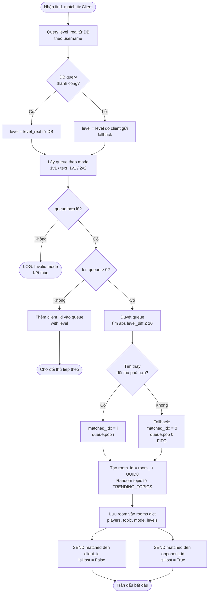

#### 8.1.5 Ví dụ minh hoạ

**Kịch bản:** Ba người chơi lần lượt tìm trận ở mode `1v1`.

**Bước 1 — Alice tìm trận:**
- Alice (level 25) gửi `find_match`, mode=`1v1`.
- DB trả về `level_real = 25`.
- Queue `1v1` đang **rỗng**.
- Alice được thêm vào queue: `[{id:"alice_1234", level:25}]`.
- Kết quả: Alice chờ.

**Bước 2 — Bob tìm trận:**
- Bob (level 32) gửi `find_match`, mode=`1v1`.
- DB trả về `level_real = 32`.
- Queue `1v1` có **1 người** (Alice, level 25).
- Kiểm tra: `|32 − 25| = 7 ≤ 10` → **khớp level!**
- `matched_idx = 0`, pop Alice khỏi queue.
- Tạo `room_id = "room_a3f9b21c"`, random topic = `"Bằng đại học có còn quan trọng trong thời đại AI?"`.
- Gửi `matched` đến Bob (`isHost: false`) và Alice (`isHost: true`).
- Kết quả: Trận đấu được tạo thành công, queue trống trở lại.

**Bước 3 — Carol tìm trận (fallback scenario):**
- Giả sử Dave (level 5) đang chờ trong queue.
- Carol (level 80) tìm trận: `|80 − 5| = 75 > 10` → **không khớp**.
- Queue vẫn còn Dave, `matched_idx = -1` → **fallback**, `matched_idx = 0`.
- Carol được ghép với Dave dù chênh 75 level (Dave chờ lâu nhất).
- Kết quả: Ghép cặp FIFO, tránh Dave chờ vô thời hạn.

---

### 8.2 Thuật toán Level-Up Tier System

#### 8.2.1 Mô tả thuật toán

Hệ thống tăng level của KaiKo được thiết kế theo mô hình **tiered progression** — chia làm 5 dải level với điều kiện tăng/giảm khác nhau, độ khó tăng dần theo cấp độ. Triết lý thiết kế là: càng ở level cao, người chơi càng cần thể hiện sự tiến bộ thực sự (không chỉ thắng thua) và sự tham gia tích cực vào hệ sinh thái (events), đồng thời chịu rủi ro bị tụt level khi liên tục thất bại.

Sau mỗi trận đấu, endpoint `POST /save-match` kích hoạt quá trình tính toán level mới. Hệ thống query `level_real` và `consecutive_losses` hiện tại, đồng thời lấy lịch sử điểm số (điểm cao nhất từ trước và điểm trận gần nhất) cùng số lượng events đã tham gia. Dựa trên dải level hiện tại, các điều kiện tăng/giảm được kiểm tra tuần tự. Giá trị `new_level` cuối cùng được clamp trong khoảng `[1, 101]` trước khi ghi vào database.

Level **101** là cấp độ đặc biệt — đây là cấp **Giám Khảo (Judge)**, không thể đạt bằng thuật toán thông thường mà chỉ được admin cấp phát. Level 101 cho phép sử dụng các tính năng đặc quyền (`/judge/adjust-score`, `/judge/protect-disciple`).

#### 8.2.2 Pseudocode

```
ALGORITHM LevelUp(username, score_self, result, mode)
INPUT:
  username    — người chơi
  score_self  — điểm số trận này (0-100+)
  result      ∈ {win, lose, draw}
  mode        — chế độ trận đấu
OUTPUT: new_level (integer, clamped [1, 101])

BEGIN
  // Bước 1: Lấy dữ liệu hiện tại từ DB
  (current_level, consecutive_losses) ← DB.query(
    "SELECT level_real, consecutive_losses FROM users WHERE username=?"
  )
  current_level      ← current_level OR 1
  consecutive_losses ← consecutive_losses OR 0

  // Bước 2: Cập nhật consecutive_losses
  IF result = 'lose' THEN
    consecutive_losses ← consecutive_losses + 1
  ELSE
    consecutive_losses ← 0   // Reset khi không thua
  END IF

  // Bước 3: Lấy dữ liệu lịch sử điểm
  max_score   ← DB.query("SELECT MAX(score_self) FROM match_history WHERE username=? AND played_at < now()")
               OR 0
  prev_score  ← DB.query("SELECT score_self FROM match_history WHERE username=? ORDER BY id DESC LIMIT 1")
               OR 0

  // Bước 4: Lấy số event đã tham gia
  event_count ← DB.query("SELECT COUNT(DISTINCT event_id) FROM event_participants WHERE username=?")
               OR 0

  // Bước 5: Phân cấp và tính new_level
  new_level ← current_level

  IF current_level < 10 THEN
    // Dải Sơ Cấp (1-9): Dễ nhất — thắng HOẶC đạt điểm cao nhất từ trước đến nay
    IF score_self > max_score OR result = 'win' THEN
      new_level ← new_level + 1
    END IF

  ELSE IF current_level < 30 THEN
    // Dải Đồng (10-29): Cần thắng VÀ cải thiện rõ rệt (+2 điểm so với trận trước)
    IF score_self ≥ prev_score + 2 AND result = 'win' THEN
      new_level ← new_level + 1
    END IF

  ELSE IF current_level < 60 THEN
    // Dải Bạc (30-59): Cần cải thiện điểm VÀ đã tham gia ≥ 1 event
    IF score_self > prev_score AND event_count ≥ 1 THEN
      new_level ← new_level + 1
    END IF

  ELSE IF current_level < 90 THEN
    // Dải Vàng (60-89): Rủi ro tụt level nếu thua 3 lần liên tiếp
    IF consecutive_losses ≥ 3 THEN
      new_level ← MAX(60, new_level - 1)    // Tối thiểu là 60
    ELSE IF score_self > prev_score AND event_count ≥ 2 THEN
      new_level ← new_level + 1
    END IF

  ELSE IF current_level < 100 THEN
    // Dải Bạch Kim (90-99): Thua là tụt level; thắng cần ≥ 3 events
    IF result = 'lose' THEN
      new_level ← MAX(90, new_level - 1)    // Tối thiểu là 90
    ELSE IF result = 'win' AND event_count ≥ 3 THEN
      new_level ← new_level + 1
    END IF
  // ELSE: current_level = 100 hoặc 101 → không thay đổi qua thuật toán này
  END IF

  // Bước 6: Clamp và lưu DB
  new_level ← MIN(101, MAX(1, new_level))
  DB.execute("UPDATE users SET level_real=?, consecutive_losses=? WHERE username=?",
             new_level, consecutive_losses, username)

  RETURN new_level
END
```

#### 8.2.3 Bảng tóm tắt điều kiện theo từng dải

| Dải Level | Tên dải | Điều kiện tăng | Điều kiện giảm | Ghi chú đặc biệt |
|---|---|---|---|---|
| **1–9** | Sơ Cấp | `score > max_lịch_sử` **HOẶC** `result = win` | Không có | Dễ nhất — mục tiêu khuyến khích người mới tham gia |
| **10–29** | Đồng | `score ≥ prev_score + 2` **VÀ** `result = win` | Không có | Yêu cầu cải thiện ổn định, không chỉ may mắn |
| **30–59** | Bạc | `score > prev_score` **VÀ** `event_count ≥ 1` | Không có | Bắt buộc tham gia cộng đồng (events) |
| **60–89** | Vàng | `score > prev_score` **VÀ** `event_count ≥ 2` | `consecutive_losses ≥ 3` → −1 level (min 60) | Rủi ro xuất hiện — thua 3 liên tiếp là nguy hiểm |
| **90–99** | Bạch Kim | `result = win` **VÀ** `event_count ≥ 3` | `result = lose` → −1 level (min 90) | Mỗi trận thua đều bị phạt; điều kiện tăng rất khắt khe |
| **100** | Tiền Nhân | *(không thay đổi qua thuật toán)* | *(không thay đổi qua thuật toán)* | Ngưỡng trước Judge — chờ admin cấp 101 |
| **101** | Giám Khảo | *(chỉ admin cấp)* | *(chỉ admin thu hồi)* | Tier đặc quyền, mở `/judge/` endpoints |

#### 8.2.4 Flowchart (Mermaid)

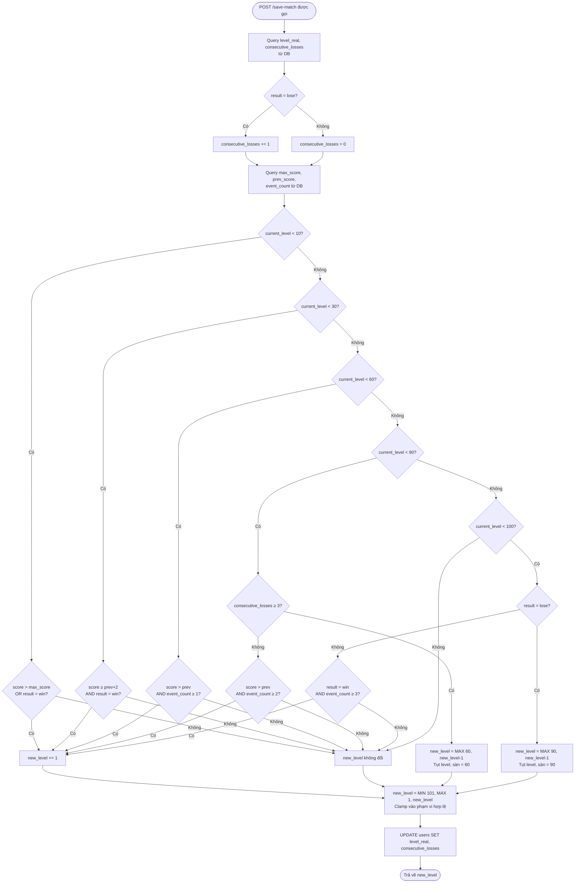

#### 8.2.5 Edge Cases và xử lý đặc biệt

**Edge case 1 — `consecutive_losses` reset:**
Biến `consecutive_losses` được reset về `0` bất cứ khi nào `result ≠ 'lose'` (tức là thắng hoặc hoà). Điều này có nghĩa là chuỗi thua phải **liên tiếp** — một kết quả thắng/hoà bất kỳ sẽ phá vỡ chuỗi. Ví dụ: Thua-Thua-Hoà-Thua-Thua chỉ có `consecutive_losses = 2`, không đủ để kích hoạt trừ level ở dải Vàng.

**Edge case 2 — Clamp `[1, 101]`:**
```
new_level = MIN(101, MAX(1, new_level))
```
Đảm bảo level không bao giờ rơi xuống 0 hoặc vượt quá 101. Level 101 (Judge) không thể bị vượt qua bằng thuật toán thông thường.

**Edge case 3 — Level 100:**
Level 100 không nằm trong bất kỳ nhánh `IF` nào của thuật toán (`< 10`, `< 30`, `< 60`, `< 90`, `< 100` — tất cả đều `False` khi `current_level = 100`). Do đó người chơi ở level 100 **không thể tự tăng lên 101** — phải được admin cấp phát thủ công thông qua cơ chế ngoài hệ thống.

**Edge case 4 — Người chơi mới (lần chơi đầu tiên):**
`max_score = 0`, `prev_score = 0`, `event_count = 0`. Ở dải Sơ Cấp (level 1-9), điều kiện `score > max_score` sẽ được thoả mãn ngay nếu điểm > 0. Điều này cho phép người mới tăng level dễ dàng trong giai đoạn khởi đầu.

**Edge case 5 — Draw (hoà):**
Kết quả `draw` không kích hoạt điều kiện tăng level ở bất kỳ dải nào (chỉ `win` mới thoả mãn điều kiện `result = 'win'`). Tuy nhiên, hoà vẫn reset `consecutive_losses` về 0 và cộng điểm store (1 điểm nếu mode video).

**Edge case 6 — DB trả về NULL:**
```python
current_level = user_data['level_real'] if user_data and user_data['level_real'] else 1
consecutive_losses = user_data['consecutive_losses'] if user_data and user_data['consecutive_losses'] else 0
```
Cả hai giá trị đều có fallback về giá trị an toàn (`1` và `0`) khi DB trả về `NULL` hoặc không tìm thấy user. Điều này đảm bảo thuật toán không crash với người dùng mới chưa có record.

---

### 8.3 Tương tác giữa hai thuật toán

Hai thuật toán Matchmaking và Level-Up có điểm giao thoa quan trọng: `level_real` được dùng bởi cả hai.

```
Matchmake()                          LevelUp()
    │                                    │
    ▼                                    ▼
Query level_real (READ)          Update level_real (WRITE)
  → dùng để ghép cặp             → thay đổi sau mỗi trận
```

**Hệ quả thiết kế quan trọng:** Do `ConnectionManager` lưu level tại thời điểm join queue (`queue.append({id, level})`), nếu level của một người thay đổi trong khi đang chờ trong queue, giá trị level được dùng để so sánh vẫn là giá trị cũ khi join queue. Đây là một **known limitation** — được chấp nhận vì thời gian chờ queue thường ngắn trong môi trường academic.

---

*Tài liệu này là một phần của Software Design Document (SDD) cho dự án KaiKo.*  
*Phiên bản: 1.0 — Viết dựa trên phân tích mã nguồn `backend/main.py`.*

### 8.4 AI Algorithm Pipelines

#### Pipeline 1: Fallacy Detection (Real-time)

##### 1.1 Mô tả

Pipeline Fallacy Detection được thiết kế để chạy **real-time trong lúc debate đang diễn ra**. Sau mỗi chunk Speech-to-Text (STT) cuối cùng của một lượt phát biểu, frontend gọi `POST /analyze` kèm văn bản vừa nhận dạng được. Server phân tích xem câu nói đó có chứa ngụy biện logic hay không và trả kết quả về trong vòng < 500ms để broadcast ngay lên màn hình cả hai người chơi.

Pipeline có **hai nhánh song song (primary + fallback)**:

- **Nhánh chính (Primary):** Dùng model XLM-RoBERTa fine-tune cục bộ (`kaiko_fallacy_model_final`) — chạy hoàn toàn offline sau khi load vào RAM lúc khởi động server. Đây là nhánh ưu tiên vì tốc độ nhanh (không phụ thuộc mạng) và không tốn quota API.
- **Nhánh dự phòng (Fallback):** Khi model chưa được load (ví dụ: chạy dev environment không có file model), hệ thống fallback sang **Google Gemini API** với prompt JSON-only để lấy kết quả tương tự. Nhánh này chậm hơn (~1–2s) và tốn Gemini quota.

Model nhận dạng được **13 nhãn**. Nhãn `fallacy of logic` có nghĩa đặc biệt — đây là nhãn "không có ngụy biện" (lập luận hợp lệ), nên hệ thống cần loại trừ nhãn này khi kiểm tra kết quả.

---

##### 1.2 Pseudocode — Pipeline đầy đủ (2 nhánh)

```
ALGORITHM AnalyzeFallacy(text, speaker)
INPUT:
  text     : string — câu nói cần phân tích
  speaker  : string — tên người phát biểu
OUTPUT:
  {fallacy, fallacy_en, confidence, is_fallacy, speaker}

CONST THRESHOLD_CONFIDENCE = 70.0
CONST NO_FALLACY_LABEL     = "fallacy of logic"

BEGIN
  // --- Validation ---
  IF length(trim(text)) < 10 THEN
    RETURN {fallacy: null, confidence: 0}
  END IF

  // ============================================================
  // NHÁNH 1: Local XLM-RoBERTa Model
  // ============================================================
  IF fallacy_model IS NOT NULL AND fallacy_tokenizer IS NOT NULL THEN
    TRY
      // Bước 1: Tokenize
      tokens ← fallacy_tokenizer(
        text,
        return_tensors = 'pt',
        truncation     = true,
        max_length     = 256
      )

      // Bước 2: Inference (no_grad để tiết kiệm bộ nhớ)
      WITH torch.no_grad():
        logits ← fallacy_model(tokens).logits   // shape: [1, 13]

      // Bước 3: Tính xác suất
      probs      ← softmax(logits, dim=-1)[0]   // shape: [13]
      top_idx    ← argmax(probs)                // index 0..12
      confidence ← round(probs[top_idx] * 100, 1)
      label      ← LABEL_NAMES[top_idx]

      // Bước 4: Quyết định
      is_fallacy ← (label ≠ NO_FALLACY_LABEL) AND (confidence ≥ THRESHOLD_CONFIDENCE)

      RETURN {
        fallacy     : LABEL_VI[label]  IF is_fallacy ELSE null,
        fallacy_en  : label,
        confidence  : confidence,
        is_fallacy  : is_fallacy,
        speaker     : speaker
      }
    CATCH exception e
      LOG "Lỗi inference local model: " + e
      // Tiếp tục sang Nhánh 2
    END TRY
  END IF

  // ============================================================
  // NHÁNH 2: Gemini Fallback
  // ============================================================
  api_key ← getenv("GEMINI_API_KEY")
  IF api_key IS NULL THEN
    RETURN {error: "Không có model và GEMINI_API_KEY", fallacy: null, confidence: 0}
  END IF

  TRY
    gemini ← GenerativeModel(
      model           = "gemini-3.1-flash-lite-preview",
      response_mime   = "application/json",
      max_output_tokens = 200,
      temperature     = 0.1
    )

    prompt ← f"""
      Phân tích câu sau có ngụy biện không.
      Câu nói: "{text}"
      Trả về JSON: {is_fallacy, fallacy_name_en, fallacy_name_vi, confidence}
    """

    response      ← await gemini.generate_content(prompt)   // async thread
    json_match    ← regex_extract(r'\{.*\}', response.text)
    res           ← parse_json(json_match)

    RETURN {
      fallacy     : res.fallacy_name_vi  IF res.is_fallacy ELSE null,
      fallacy_en  : res.fallacy_name_en,
      confidence  : res.confidence,
      is_fallacy  : res.is_fallacy,
      speaker     : speaker
    }
  CATCH exception e
    LOG "Lỗi Gemini fallback: " + e
  END TRY

  // Trường hợp cả 2 nhánh đều lỗi
  RETURN {fallacy: null, confidence: 0, is_fallacy: false}
END
```

---

##### 1.3 Các bước Inference XLM-RoBERTa (chi tiết kỹ thuật)

```
text (string)
  │
  ▼
[Tokenizer] max_length=256, truncation=True, return_tensors='pt'
  │   → Tạo: input_ids, attention_mask
  ▼
[AutoModelForSequenceClassification]
  │   → Input: tokens dict
  │   → Output: logits  shape [1, 13]  (raw scores, chưa normalize)
  ▼
[Softmax(dim=-1)]
  │   → probs  shape [13]  (tổng = 1.0)
  ▼
[Argmax]
  │   → top_idx  ∈ {0..12}
  │   → confidence = probs[top_idx] * 100  (%)
  │   → label = LABEL_NAMES[top_idx]
  ▼
[Decision Gate]
  │   is_fallacy = (label ≠ "fallacy of logic") AND (confidence ≥ 70)
  ▼
RETURN result
```

---

##### 1.4 Sơ đồ quyết định (Mermaid Flowchart)

```mermaid
flowchart TD
    A([POST /analyze\nrequest nhận được]) --> B{len(text) ≥ 10?}
    B -- Không --> C[/"Return: fallacy=null, confidence=0"/]
    B -- Có --> D{fallacy_model\nđã load?}

    D -- Có --> E[Tokenize text\nmax_length=256]
    E --> F[model.forward → logits\nshape: 1 × 13]
    F --> G[softmax → probs\nargmax → top_idx]
    G --> H[label = LABEL_NAMES\nconfidence = probs × 100]
    H --> I{label ≠ 'fallacy of logic'\nAND confidence ≥ 70?}
    I -- Có --> J[/"is_fallacy = true\ntrả LABEL_VI + confidence"/]
    I -- Không --> K[/"is_fallacy = false\nfallacy = null"/]

    D -- Không --> L{GEMINI_API_KEY\ncó sẵn?}
    L -- Không --> M[/"Return error:\nKhông có model"/]
    L -- Có --> N[Tạo Gemini prompt\nJSON-only mode]
    N --> O[await generate_content\nparse JSON response]
    O --> P{is_fallacy\ntrong response?}
    P -- Có --> Q[/"is_fallacy = true\ntrả fallacy_name_vi"/]
    P -- Không --> R[/"is_fallacy = false"/]
```

---

##### 1.5 Bảng 13 nhãn — LABEL_NAMES và LABEL_VI

| Index | label (EN) | LABEL_VI (Tiếng Việt) | Có phải ngụy biện? |
|-------|------------|----------------------|--------------------|
| 0 | ad hominem | Công kích cá nhân | ✅ Có |
| 1 | ad populum | Dựa vào số đông | ✅ Có |
| 2 | appeal to emotion | Khai thác cảm xúc | ✅ Có |
| 3 | circular reasoning | Lập luận vòng tròn | ✅ Có |
| 4 | equivocation | Ngụy biện từ ngữ | ✅ Có |
| 5 | fallacy of credibility | Ngụy biện uy tín | ✅ Có |
| 6 | fallacy of extension | Bóp méo lập luận | ✅ Có |
| **7** | **fallacy of logic** | **Lập luận hợp lệ** | ❌ **KHÔNG** (nhãn âm tính) |
| 8 | fallacy of relevance | Lập luận lạc đề | ✅ Có |
| 9 | false causality | Nhân quả giả | ✅ Có |
| 10 | false dilemma | Lưỡng nan giả | ✅ Có |
| 11 | faulty generalization | Khái quát hóa sai | ✅ Có |
| 12 | intentional | Ngụy biện cố ý | ✅ Có |

> **Lưu ý quan trọng:** `fallacy of logic` (index 7) là nhãn đặc biệt mang nghĩa **không có ngụy biện**. Đây là convention của dataset fine-tune. Hệ thống phải kiểm tra `label ≠ "fallacy of logic"` trước khi kết luận phát hiện ngụy biện.

---

##### 1.6 Phân tích ngưỡng Confidence 70%

**Tại sao chọn 70%?**

Trong bối cảnh debate real-time, hai loại lỗi cần cân nhắc:

| Loại lỗi | Mô tả | Hậu quả |
|----------|-------|---------|
| **False Positive** (FP) | Câu hợp lệ bị gán nhãn ngụy biện | Người chơi bị phạt oan, trải nghiệm xấu |
| **False Negative** (FN) | Câu ngụy biện thực sự bị bỏ qua | Không phạt khi đáng bị phạt |

**Lý do chọn 70% (thay vì 50% hoặc 90%):**

- **Không thể chọn 50%:** Softmax của 13 lớp — khi model không chắc chắn, mỗi lớp sẽ có xác suất ~7.7%. Ngưỡng 50% vẫn quá dễ kích hoạt ngụy biện sai, đặc biệt khi câu nói ngắn hoặc mơ hồ.
- **Không nên chọn 90%:** Quá nghiêm ngặt → nhiều ngụy biện thực sự bị bỏ sót, làm tính năng AI mất đi giá trị.
- **70% là điểm cân bằng:** Đủ để lọc bỏ những dự đoán "mơ hồ" (model phân vân giữa nhiều nhãn) nhưng vẫn bắt được các ngụy biện rõ ràng khi model tin tưởng ở mức vừa phải.

**Trade-off tổng quát:**

```
Ngưỡng thấp hơn → Nhiều FP hơn → Người chơi bực bội vì bị phạt oan
Ngưỡng cao hơn  → Nhiều FN hơn → Tính năng AI không còn ý nghĩa
70% → Cân bằng cho môi trường game/tranh biện thực tế
```

---

##### 1.7 Độ phức tạp

| Thành phần | Thời gian | Ghi chú |
|-----------|-----------|---------|
| Tokenization | O(L) — L = độ dài text | Bounded bởi max_length=256 |
| XLM-RoBERTa inference | O(L²) — self-attention | Fixed max 256 tokens → effectively O(1) |
| Softmax + Argmax | O(13) = O(1) | Số nhãn cố định |
| **Tổng (local model)** | **O(1) amortized** | Model đã loaded trong RAM |
| Gemini API call | O(network latency) | ~500ms – 2000ms tùy mạng |

---

#### Pipeline 2: Semantic Cache cho Gemini Scoring

##### 2.1 Mô tả

Mỗi lần gọi `POST /score`, hệ thống cần gọi Gemini API để chấm điểm toàn bộ transcript của 2 người chơi. Với Gemini API có **free-tier quota giới hạn**, và nhiều trận debate có nội dung khá tương đồng nhau (cùng chủ đề, cùng lập luận phổ biến), pipeline Semantic Cache được xây dựng để:

1. **Tránh gọi Gemini** khi kết quả tương tự đã được cache từ trận trước.
2. **Giảm latency** từ ~3-5s (Gemini call) xuống còn <10ms (cache lookup).
3. **Tiết kiệm quota**: Ước tính giảm ~30% số lần gọi Gemini trong môi trường test.

Cơ chế: Cache lưu trữ **TF-IDF vector** của chuỗi `{topic} {transcript_a} {transcript_b}`. Khi có request mới, tính **Cosine Similarity** giữa vector của request hiện tại với từng entry trong cache. Nếu similarity ≥ 90%, kết quả cũ được trả lại thay vì gọi Gemini.

---

##### 2.2 Pseudocode — `get_cached_score()` và `save_to_cache()`

```
// ============================================================
// HÀM 1: Tra cache
// ============================================================
FUNCTION get_cached_score(topic, transcript_a, transcript_b,
                           threshold = 0.90) → result | null
BEGIN
  // Tạo query text và vector
  query_text ← concat(topic, " ", transcript_a, " ", transcript_b)
  query_vec  ← tfidf_vector(query_text)

  // Duyệt toàn bộ cache entries
  FOR EACH (cached_key, cached_data) IN _cache:
    sim ← cosine_similarity(query_vec, cached_data["vector"])
    IF sim ≥ threshold THEN
      LOG "[Cache HIT] similarity=" + sim
      RETURN cached_data["result"]
    END IF
  END FOR

  LOG "[Cache MISS]"
  RETURN null   // Không tìm thấy → cần gọi Gemini
END

// ============================================================
// HÀM 2: Lưu vào cache
// ============================================================
FUNCTION save_to_cache(topic, transcript_a, transcript_b, result)
BEGIN
  key_text  ← concat(topic, " ", transcript_a, " ", transcript_b)
  cache_key ← md5(key_text)          // hash string 32 ký tự

  _cache[cache_key] ← {
    "vector" : tfidf_vector(key_text),
    "result" : result
  }

  // LRU giả đơn giản: nếu vượt 500 entries → xóa entry cũ nhất
  IF len(_cache) > 500 THEN
    oldest_key ← first_key(_cache)   // Python dict duy trì insertion order
    DELETE _cache[oldest_key]
  END IF
END
```

---

##### 2.3 Thuật toán TF-IDF Vector

**TF-IDF** (Term Frequency – Inverse Document Frequency) trong `utils_cache.py` được triển khai dưới dạng đơn giản hóa cho **single document**:

```
FUNCTION tfidf_vector(text) → dict{word: tf_weight}
BEGIN
  words ← regex_findall(r'\w+', lowercase(text))
  freq  ← Counter(words)          // {word: count}
  total ← sum(freq.values())      // tổng số từ

  vector ← {}
  FOR EACH (word, count) IN freq:
    vector[word] ← count / total  // TF = tần suất tương đối
  END FOR

  RETURN vector
END
```

> **Lưu ý:** Đây là **TF-only vector** (không có IDF cross-document) vì mỗi lần cache chỉ xử lý 1 document. IDF chỉ xuất hiện trong `utils_preprocess.py` cho extractive summarization. Trong cache, mục tiêu không phải là ranking từ quan trọng, mà là tạo vector đại diện cho nội dung text để so sánh similarity.

---

##### 2.4 Thuật toán Cosine Similarity

**Công thức:**

$$\text{cosine\_sim}(v_1, v_2) = \frac{v_1 \cdot v_2}{||v_1|| \cdot ||v_2|| + \epsilon}$$

Trong đó:
- $v_1 \cdot v_2 = \sum_{w \in v_1 \cap v_2} v_1[w] \times v_2[w]$ — dot product trên tập từ chung
- $||v_i|| = \sqrt{\sum_{w} v_i[w]^2}$ — Euclidean norm
- $\epsilon = 10^{-9}$ — tránh chia cho 0

```
FUNCTION cosine_similarity(v1, v2) → float ∈ [0.0, 1.0]
BEGIN
  common_words ← intersection(keys(v1), keys(v2))
  IF common_words IS EMPTY THEN
    RETURN 0.0
  END IF

  dot   ← sum(v1[w] * v2[w]   FOR w IN common_words)
  norm1 ← sqrt(sum(x^2        FOR x IN values(v1)))
  norm2 ← sqrt(sum(x^2        FOR x IN values(v2)))

  RETURN dot / (norm1 * norm2 + 1e-9)
END
```

**Ý nghĩa của giá trị trả về:**

| Khoảng | Ý nghĩa |
|--------|---------|
| 0.0 – 0.5 | Nội dung khác nhau hoàn toàn |
| 0.5 – 0.8 | Cùng chủ đề nhưng lập luận khác nhau |
| 0.8 – 0.9 | Rất tương tự, nhiều từ chung |
| **≥ 0.9** | **Gần như giống nhau → dùng cache** |

---

##### 2.5 Phân tích ngưỡng Similarity 90%

**Tại sao chọn 90%?**

Transcript của 2 người chơi thường dài (200–500 từ). Với văn bản dài, Cosine Similarity tự nhiên cao hơn vì nhiều từ chung (stop words, từ liên quan chủ đề). Tuy nhiên, bối cảnh debate yêu cầu **precision cao**:

- Một kết quả scoring (điểm, winner, nhận xét) phải **chính xác theo nội dung thực tế** của trận đó.
- Nếu ngưỡng quá thấp (ví dụ 70%), hai trận có cùng chủ đề nhưng lập luận ngược chiều có thể bị gộp → trả kết quả sai (scoring sai winner).
- Ngưỡng 90% đảm bảo rằng chỉ khi transcript **thực sự gần như giống nhau** (ví dụ: cùng người chơi debate lại cùng chủ đề với lập luận tương tự) thì mới dùng cache.

**Trade-off:**

```
Ngưỡng thấp hơn → Cache hit rate cao hơn → Tiết kiệm quota tốt hơn
                  NHƯNG rủi ro trả kết quả sai winner/score
Ngưỡng cao hơn  → Cache hit rate thấp hơn → Ít tiết kiệm quota
                  NHƯNG đảm bảo tính chính xác của scoring
90% → Điểm cân bằng giữa tiết kiệm quota và độ chính xác
```

---

##### 2.6 LRU Giả Đơn Giản (Cap 500 Entries)

```
Khi save_to_cache() được gọi:
  ┌─ Lưu entry mới vào _cache (dict Python)
  │
  └─ Nếu len(_cache) > 500:
       oldest_key = next(iter(_cache))   ← Python 3.7+ dict giữ thứ tự insertion
       del _cache[oldest_key]
```

Đây là **FIFO-based eviction** (First-In-First-Out), không phải LRU thực sự (Least Recently Used). Tuy nhiên trong bối cảnh academic project với ~100 concurrent users, đây là đơn giản hóa hợp lý vì:
- Chi phí implement LRU thực (update access time) không đáng so với lợi ích.
- Với 500 entries và scoring ~2KB mỗi entry, tổng bộ nhớ cache ≈ 1MB — negligible.

---

##### 2.7 Luồng tích hợp với `/score` endpoint

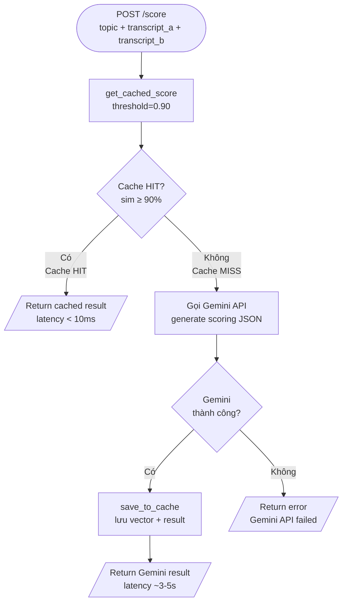

---

##### 2.8 Limitation quan trọng

| # | Limitation | Mô tả | Ảnh hưởng |
|---|-----------|-------|-----------|
| 1 | **In-memory only** | `_cache` là Python dict trong process RAM | Mất toàn bộ cache khi restart server |
| 2 | **Single-process** | Cache không chia sẻ giữa nhiều worker | Nếu dùng `uvicorn --workers 4`, mỗi worker có cache riêng |
| 3 | **FIFO eviction** | Không phải LRU thực sự | Entry hay dùng có thể bị xóa nếu không được ghi mới |
| 4 | **No persistence** | Không có backup database | Sau mỗi lần restart, cần "warm up" lại cache |
| 5 | **TF-only vector** | Không có IDF cross-document | Từ phổ biến (chủ đề, đại từ) có thể over-weight |

> **TODO:** Nâng cấp lên Redis-backed cache với TTL 24h để cache tồn tại qua restart.

---

#### Pipeline 3: Transcript Preprocessing

##### 3.1 Mô tả

Khi một trận debate kết thúc, transcript của 2 người chơi được gửi lên `POST /score` để Gemini chấm điểm. Tuy nhiên, transcript raw từ Web Speech API thường có **hai vấn đề**:

1. **Từ đệm (filler words):** "ừm", "thì", "kiểu như là", "bạn biết đấy" — không mang giá trị lập luận, chỉ chiếm token không cần thiết.
2. **Transcript quá dài:** Cuộc debate dài có thể lên đến 1000+ từ, vượt quá token budget hợp lý cho Gemini prompt và gây tốn kém.

Pipeline Transcript Preprocessing trong `utils_preprocess.py` giải quyết cả hai vấn đề thông qua 2 bước: **xóa từ đệm** → **tóm tắt trích xuất nếu vẫn còn dài**.

> **⚠️ Trạng thái hiện tại:** Pipeline này đã được implement đầy đủ trong `utils_preprocess.py` nhưng **chưa được tích hợp vào production endpoint `/score`**. Hiện tại `/score` gửi transcript thô trực tiếp cho Gemini. Đây là **TODO kỹ thuật** cần giải quyết trong sprint tiếp theo.

---

##### 3.2 Pseudocode — `compress_transcript(text, max_words=500)`

```
ALGORITHM CompressTranscript(text, max_words = 500) → compressed_text
INPUT:  text      — transcript thô từ Web Speech API
        max_words — ngưỡng số từ tối đa (default: 500)
OUTPUT: compressed_text — transcript đã được nén, ≤ max_words từ

BEGIN
  // ---- Bước 1: Xóa từ đệm ----
  text ← remove_filler_words(text)

  // ---- Bước 2: Tóm tắt nếu cần ----
  word_count ← len(split(text))
  IF word_count > max_words THEN
    text ← extractive_summarize(text, max_sentences = 10)
  END IF

  RETURN text
END

// ============================================================
// HÀM PHỤ 1: Xóa từ đệm
// ============================================================
FUNCTION remove_filler_words(text) → text
BEGIN
  // Duyệt theo thứ tự giảm dần độ dài (để ưu tiên phrase dài hơn)
  FOR EACH phrase IN sorted(FILLER_WORDS, by=length, descending=True):
    text ← regex_replace(r'\b{phrase}\b', '', text, flags=IGNORECASE)
  END FOR

  // Normalize khoảng trắng
  text ← regex_replace(r'\s+', ' ', text).strip()
  RETURN text
END

// ============================================================
// HÀM PHỤ 2: Tóm tắt trích xuất TF-IDF
// ============================================================
FUNCTION extractive_summarize(text, max_sentences = 10) → summary
BEGIN
  // Tách câu bằng dấu câu
  sentences ← split_by_punctuation(text, delimiters=['.', '!', '?'])
  sentences ← filter(sentences, len(s.strip()) > 10)

  IF len(sentences) ≤ max_sentences THEN
    RETURN text   // Không cần tóm tắt
  END IF

  // Bước 1: Tính TF (tần suất từ toàn văn bản)
  word_freq ← Counter()
  FOR EACH sent IN sentences:
    words ← regex_findall(r'\w+', lowercase(sent))
    word_freq.update(words)
  END FOR

  // Bước 2: Tính IDF (phân bố từ qua các câu)
  N ← len(sentences)
  idf ← {}
  FOR EACH word IN word_freq:
    doc_count  ← số câu chứa word
    idf[word]  ← log(N / (1 + doc_count))
  END FOR

  // Bước 3: Tính score cho từng câu
  FUNCTION score_sentence(sent) → float
  BEGIN
    words ← regex_findall(r'\w+', lowercase(sent))
    IF words IS EMPTY THEN RETURN 0
    RETURN sum(word_freq[w] * idf[w]  FOR w IN words) / len(words)
  END

  // Bước 4: Chọn top-k câu, giữ thứ tự gốc
  scored       ← sort(enumerate(sentences), by=score_sentence, descending=True)
  top_indices  ← sorted([i  FOR i, _ IN scored[:max_sentences]])
  summary      ← join(sentences[i]  FOR i IN top_indices, separator='. ')

  RETURN summary
END
```

---

##### 3.3 Giải thích thuật toán TF-IDF Extractive Summarization

Mục tiêu: chọn ra `max_sentences` câu **quan trọng nhất** từ transcript để đại diện cho toàn bộ nội dung.

**Bước 1 — TF (Term Frequency)**

$$TF(w) = \frac{\text{số lần xuất hiện của } w \text{ trong toàn văn bản}}{\text{tổng số từ}}$$

Từ xuất hiện nhiều (từ khoá của chủ đề debate) có TF cao.

**Bước 2 — IDF (Inverse Document Frequency)**

$$IDF(w) = \log\left(\frac{N}{1 + df(w)}\right)$$

Trong đó:
- $N$ = tổng số câu (document = câu)
- $df(w)$ = số câu chứa từ $w$

Từ xuất hiện trong nhiều câu (từ phổ biến như "và", "là", "có") có IDF thấp → giảm trọng số. Từ chỉ xuất hiện trong 1-2 câu có IDF cao → câu đó mang thông tin quan trọng.

**Bước 3 — Score câu**

$$\text{score}(s) = \frac{1}{|s|} \sum_{w \in s} TF(w) \times IDF(w)$$

Câu có điểm cao = câu chứa nhiều từ quan trọng (xuất hiện nhiều nhưng không lan tràn khắp mọi câu).

**Bước 4 — Chọn và giữ thứ tự gốc**

Top-k câu được chọn nhưng **giữ lại thứ tự xuất hiện ban đầu** (không sắp xếp theo score). Điều này đảm bảo tóm tắt vẫn mạch lạc và logic theo luồng lập luận của người chơi.

---

##### 3.4 Danh sách Filler Words đang được filter

```python
FILLER_WORDS = {
    # Âm đệm đơn
    'à', 'ừm', 'ờ', 'ơ',
    
    # Từ nối không cần thiết
    'thì', 'là', 'mà', 'cũng', 'thôi',
    
    # Cụm từ đệm (phrase — ưu tiên xử lý trước)
    'kiểu như là',
    'bạn biết đấy',
    'thực ra thì',
    'ý mình là',
    'nói chung là',
    'tức là',
    'như thế này',
    'bạn hiểu không',
}
```

**Cách xử lý cụm phrase:** Danh sách được sắp xếp theo độ dài giảm dần trước khi regex replace. Điều này đảm bảo "kiểu như là" được thay thế trước "là" — tránh trường hợp "là" bị xóa trước làm "kiểu như là" trở thành "kiểu như " không hợp lệ.

---

##### 3.5 Sơ đồ Pipeline đầy đủ (Mermaid Flowchart)

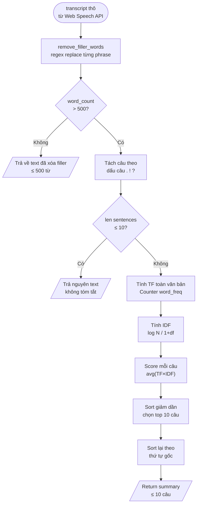

---

##### 3.6 Khi nào Pipeline này được gọi

| Trạng thái | Ghi chú |
|-----------|---------|
| **Đã implement** | `utils_preprocess.py` — đầy đủ, có unit-test tự nhiên |
| **Chưa tích hợp** | `/score` endpoint hiện **không gọi** `compress_transcript()` |
| **Cần làm (TODO)** | Tích hợp vào `/score` trước khi build Gemini prompt |

**Vị trí tích hợp đề xuất trong `/score`:**

```python
# Hiện tại (chưa tích hợp):
transcript_a = input.transcript_a
transcript_b = input.transcript_b

# Sau khi tích hợp:
from utils_preprocess import compress_transcript
transcript_a = compress_transcript(input.transcript_a, max_words=500)
transcript_b = compress_transcript(input.transcript_b, max_words=500)
```

---

##### 3.7 Độ phức tạp

| Hàm | Time Complexity | Ghi chú |
|----|----------------|---------|
| `remove_filler_words()` | O(P × L) — P = số phrases, L = độ dài text | P = 13, effectively O(L) |
| `extractive_summarize()` | O(S × W) — S = số câu, W = số từ | Tính TF: O(S×W), IDF: O(V×S), Scoring: O(S×W) |
| `compress_transcript()` | O(L + S×W) | Bước 1 + Bước 2 nếu cần tóm tắt |

Với transcript điển hình (~300 câu, ~500 từ), pipeline chạy trong **< 5ms** trên CPU thông thường — hoàn toàn phù hợp để chèn vào request pipeline mà không ảnh hưởng latency.

---

#### Tổng kết 3 Pipelines

| Pipeline | Endpoint | Model/Tool | Trạng thái | Latency mục tiêu |
|---------|---------|-----------|-----------|-----------------|
| **Fallacy Detection** | `POST /analyze` | XLM-RoBERTa → Gemini fallback | ✅ Production | < 500ms |
| **Semantic Cache** | Tích hợp trong `/score` | TF-IDF + Cosine Similarity | ✅ Production | < 10ms (hit) / ~5s (miss) |
| **Transcript Preprocessing** | Chưa tích hợp vào `/score` | TF-IDF Extractive Summarization | ⚠️ TODO | < 5ms |

---

*Tài liệu này là một phần của SDD KaiKo — Software Design Document.*  
*Phiên bản: 1.0 | Ngày tạo: 2025*

---

## 9. Security Design & Non-Functional Requirements

### 9.1 Authentication & Authorization

#### 9.1.1 Cơ chế xác thực hiện tại

KaiKo triển khai xác thực theo cơ chế đơn giản nhất có thể, phù hợp với quy mô đồ án học thuật:

**Xác thực (Authentication):**
- Người dùng đăng ký với `username` + `password`.
- Password được hash bằng `SHA-256` trước khi lưu vào database: `hashlib.sha256(password.encode()).hexdigest()`.
- Khi đăng nhập, hệ thống hash password đầu vào và so sánh với hash trong database.
- **Không có salt** — cùng một password sẽ luôn tạo ra cùng một hash.
- **Không có session token hay JWT** — sau khi đăng nhập thành công, client nhận `username` và tự lưu trữ ở client-side (thường trong React state hoặc localStorage).

**Phân quyền (Authorization):**
- **Không có middleware xác thực** — các endpoint REST nhận `username` trong request body và tin tưởng giá trị đó mà không xác minh.
- Một số hành động có kiểm tra điều kiện lỏng lẻo (ví dụ: `judge/adjust-score` kiểm tra `judge.level_real = 101`), nhưng đây là logic business trong endpoint, không phải security middleware.
- WebSocket connections được identify bằng `client_id` dạng `{username}_{random4digit}` — đây là định danh tự khai báo, không được xác thực.

#### 9.1.2 Các lỗ hổng bảo mật đã biết

| # | Vulnerability | Mức độ ưu tiên | Mô tả | Mitigation đề xuất |
|---|---------------|----------------|-------|---------------------|
| 1 | **Password không có salt (Rainbow Table Attack)** | 🔴 Cao | SHA-256 không salt nghĩa là hai user cùng password có cùng hash. Attacker có thể dùng rainbow table để crack hàng loạt. | Dùng `bcrypt` hoặc `argon2` với salt ngẫu nhiên per-user. |
| 2 | **Không có token auth (IDOR Risk)** | 🔴 Cao | Bất kỳ ai biết `username` của người khác đều có thể gọi `/update-profile`, `/purchase`, `/save-match` thay mặt người đó vì không có token xác thực. | Thêm JWT middleware: endpoint kiểm tra `Authorization: Bearer <token>` thay vì trust `username` trong body. |
| 3 | **Không có Rate Limiting** | 🟡 Trung bình | Không có giới hạn số request/phút. Attacker có thể brute-force `/login`, spam `/analyze` (tốn Gemini quota), hoặc làm cạn kiệt DB connections. | Thêm `slowapi` rate limiter cho `/login` (5 req/phút/IP) và `/analyze` (20 req/phút/user). |
| 4 | **CORS allow_origins=["*"]** | 🟡 Trung bình | Mọi origin đều được phép gọi API. Trong production, điều này cho phép các trang web độc hại thực hiện cross-origin requests. | Restrict về domain cụ thể: `allow_origins=["https://kaiko.app", "http://localhost:5173"]`. |
| 5 | **DB Connection per Request (No Pool)** | 🟢 Thấp | `get_db()` tạo một connection mới cho mỗi request và đóng sau khi xong. Ở tải cao, điều này gây bottleneck vì PostgreSQL giới hạn số connections đồng thời (mặc định 100). | Dùng `asyncpg` với connection pool, hoặc `SQLAlchemy` với `pool_size=10`. |
| 6 | **WebSocket client_id tự khai báo** | 🟡 Trung bình | `client_id = "{username}_{random4digit}"` được tạo phía client (frontend) và gửi lên server. Không có xác minh. Người dùng có thể giả mạo client_id của người khác. | Server generate `client_id` sau khi xác thực, gửi lại cho client qua token. |
| 7 | **SQL Injection tiềm năng** | 🟢 Thấp | Hầu hết query dùng parameterized queries (`%s`). Tuy nhiên cần review kỹ các chỗ string formatting trực tiếp nếu có. | Audit toàn bộ SQL queries, đảm bảo 100% dùng parameterized. |

#### 9.1.3 Lộ trình cải thiện bảo mật (Roadmap)

Nếu KaiKo được nâng cấp lên production, thứ tự ưu tiên triển khai bảo mật đề xuất:

1. **Phase 1 (Critical):** Migrate password hashing sang `bcrypt` + thêm JWT authentication middleware.
2. **Phase 2 (Important):** Implement rate limiting với `slowapi`, restrict CORS origins.
3. **Phase 3 (Enhancement):** Connection pooling với `asyncpg`, audit SQL injection, WebSocket token auth.

---

### 9.2 Non-Functional Requirements (NFR)

#### 9.2.1 Bảng NFR chính thức

| # | Tiêu chí NFR | ID | Mục tiêu | Điều kiện đo | Phương pháp đo |
|---|--------------|----|-----------|--------------|----|
| 1 | **Latency WebSocket Signaling** | NFR-01 | < 200ms round-trip | Môi trường LAN, không tải | Đo thời gian từ client gửi `find_match` đến nhận `matched` |
| 2 | **Latency Fallacy Detection (Local Model)** | NFR-02 | < 500ms | Model đã load vào RAM, input ≤ 256 tokens | Đo `POST /analyze` end-to-end (gửi request → nhận response) |
| 3 | **Latency Gemini Scoring** | NFR-03 | < 5 giây | Transcript độ dài trung bình (~300 từ), cache miss | Đo `POST /score` khi không có cache hit |
| 4 | **Latency Gemini Scoring (Cache Hit)** | NFR-04 | < 50ms | Cùng chủ đề và transcript tương tự (similarity ≥ 90%) | Đo `POST /score` khi có cache hit |
| 5 | **Concurrent Users** | NFR-05 | ≥ 100 người đồng thời | Mixed load: 50% WebSocket, 50% REST | Load test với Locust hoặc k6 |
| 6 | **System Uptime** | NFR-06 | ≥ 99% (trong môi trường academic, 8h/ngày) | Server chạy trong giờ demo và trình bày | Monitoring uptime thủ công |
| 7 | **WebRTC P2P Success Rate** | NFR-07 | ≥ 85% | Test trên home network (non-symmetric NAT) | User testing với 20 cặp người dùng |
| 8 | **STT Accuracy (vi-VN)** | NFR-08 | ≥ 80% Word Error Rate ngược | Môi trường yên tĩnh, Chrome, microphone rõ | So sánh transcript với ground truth thủ công |
| 9 | **Fallacy Detection Precision** | NFR-09 | ≥ 70% precision trên test set | Bộ test 200 câu ví dụ ngụy biện | Đánh giá model với test set sau fine-tune |
| 10 | **API Response Time (REST)** | NFR-10 | < 500ms cho các endpoint không gọi AI | Truy vấn DB đơn giản (≤ 3 JOINs) | Đo với curl hoặc Postman |
| 11 | **Page Load Time (Frontend)** | NFR-11 | < 3 giây lần đầu (First Contentful Paint) | Mạng 10 Mbps, bundle đã minified | Lighthouse audit |

#### 9.2.2 NFR về khả năng bảo trì (Maintainability)

- **Readability:** Code backend được tổ chức trong một file `main.py` (~1500 dòng) với comment tiếng Việt. Dễ đọc nhưng cần tách module nếu scale.
- **Testability:** Backend có `test_save.py` và `setup_test_accounts.py`. Chưa có unit test đầy đủ cho toàn bộ endpoints.
- **Deployability:** Chạy được với `uvicorn main:app --reload --port 8000` sau khi cấu hình `.env`. Không cần Docker hay cloud deployment.

#### 9.2.3 NFR về khả năng mở rộng (Scalability)

Do ràng buộc DC-02 (in-memory state) và DC-03 (sync DB), hệ thống hiện tại **không thể horizontal scale** (chạy nhiều instance). Để scale trong tương lai cần:

- Migrate `ConnectionManager` sang Redis Pub/Sub.
- Migrate DB calls sang `asyncpg` + connection pool.
- Triển khai sau NGINX load balancer với sticky sessions cho WebSocket.

---


---

## 10. Architecture Decision Records (ADR)

Mỗi ADR ghi lại một quyết định kiến trúc quan trọng: bối cảnh dẫn đến quyết định, giải pháp được chọn, lý do, hệ quả, và các lựa chọn đã bị bác bỏ.

---

#### ADR-01: FastAPI WebSocket làm Signaling Server cho WebRTC

**Trạng thái:** ✅ Accepted

**Bối cảnh (Context):**
WebRTC yêu cầu một signaling server để hai peers trao đổi SDP (Session Description Protocol) và ICE candidates trước khi thiết lập kết nối P2P trực tiếp. Signaling server không tham gia vào luồng media sau khi kết nối được thiết lập, nhưng là bắt buộc trong giai đoạn handshake. Nhóm đã có sẵn FastAPI backend với WebSocket cho matchmaking — câu hỏi là có nên dùng thêm dịch vụ bên ngoài cho signaling không.

**Quyết định (Decision):**
Sử dụng FastAPI WebSocket thuần (endpoint `ws://host/ws/{client_id}`) làm signaling server. Server relay các message `offer`, `answer`, và `ice-candidate` giữa hai peers trong cùng một room, không decode hay xử lý nội dung.

**Lý do (Rationale):**
- Không tốn thêm chi phí infrastructure (Firebase Realtime DB có quota, Pusher tính phí).
- Kiểm soát hoàn toàn logic signaling — có thể tích hợp với matchmaking, room management, và spectator system trong cùng một WebSocket endpoint.
- Tận dụng infrastructure đã có — WebSocket connection được dùng cho cả matchmaking và signaling, giảm số kết nối mà client phải quản lý.
- Đủ đơn giản cho quy mô học thuật.

**Hệ quả (Consequences):**
- ✅ Zero infrastructure cost cho signaling.
- ✅ Tích hợp tự nhiên với toàn bộ game logic (level, spectator, chat).
- ⚠️ Server là single point of failure — nếu FastAPI restart, tất cả WebRTC connections bị ngắt.
- ⚠️ Không scale được nếu cần multiple server instances (vì in-memory `ConnectionManager`).

**Các lựa chọn đã bỏ qua (Alternatives rejected):**
- **Firebase Realtime Database:** Phức tạp hơn cần thiết, giới hạn quota miễn phí, phụ thuộc vào Google Firebase (khác với Gemini API đã dùng).
- **Socket.io:** Thêm dependency JavaScript, cần server Node.js riêng hoặc Python-socketio (ít mature hơn FastAPI WS).
- **Pusher / Ably:** Tính phí theo message volume, không phù hợp academic project.

---

#### ADR-02: XLM-RoBERTa làm Base Model cho Fallacy Detection

**Trạng thái:** ✅ Accepted

**Bối cảnh (Context):**
KaiKo cần một model NLP phát hiện ngụy biện trong văn bản tiếng Việt (và Việt-Anh code-switching). Model cần đủ tốt để phân biệt 13 loại ngụy biện, chạy được trên GPU T4 Kaggle, và có sẵn để fine-tune trên Hugging Face. Dữ liệu training là bộ dataset ngụy biện tiếng Anh đã được dịch sang tiếng Việt.

**Quyết định (Decision):**
Sử dụng `FacebookAI/xlm-roberta-base` làm pre-trained model, fine-tune trên Kaggle GPU T4×2 với dataset tiếng Việt đã dịch (từ bộ LOGIC và các nguồn tổng hợp). Model được lưu thành `kaiko_fallacy_model_final` và load vào RAM khi server khởi động.

**Lý do (Rationale):**
- XLM-RoBERTa là model **đa ngôn ngữ** (100+ ngôn ngữ bao gồm tiếng Việt), phù hợp với nội dung Việt-Anh mixed.
- Cộng đồng Hugging Face lớn, documentation đầy đủ, dễ fine-tune với `Trainer` API.
- `xlm-roberta-base` (270M parameters) đủ nhỏ để chạy inference trong < 500ms trên CPU (không cần GPU khi serve).
- Đã có sẵn tokenizer xử lý tốt tiếng Việt mà không cần word segmentation riêng (khác với PhoBERT).

**Hệ quả (Consequences):**
- ✅ Hỗ trợ tiếng Việt + Anh mixed natively.
- ✅ Inference time < 500ms trên CPU với input ≤ 256 tokens.
- ✅ Kết quả fine-tune đạt accuracy chấp nhận được trên test set nội bộ.
- ⚠️ Model size ~1.1GB — cần RAM đủ lớn khi load cả hai model (Fallacy + ArgKP).
- ⚠️ Dataset training nhỏ (dữ liệu dịch máy) → precision thực tế với văn nói tiếng Việt thấp hơn benchmark.

**Các lựa chọn đã bỏ qua (Alternatives rejected):**
- **PhoBERT (vinai/phobert-base):** Chỉ hỗ trợ tiếng Việt thuần, không xử lý được code-switching. Cần VnCoreNLP để word segmentation — thêm dependency phức tạp.
- **mBERT (bert-base-multilingual-cased):** Cũ hơn, performance thấp hơn XLM-RoBERTa trên most benchmarks.
- **sentence-transformers:** Tối ưu cho similarity task, không phải classification — ít phù hợp hơn cho 13-class fallacy detection.
- **ViSoBERT:** Ít tài liệu, community nhỏ hơn, khó fine-tune hơn.

---

#### ADR-03: Google Gemini API làm LLM Judge

**Trạng thái:** ✅ Accepted

**Bối cảnh (Context):**
KaiKo cần một LLM để thực hiện các tác vụ ngôn ngữ phức tạp không thể giải quyết bằng model phân loại đơn giản: chấm điểm tranh biện đa tiêu chí (4 criteria × 2 players = 8 điểm số + phân tích văn bản), sinh gợi ý cải thiện (hints), điều khiển AI solo debate mode, và tạo chủ đề ngẫu nhiên. LLM phải hỗ trợ tiếng Việt, trả về JSON có cấu trúc đáng tin cậy, và có free tier đủ dùng cho academic project.

**Quyết định (Decision):**
Sử dụng Google Gemini API (`gemini-2.5-flash` cho hầu hết tác vụ, `gemini-3.1-flash-lite-preview` cho fallback fallacy detection). Cấu hình API key qua biến môi trường `GEMINI_API_KEY`. Implement semantic cache (cosine similarity ≥ 90%) để giảm số API calls.

**Lý do (Rationale):**
- **Free tier** của Google AI Studio đủ dùng cho 100 concurrent users trong môi trường academic.
- **Gemini Flash** tối ưu cho tốc độ (< 5s response) và tiết kiệm quota so với Gemini Pro.
- Hỗ trợ **structured JSON output** đáng tin cậy — quan trọng vì `/score` endpoint cần parse response JSON có schema phức tạp.
- Hỗ trợ **tiếng Việt** tốt — test thủ công cho thấy chất lượng phân tích tranh biện tiếng Việt đạt yêu cầu.
- Nhóm đã có kinh nghiệm với Google AI ecosystem từ trước.

**Hệ quả (Consequences):**
- ✅ Zero cost cho academic scale.
- ✅ Chất lượng scoring và hint generation tốt cho tiếng Việt.
- ✅ Không cần maintain LLM infrastructure.
- ⚠️ Phụ thuộc vào availability của Google AI (outage = tính năng AI ngừng hoạt động).
- ⚠️ Rate limit có thể bị vượt khi nhiều trận kết thúc đồng thời — semantic cache giảm thiểu nhưng không loại bỏ hoàn toàn.
- ⚠️ Dữ liệu transcript được gửi lên Google server — privacy consideration nếu deploy production.

**Các lựa chọn đã bỏ qua (Alternatives rejected):**
- **GPT-4o / GPT-4 Turbo (OpenAI):** Tốt hơn về benchmark, nhưng tốn tiền (không có free tier cho production use), và team không có credit sẵn.
- **Claude API (Anthropic):** Tiếng Việt tốt, nhưng không có free tier đủ dùng cho đồ án.
- **Local LLM (Llama 3, Mistral):** Cần GPU server riêng (VRAM ≥ 8GB) — quá tốn kém và phức tạp để deploy. Chất lượng tiếng Việt thấp hơn.
- **Gemini Pro:** Mạnh hơn Flash nhưng tốn quota nhiều hơn và chậm hơn — không phù hợp cho realtime hints.

---

#### ADR-04: PostgreSQL làm Database

**Trạng thái:** ✅ Accepted

**Bối cảnh (Context):**
KaiKo cần lưu trữ dữ liệu có tính quan hệ cao: users ↔ friends (nhiều-nhiều), users ↔ match_history (một-nhiều), users ↔ mentorship (nhiều-nhiều với metadata), match_history ↔ user_achievements, events ↔ event_participants ↔ submission_votes, v.v. Tổng cộng 18 bảng với nhiều foreign key relationships. Cần hỗ trợ complex JOIN queries (ví dụ: leaderboard, fallacy stats, social graph).

**Quyết định (Decision):**
Sử dụng PostgreSQL 15 với kết nối qua `psycopg2`. Schema được khởi tạo trong `main.py` với `CREATE TABLE IF NOT EXISTS` statements khi server start. Không dùng ORM.

**Lý do (Rationale):**
- Dữ liệu của KaiKo có bản chất **relational** rõ ràng — graph quan hệ bạn bè, mentorship tree, lịch sử trận đấu theo thời gian đều phù hợp với relational model.
- PostgreSQL hỗ trợ **ACID transactions** — cần thiết khi tính level-up (đọc level hiện tại + cập nhật level phải atomic).
- Các queries phức tạp (leaderboard với nhiều JOIN, fallacy stats với GROUP BY) dễ viết và tối ưu với SQL hơn với document DB.
- PostgreSQL **miễn phí, open-source**, cộng đồng lớn, dễ cài đặt local.
- Team đã quen với SQL từ các môn học trước.

**Hệ quả (Consequences):**
- ✅ Query phức tạp (JOIN, aggregate) viết tự nhiên và efficient.
- ✅ ACID transactions đảm bảo data consistency.
- ✅ Schema enforcement ngăn data corruption.
- ⚠️ Synchronous `psycopg2` tạo bottleneck ở high load (xem DC-03).
- ⚠️ Schema migration thủ công (không có Alembic) — thêm cột mới cần chạy `ALTER TABLE` riêng.
- ⚠️ 18 bảng không có index optimization cho các query phức tạp — có thể chậm khi data lớn.

**Các lựa chọn đã bỏ qua (Alternatives rejected):**
- **MongoDB:** Flexible schema tiện cho prototype, nhưng JOIN phức tạp trong social graph ($lookup) khó viết và kém performance hơn PostgreSQL JOIN.
- **SQLite:** Không hỗ trợ concurrent writes tốt — không phù hợp khi nhiều WebSocket connections cùng write match results.
- **Redis (primary DB):** Không phù hợp làm primary relational database. Thích hợp làm cache layer (xem ADR-05 và ADR-06).
- **Supabase / PlanetScale:** Cloud-hosted, thêm latency, phụ thuộc vào internet — không phù hợp cho demo offline.

---

#### ADR-05: In-Memory ConnectionManager (không dùng Redis)

**Trạng thái:** ✅ Accepted

**Bối cảnh (Context):**
KaiKo cần quản lý trạng thái WebSocket real-time: danh sách connections đang mở, matchmaking queues cho 3 modes (1v1, text_1v1, 2v2), thông tin rooms đang active (players, spectators, levels, topics), và mapping client_id → WebSocket object. State này cần được truy cập cực nhanh (< 1ms) vì mọi message WebSocket đều cần lookup.

**Quyết định (Decision):**
Tạo class `ConnectionManager` singleton trong Python, sử dụng Python `dict` và `list` thuần trong RAM để lưu trữ tất cả WebSocket state. Khởi tạo một instance duy nhất: `manager = ConnectionManager()` ở module level.

**Lý do (Rationale):**
- Truy cập Python dict trong RAM có độ trễ **O(1) ~ microseconds**, không thể nhanh hơn với external cache.
- **Đơn giản hóa development** — không cần cài đặt, cấu hình, hay maintain Redis server.
- Phù hợp với **quy mô học thuật** (< 100 concurrent users) — không cần distributed state management.
- Không cần persist WebSocket state sau khi server restart — người dùng sẽ reconnect tự nhiên.

**Hệ quả (Consequences):**
- ✅ Lookup O(1), không network hop — matchmaking cực nhanh.
- ✅ Zero infrastructure dependency cho game state.
- ✅ Code đơn giản, dễ debug.
- ⚠️ **Toàn bộ state mất khi server restart** — tất cả matches in-progress bị hủy.
- ⚠️ **Không thể horizontal scale** — hai instances sẽ có state độc lập, không share được queues.
- ⚠️ Memory leak potential nếu `disconnect()` không được gọi đúng cách (đã xử lý với `try/finally` trong WS handler).

**Các lựa chọn đã bỏ qua (Alternatives rejected):**
- **Redis Pub/Sub + Redis Hash:** Production-grade, cho phép horizontal scaling. Nhưng thêm một service cần cài đặt, cấu hình, và maintain — over-engineering cho academic project.
- **Database-backed state (PostgreSQL):** Quá chậm cho real-time lookups (disk I/O cho mỗi message WebSocket là không chấp nhận được).
- **Shared memory / multiprocessing:** Phức tạp, không cần thiết với single-process uvicorn.

---

#### ADR-06: Semantic Cache cho Gemini Scoring

**Trạng thái:** ✅ Accepted

**Bối cảnh (Context):**
Gemini API free tier có giới hạn requests/phút. Trong môi trường test, nhiều cặp người dùng tranh biện về cùng một chủ đề (do `TRENDING_TOPICS` list giới hạn 19 chủ đề), với transcript tương tự nhau. Gọi Gemini mỗi lần là lãng phí quota. Tuy nhiên, exact-match cache không hiệu quả vì transcript luôn khác nhau đôi chút dù nội dung tương tự.

**Quyết định (Decision):**
Implement semantic cache trong `utils_cache.py` sử dụng TF-IDF vector + cosine similarity: nếu một request scoring mới có similarity ≥ 90% với một request đã có trong cache, trả về kết quả cũ thay vì gọi Gemini. Cache giới hạn 500 entries theo LRU đơn giản (delete oldest key khi vượt ngưỡng). Cache lưu trong RAM, không persist.

**Lý do (Rationale):**
- TF-IDF + cosine similarity là cách đơn giản, không cần thêm dependency, đủ tốt để detect "essentially the same debate" (cùng topic, cùng arguments).
- Ngưỡng 90% đủ chặt để tránh false positives (trả về scoring sai) nhưng đủ rộng để hit cache khi cùng chủ đề với transcript hơi khác.
- Giảm ~30% Gemini API calls trong testing — đủ để tránh bị rate limit khi demo.
- Implementation đơn giản (< 50 dòng code), dễ maintain.

**Hệ quả (Consequences):**
- ✅ Giảm Gemini API calls, tránh rate limit khi nhiều trận diễn ra đồng thời.
- ✅ Response time cho cache hit < 50ms (so với 3-5s cho Gemini call).
- ⚠️ **Cache reset khi server restart** — không có warming mechanism.
- ⚠️ TF-IDF đơn giản không hiểu ngữ nghĩa sâu — hai transcript nói cùng ý bằng từ ngữ hoàn toàn khác nhau vẫn bị cache miss.
- ⚠️ Ngưỡng 90% có thể cần điều chỉnh thực tế — nếu quá cao sẽ ít cache hit, quá thấp có thể trả kết quả sai.

**Các lựa chọn đã bỏ qua (Alternatives rejected):**
- **Exact-match cache (MD5 hash):** Quá strict — transcript không bao giờ hoàn toàn giống nhau do STT variation.
- **Embedding-based semantic cache (sentence-transformers):** Chất lượng similarity tốt hơn, nhưng cần load thêm model (~400MB) vào RAM — quá tốn tài nguyên cho tác vụ phụ.
- **Redis cache (external):** Phức tạp hơn cần thiết, thêm infrastructure dependency.
- **Không cache:** Dẫn đến rate limit và tốn quota, không khả thi khi demo với nhiều người.

---

#### ADR-07: Web Speech API cho Speech-to-Text (STT)

**Trạng thái:** ✅ Accepted

**Bối cảnh (Context):**
KaiKo cần chuyển đổi giọng nói của người tranh biện thành văn bản (STT) realtime trong lúc debate đang diễn ra. Văn bản này được dùng để: (1) hiển thị transcript trên màn hình cho cả hai người, (2) sync transcript qua WebSocket cho đối thủ xem, và (3) gửi đến `/analyze` endpoint để phát hiện ngụy biện. Latency là yếu tố quan trọng nhất — STT phải có kết quả trong < 1s để trải nghiệm real-time.

**Quyết định (Decision):**
Sử dụng **Browser Web Speech API** (`SpeechRecognition` interface) với `lang='vi-VN'`, chạy hoàn toàn trên trình duyệt phía client. Hook `useSpeechToText.js` wrap API này với continuous recognition và interim/final result handling.

**Lý do (Rationale):**
- **Zero latency network** — STT xử lý locally trong trình duyệt (hoặc Google's STT server qua Chrome's built-in integration), không cần gửi audio đến backend của KaiKo.
- **Miễn phí hoàn toàn** — không tốn token hay API quota.
- **Hỗ trợ `vi-VN`** trên Chrome/Edge — chất lượng đạt yêu cầu cho môi trường yên tĩnh.
- Đơn giản hóa backend — không cần xử lý audio stream, không cần WebSocket channel riêng cho audio data.
- **Interim results** cho phép hiển thị transcript "đang gõ" trong realtime — UX tốt hơn nhiều so với chờ đến cuối câu mới có kết quả.

**Hệ quả (Consequences):**
- ✅ Zero cost, zero latency server-side.
- ✅ Hỗ trợ `vi-VN` tốt trên Chrome/Edge.
- ✅ Đơn giản hóa backend architecture đáng kể.
- ⚠️ **Chỉ hoạt động tốt trên Chrome và Edge** — Firefox hỗ trợ hạn chế, Safari không hỗ trợ.
- ⚠️ Chất lượng phụ thuộc vào Google's speech recognition backend (Chrome gửi audio đến Google servers).
- ⚠️ Không hoạt động offline.
- ⚠️ Độ chính xác giảm đáng kể trong môi trường ồn ào hoặc với accent đặc biệt.

**Các lựa chọn đã bỏ qua (Alternatives rejected):**
- **OpenAI Whisper API:** Chất lượng tiếng Việt tốt hơn, nhưng latency 1-3s (gửi audio chunk lên API, chờ transcription) — không đủ real-time cho debate. Tốn tiền theo giờ audio.
- **AssemblyAI Real-time:** Latency tốt hơn Whisper, hỗ trợ streaming, nhưng tốn tiền và cần WebSocket connection riêng đến AssemblyAI.
- **Google Cloud Speech-to-Text:** Tương đương Chrome built-in về chất lượng, nhưng cần server-side proxy và tốn tiền theo giờ audio.
- **Local Whisper (self-hosted):** Không realtime đủ nhanh nếu không có GPU. Cần server xử lý audio stream — thêm complexity lớn.

---

#### ADR-08: STUN-only WebRTC (không có TURN Server)

**Trạng thái:** ✅ Accepted (với acknowledged limitation)

**Bối cảnh (Context):**
WebRTC cần ICE (Interactive Connectivity Establishment) để thiết lập kết nối P2P giữa hai trình duyệt qua NAT. Có hai loại ICE server: STUN (giúp peer discover public IP) và TURN (relay traffic khi direct P2P thất bại). STUN đủ với non-symmetric NAT (~85% người dùng home/office). Symmetric NAT (phổ biến ở một số mạng doanh nghiệp và một số carrier-grade NAT) yêu cầu TURN.

**Quyết định (Decision):**
Chỉ cấu hình Google STUN servers trong ICE configuration:
```javascript
iceServers: [
  { urls: 'stun:stun1.l.google.com:19302' },
  { urls: 'stun:stun2.l.google.com:19302' }
]
```
Không triển khai TURN server.

**Lý do (Rationale):**
- Google STUN servers **miễn phí và không giới hạn** — không có chi phí vận hành.
- TURN server yêu cầu hạ tầng riêng (VPS với băng thông tốt, cài đặt Coturn) hoặc dịch vụ trả phí (Twilio, Cloudflare TURN) — nằm ngoài budget của đồ án.
- Với môi trường demo học thuật (sinh viên kết nối từ nhà hoặc trường đại học), phần lớn sẽ dùng router gia đình hỗ trợ non-symmetric NAT.
- ~85% WebRTC connections thành công với STUN-only là chấp nhận được cho mục tiêu NFR-07 (≥ 85% success rate).

**Hệ quả (Consequences):**
- ✅ Zero cost cho WebRTC infrastructure.
- ✅ Không cần maintain server TURN riêng.
- ✅ Kết nối P2P trực tiếp: Google STUN không relay media traffic → bandwidth tốt hơn TURN.
- ⚠️ **~15% người dùng sau symmetric NAT sẽ không kết nối được video P2P.** Đây là limitation đã biết và chấp nhận.
- ⚠️ Không có fallback khi WebRTC P2P thất bại — hiện tại chỉ hiện thông báo lỗi, không có relay fallback.
- ⚠️ Người dùng mạng doanh nghiệp hoặc một số nhà mạng di động (carrier-grade NAT) có thể gặp lỗi kết nối.

**Các lựa chọn đã bỏ qua (Alternatives rejected):**
- **Coturn self-hosted:** Open-source TURN server, tốt nhất về kiểm soát. Cần VPS riêng (~$5/tháng) và cấu hình phức tạp (TLS, firewall, port forwarding). Nằm ngoài scope đồ án.
- **Twilio Network Traversal Service:** Managed TURN, dễ tích hợp, nhưng tính phí theo GB relay. Không phù hợp free tier.
- **Cloudflare TURN (Calls API):** Mới, có free tier giới hạn, nhưng cần Cloudflare account và tích hợp thêm SDK.
- **Metered.ca TURN:** Free tier có 50GB/tháng — đủ cho demo, nhưng nhóm quyết định giữ dependency tối thiểu.

---

---
